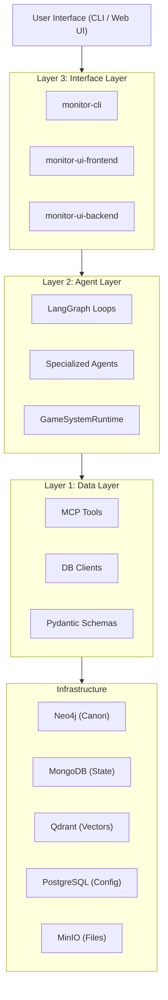

# MONITOR Architecture

> **Multi-Ontology Narrative Intelligence Through Omniversal Representation**

This document defines the high-level architecture of MONITOR, its subsystems, agent coordination, and data flow patterns.

---

## 1. High-Level Architecture: The "3-Layer Cake"

MONITOR follows a strict layered architecture pattern. Dependencies only flow **downward**.

### Layer 1: Data Layer (`monitor-data-layer`)
The foundation of the system. It owns all database connections, data schemas (Pydantic), and the "Canonical Truth".
- **Responsibilities:** Database CRUD, authority enforcement, request validation, Model Context Protocol (MCP) tool exposure.
- **Rule:** Never imports from Layer 2 or 3.

### Layer 2: Agent Layer (`monitor-agents`)
The "brain" of the system. It handles narrative intelligence, reasoning, and orchestration.
- **Responsibilities:** specialized agents (Narrator, Resolver, CanonKeeper, etc.), LangGraph state machine loops, DSPy modules.
- **Rule:** Imports from Layer 1; never imports from Layer 3.

### Layer 3: Interface Layer (`monitor-cli`, `monitor-ui`)
The user-facing surfaces.
- **Responsibilities:** Command execution, interactive REPL, web-based chat, visual graph browsing.
- **Rule:** Imports from Layer 2; avoids direct Layer 1 imports (skip-layer protection).

---

## 2. Subsystem Architecture

### 2.1 Agent Architecture
MONITOR is a **multi-agent system** of specialized, stateless workers coordinated by state machines.

| Agent | Responsibility | Write Authority |
|-------|----------------|-----------------|
| **ContextAssembly** | Gathers data from all DBs for a turn | Read-Only |
| **Narrator** | Generates prose and descriptions | MongoDB (Turns) |
| **Resolver** | Adjudicates rules and dice | MongoDB (Resolutions) |
| **CanonKeeper** | The "Gatekeeper" of truth | **Neo4j (Exclusive)** |
| **Indexer** | Embeds and indexes documents | Qdrant |
| **Analyzer** | Extracts knowledge from text | MongoDB (Packs) |
| **IngestionPipeline** | Orchestrates file processing | MinIO, Neo4j (Sources) |
| **WorldArchitect** | Guides world-building sessions | Neo4j (via CanonKeeper) |
| **NPCVoice** | Speaks as specific NPCs | MongoDB (Turns) |
| **RecapAgent** | Synthesizes story history | Read-Only |

### 2.2 Orchestration via LangGraph
Instead of a monolithic "Orchestrator," we use LangGraph **StateGraph** loops.
- **SceneLoop:** Manages the turn-by-turn interactive scene.
- **StoryLoop:** Manages the high-level campaign progression and scene transitions.
- **ConversationLoop:** Specialized loop for deep NPC interactions.
- **WorldBuildingLoop:** Collaborative setting creation flow.

### 2.3 Knowledge Architecture (The "Brain")
- **DSPy:** Used for creative reasoning chains (prose generation, knowledge extraction).
- **instructor:** Used for strict Pydantic output from LLMs (tool calls, structured responses).
- **LiteLLM:** Provider-agnostic abstraction for OpenAI, Anthropic, Gemini, etc.

---

## 3. Data Flow Patterns

### 3.1 The "Proposed Change" Pattern
To ensure the Neo4j Knowledge Graph remains clean and consistent, **no agent (except CanonKeeper) can write to Neo4j**.
1. **Agents** (Narrator, Resolver, Analyzer) produce `ProposedChange` documents in MongoDB.
2. **CanonKeeper** reviews these proposals against established policies.
3. **CanonKeeper** commits accepted proposals to Neo4j and marks them `accepted`.

### 3.2 Context Retrieval Flow (RAG)
1. **User Action** → `ContextAssembly` agent.
2. `ContextAssembly` performs:
   - **Semantic Search** in Qdrant (memories, lore).
   - **Graph Traversal** in Neo4j (relationships, entities).
   - **History Lookup** in MongoDB (recent turns).
3. Resulting **Context Package** is injected into the prompt for the `Narrator` or `Resolver`.

---

## 4. Tech Stack

| Component | Technology |
|-----------|------------|
| **Language** | Python 3.11+ |
| **Package Mgmt** | [uv](https://github.com/astral-sh/uv) |
| **Agent Framework** | [LangGraph](https://github.com/langchain-ai/langgraph) |
| **Prompt Engineering** | [DSPy](https://github.com/stanfordnlp/dspy) |
| **Schemas** | Pydantic v2 |
| **Interface** | Typer (CLI), FastAPI (Backend), Next.js (Frontend) |
| **Database: Graph** | Neo4j |
| **Database: Document** | MongoDB |
| **Database: Vector** | Qdrant |
| **Database: Relational** | PostgreSQL (Config/Management) |
| **Object Storage** | MinIO (S3 Compatible) |
| **Communication** | [Model Context Protocol (MCP)](https://modelcontextprotocol.io/) |

---

## 5. Communications & Interoperability (MCP)

MONITOR uses the **Model Context Protocol (MCP)** as the standard interface between agents and data.

- **Tools as Services:** Every database operation (Layer 1) is exposed as an MCP Tool.
- **Language Agnostic:** Agents can be written in any language that supports MCP clients, while the data layer remains a stable MCP server.
- **Transport:** Currently uses `stdio` for local execution and is ready for `SSE/HTTP` for distributed deployments.
- **Standardization:** All tool definitions follow the MCP schema, including descriptions, input parameters, and output formats.

---

## 6. Deployment & Scalability
MONITOR is built to be **cloud-native** and **distributed**.
- Every database runs in Docker.
- Layers are package-separated for independent scaling.
- Agents are stateless, allowing for horizontal scaling of worker nodes.
- **Durability:** Every loop state is checkpointed to MongoDB via `MongoDBSaver`.

---

## 7. Deep Dive Documentation

For detailed specifications of individual subsystems, refer to the following documents:

| Topic | Document |
|-------|----------|
| **Execution Loops** | [docs/architecture/CONVERSATIONAL_LOOPS.md](docs/architecture/CONVERSATIONAL_LOOPS.md) |
| **Data Flow** | [docs/architecture/DATA_FLOWS.md](docs/architecture/DATA_FLOWS.md) |
| **Memory & RAG** | [docs/architecture/RAG_AND_MEMORY.md](docs/architecture/RAG_AND_MEMORY.md) |
| **Prompt Engineering** | [docs/architecture/PROMPT_ENGINEERING.md](docs/architecture/PROMPT_ENGINEERING.md) |
| **Rules Engine** | [docs/architecture/RULES_ENGINE.md](docs/architecture/RULES_ENGINE.md) |
| **Lifecycle & Recovery** | [docs/architecture/LIFECYCLE_AND_RECOVERY.md](docs/architecture/LIFECYCLE_AND_RECOVERY.md) |
| **DB Integration** | [docs/architecture/DATABASE_INTEGRATION.md](docs/architecture/DATABASE_INTEGRATION.md) |

---

## 8. Development Standards
- **Layer Integrity:** Strict import rules enforced by linting/tests.
- **Statelessness:** Agents must never store local state; use DBs or LangGraph state.
- **Traceability:** All LLM calls and tool executions are logged for auditing and debugging.
