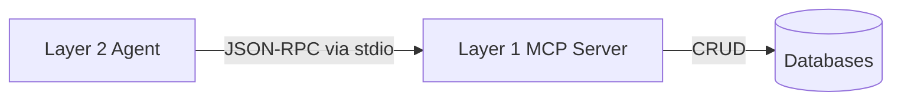

# MCP Transport

MONITOR uses the **Model Context Protocol (MCP)** as the standard interface between Layer 2 (Agents) and Layer 1 (Data).

## Why MCP?
- **Tools as Services**: Every database operation is exposed as an MCP Tool.
- **Language Agnostic**: Agents can be written in any language that supports MCP clients. The data layer remains a stable MCP server.
- **Standardization**: All tool definitions follow the MCP schema strictly (descriptions, input parameters, output formats).

## Architecture

## Transport Modes
- Currently uses `stdio` for local execution.
- Designed to be easily upgraded to `SSE/HTTP` for distributed deployments.

## See Also
- [Layer 1: Data](./layer1_data.md)
- [Layer 2: Agents](./layer2_agents.md)
