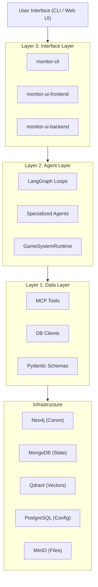

# The Three Layers

MONITOR follows a strict layered architecture pattern known as the **3-Layer Cake**. Dependencies only flow **downward**.

## Layer Summary
1. **[Layer 1: Data Layer](./layer1_data.md)**: Connects to databases. Validates schemas. Exposes MCP Tools. Never imports from Layer 2 or 3.
2. **[Layer 2: Agent Layer](./layer2_agents.md)**: AI logic, LangGraph loops, DSPy reasoning. Imports from Layer 1. Never imports from Layer 3.
3. **[Layer 3: Interface Layer](./layer3_interface.md)**: User surfaces. Imports from Layer 2. Avoids direct Layer 1 imports.

## See Also
- [Architecture Index](./_index.md)
