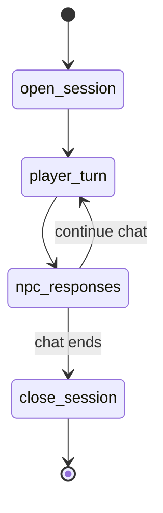

# Conversation Loop

**Intent:** Provide a dedicated flow for social interactions, focusing on dialogue flow and relationship shifts rather than physical action adjudication.

## Flow Diagram

## Node Explanations
- **`open_session`**: Bootstraps the dialogue context (who is present, what is their disposition, recent memories).
- **`player_turn`**: Awaits user dialogue input.
- **`npc_responses`**: Calls the `NPCVoice` agent to generate in-character responses for one or more NPCs based on their specific personality profiles.
- **`close_session`**: Summarizes the conversation, extracts new facts, and stages relationship-update `ProposedChange` documents.

## See Also
- [Loops Index](./_index.md)
