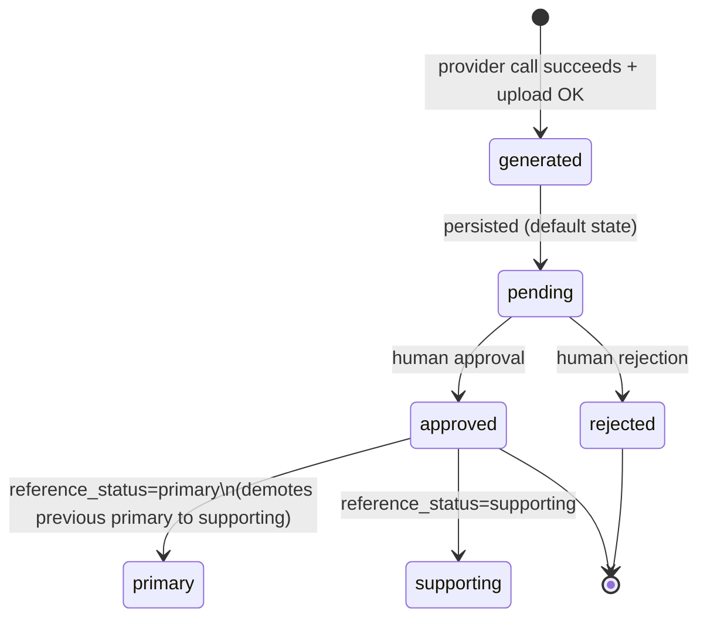

# Image Generation

**Intent:** Generation is canon-anchored, durable, and operator-gated. Every
portrait and scene image produces a persistent `GeneratedAsset` linked to the
canonical visual identity, the prompt that produced it, the provider/model,
and (when applicable) the source turn — with explicit human approval before
it becomes an avatar or a reference.

**Sources:**
- Router: `packages/ui/backend/src/monitor_ui/routers/image_gen.py`
- Assets router: `packages/ui/backend/src/monitor_ui/routers/image_assets.py`
- Budget enforcement: `packages/ui/backend/src/monitor_ui/image_budget.py`
- Provider adapters: `packages/data-layer/src/monitor_data/llm/image_providers.py`
- Settings + policy: `packages/data-layer/src/monitor_data/llm/image_policy.py`,
  `packages/data-layer/src/monitor_data/schemas/image_settings.py`
- Schemas: `packages/data-layer/src/monitor_data/schemas/generated_assets.py`
- Loop suggestions: `packages/agents/src/monitor_agents/image_suggestions.py`
- Canon context assembly: `packages/agents/src/monitor_agents/image_context.py`

## Asset lifecycle



| State | What it means |
|-------|---------------|
| **generated** | Bytes uploaded to MinIO; the response carries `asset_id` + presigned URL. |
| **pending** | The default state for every successful generation (Task 8). Avatar is **not** mutated at generation time. |
| **approved** | Human clicked "Approve"; optional `use_as_avatar=True` and/or `reference_status` may be set. |
| **rejected** | Human clicked "Reject". Leaves default galleries, clears any reference role. |
| **primary / supporting** | Reference role on an approved asset — used to build the prompt for future generations. |

Generation order is `generate → upload → persist → (optional) avatar mutation`.
**A failed provider call, upload, or persistence step never leaves a
durable asset record**; the cleanup path on persistence failure deletes
the uploaded MinIO key and returns 500.

Object keys for new uploads:

```text
assets/{asset_type}/{scope}/{uuid}.png
# e.g. assets/portrait/character-<id>/<uuid>.png
#      assets/scene/conversation-<id>/<uuid>.png
#      assets/scene/session-<id>/<uuid>.png
```

Legacy `portraits/` / `scenes/` keys continue to be served unchanged. No
eager migration runs — provenance starts from new generations.

## Provider capabilities

Adapters declare capability through `ImageCapabilities`:

```python
@dataclass(frozen=True)
class ImageCapabilities:
    provider_id: str
    model: str
    supports_reference_images: bool
    supported_aspect_ratios: frozenset[str]
```

Two shipped adapters (`MiniMaxImageAdapter` for `image-01`,
`GeminiImageAdapter` for `gemini-2.5-flash-image`) **both advertise
`supports_reference_images=False`** today. The plumbing
(`select_references` / `load_reference_images` /
`filter_references_for_adapter`) is in place but is not used by either
shipped adapter until a provider-payload test confirms the real contract.

### Text-only fallback

When the orchestration layer sees approved references **and** the adapter
can't consume them, it forwards the prompt text only and emits:

```text
prompt_warnings += [
    "text-only fallback: provider does not consume reference images; "
    "dropped {N} approved reference(s) at the orchestrator."
]
```

When the adapter *can* consume references, the loader pulls the selected
keys from MinIO, enforces `_MAX_REFERENCE_IMAGES` (4) plus per-subject and
per-provider caps, and emits:

```text
prompt_warnings += [
    "reference conditioning active: sent {N} of {M} approved "
    "reference(s) to {provider_id}{suffix}."
]
```

The asset's `reference_asset_ids` is always persisted — even when bytes
weren't sent — so provenance is durable and the UI badge derives from
`prompt_warnings` first, then falls back to the IDs.

## Scope budgets

The router **reserves** the slot before the provider call (and the
asset-persistence call) and **rolls back** on every failure path. Three
scopes share the same machinery (`image_budget.py`):

| Scope | Source field | Default cap |
|-------|--------------|-------------|
| `scene` | current `scene_id` | `image_max_per_scene = 4` |
| `conversation` | current `conversation_id` (or session id) | `image_max_per_conversation = 8` |
| `actor_hour` | current actor in the last hour | `image_max_per_actor_hour = 12` |

`0` disables that scope. Reserves happen via Redis `INCR + EXPIRE`
(atomic counter with a TTL for the actor-hour window) when Redis is
available, or via a `generated_assets` Mongo query scoped to the same
criterion when it isn't. **Failed calls never count** — the increment is
rolled back before the response is sent, and the Mongo fallback query
only counts assets that were actually persisted.

A 429 response includes `scope`, `used`, `limit`, and human-readable
`retry` guidance, e.g.:

```json
{
  "detail": {
    "scope": "actor_hour",
    "used": 12,
    "limit": 12,
    "retry": "Per-actor generation cap reached (12/12). Wait an hour or raise the limit in Settings → Image Generation."
  }
}
```

## Moderation behavior

Two modes (`ImageModerationMode`):

- `provider_default` — pass everything through; the provider's own
  safety filter is authoritative. This is the right default for Light RP.
- `lines_and_veils` — block prompts that substring-match an active
  campaign line or veil (case-insensitive). Light RP with no agreements
  is **never** silently upgraded: `lines_and_veils` + empty agreements =
  `lines_and_veils_no_agreements` reason, `allowed=True`. The policy
  never invents restrictions the table didn't opt into.

Settings live in the `ImageGenerationSettings` singleton
(`_id="global"`); the `PUT /api/image/settings` endpoint requires
`IMAGE_SETTINGS_ADMIN_KEY` when configured. The mode is the operator's
explicit choice; the policy does not claim to bypass provider rules.

## Loop suggestions

The scene loop may **suggest** an image worth generating — it never
auto-generates. Suggestions are pure data (`ImageSuggestion` models)
carried on `SceneState.image_suggestions` → narrate result → done-frame
metadata; the frontend renders them as chips and only an explicit click
calls the provider.

Triggers (evaluated in spec order):

1. `location_change` — first time a canonical location anchors the scene.
2. `npc_entry` — first time an NPC is visually anchored.
3. `visual_state_change` — the resolver explicitly declared an appearance
   change on the player character (`appearance_change=True` flag or an
   effect string mentioning "appearance"; deliberately explicit, never
   inferred from prose).
4. `climax` — pacing phase `peak` for one establishing scene image.

Rate limits:

- At most **one** suggestion per `SUGGESTION_CADENCE_TURNS = 3` turns.
- At most **two** suggestions per scene (`MAX_SUGGESTIONS_PER_SCENE`).

Determinism: the same inputs produce the same suggestions with
uuid5-derived `suggestion_id` (reason + subjects + source turn). The
chip rendering is gated by the `image_suggestions_enabled` setting
(`/config → Image Generation`). When the chip is clicked, it calls the
existing portrait or scene endpoint with `trigger="loop_suggestion"` and
`source_turn_id` provenance — the returned PENDING asset reuses the
post-generation review UI.

## The actual endpoints

```text
POST /api/image/portrait            character_id (or entity_id) -> PENDING asset + presigned URL
POST /api/image/scene               scene_id / conversation_id -> PENDING asset + presigned URL
GET  /api/image/assets              filters: character_id, entity_id, scene_id, approval_status, ...
GET  /api/image/assets/{id}         single asset (404 unknown)
GET  /api/image/assets/{id}/file    presigned MinIO redirect (302/307)
POST /api/image/assets/{id}/approve approved_by, use_as_avatar?, reference_status?
POST /api/image/assets/{id}/reject  rejected_by
GET  /api/image/visual-identities / current / PUT current
GET  /api/image/settings            open GET on the singleton
PUT  /api/image/settings            gated when IMAGE_SETTINGS_ADMIN_KEY is set
```

The chat WebSocket frame format reuses the existing `done` frame:
`image_suggestions` appears as a sibling of `suggested_actions` in the
GM message metadata — no new WebSocket event type was introduced.

## See Also

- [Visual Identity](../4_ontology/visual_identity.md) — the precedence,
  incarnation isolation, and CanonKeeper-boundary rules.
- [GM as Authority](../architecture/GM_AS_AUTHORITY.md) — the narrator
  contract that surfaces `image_suggestions`.
- [Scene Loop](./scene_loop.md) — narrate node accumulates suggestions.
- [Loops Index](./_index.md) — sibling loop docs.
