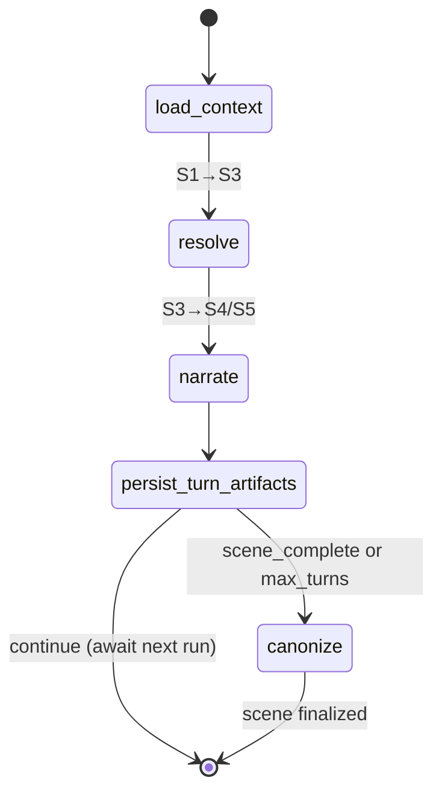

# Scene Loop (Core Play)

**Intent:** Provide a durable, checkpointed state machine to handle a single turn of gameplay, ensuring the player's action is resolved, narrated, and safely persisted.

## Flow Diagram

## Node Explanations
- **`load_context`**: Calls `ContextAssembly` agent to gather entities, facts, and memories relevant to the scene and action.
- **`resolve`**: Calls the `Resolver` agent to adjudicate rules and dice. Outputs `ProposedChange` documents.
- **`narrate`**: Calls the `Narrator` agent to generate immersive GM prose based on the context and resolution.
- **`persist_turn_artifacts`**: Saves the generated turn and resolution state to MongoDB.
- **`canonize`**: (Runs at end of scene) Calls the `CanonKeeper` to evaluate all staged `ProposedChange` documents and commit accepted ones to Neo4j.

## See Also
- [Loops Index](./_index.md)
- [The Proposed Change Pattern](../2_architecture/the_proposed_change_pattern.md)
