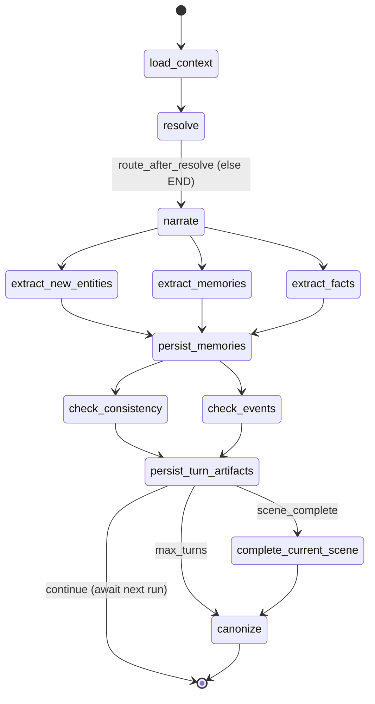

# Scene Loop (Core Play)

**Intent:** A durable, checkpointed LangGraph state machine that runs a single
turn of gameplay — resolve the player's action under the **GM's authority**,
narrate the consequences, extract world changes, and persist everything.

**Source:** `packages/agents/src/monitor_agents/loops/scene_loop.py`
(`build_scene_graph`, node functions). Checkpointed via `MongoDBSaver`.

## The real node graph



The three `extract_*` nodes **fan out concurrently** after `narrate` and **fan in** at `persist_memories`. Then `check_consistency` and `check_events` **fan out concurrently** and **fan in** at `persist_turn_artifacts`.

## Node reference

| Node | Does |
|------|------|
| `load_context` | Loads Neo4j entities, MongoDB turns, Qdrant memories (via `RetrievalService`), and the game-system doc into state. |
| `resolve` | Calls `Resolver.resolve_turn(...)` — see the turn flow below. Emits the resolution dict + `ProposedChange`s; manages the pending-roll state machine. |
| `narrate` | Calls `Narrator.narrate_turn(...)` to produce GM prose + suggested actions; persists the turn to MongoDB. |
| `extract_new_entities` / `extract_memories` / `extract_facts` | Concurrent extractors that stage new entities, episodic memories, and candidate facts as `ProposedChange`s. |
| `persist_memories` | Writes accepted memories to Qdrant/Mongo. |
| `check_consistency` | Flags contradictions against established facts. |
| `check_events` | Detects triggered world events / condition changes. |
| `persist_turn_artifacts` | Saves the turn + resolution state; routes to scene end or continuation. |
| `complete_current_scene` | End-of-scene choreography (summaries, transitions). |
| `canonize` | **CanonKeeper** evaluates all staged `ProposedChange`s and commits accepted ones to Neo4j. Runs at scene end / max turns. |

## The turn flow (GM as authority)

The `resolve` and `narrate` nodes are where the 3-agent pipeline lives. See
[GM as Authority](../architecture/GM_AS_AUTHORITY.md) for the full pipeline.

```
resolve  → Resolver.resolve_turn()
              └─ GMAgent.decide()  ← the LM authority: ReAct over gm_tools,
                                      emits a GMVerdict (intent, roll_necessity,
                                      causality, subsystem, narrative_draft)
              └─ shapes the verdict into the legacy resolution dict
                 (+ pending-roll state machine)
narrate  → Narrator.narrate_turn(resolution=…, gm_verdict=…)  → 3-step reconcile → GM prose + suggestions
```

- **The GM decides.** `GMAgent` (inside the resolver) is the authority on
  intent, whether a roll is needed, causality, and the suggested stat/DC. The
  classifiers it once consulted were deleted — it emits those fields directly
  (see [De-heuristic Principle](../architecture/DE_HEURISTIC_PRINCIPLE.md)).
- **Retrieval is encapsulated.** Any embedding/RAG (context load, action
  routing, condition matching) goes through the
  [RetrievalService](../architecture/RETRIEVAL_SERVICE.md) — the single owner
  of embeddings + Qdrant.
- **Narration today:** the scene loop calls the Narrator with **both** the
  resolution dict (the outcome) and the `GMVerdict` (with the GM's
  `narrative_draft`). The Narrator runs the **3-step reconcile**:
  a small `dspy.Predict` judges draft↔outcome compatibility, and
  dispatches to refine (COMPATIBLE), refine with an outcome anchor
  (DIVERGES), or regenerate from the outcome (INCOMPATIBLE). For
  non-rolled turns (trivial / forced_narrative / propose_roll /
  narrative) the compat check is skipped — the draft IS the story.
  Empty draft falls back to the legacy generate-from-resolution path.
  See [GM as Authority](../architecture/GM_AS_AUTHORITY.md) for the
  full pipeline.

## Pending-roll state machine

When the GM returns `propose_roll` (freeform mode), `resolve` persists the roll
spec to `pending_roll` so the next turn knows a roll is offered; the player may
accept or ignore it. On a resolved `dice`/`contested`/`forced_narrative_pushback`
outcome, `pending_roll` clears.

## See Also
- [GM as Authority](../architecture/GM_AS_AUTHORITY.md) — the narration pipeline
- [Retrieval Service](../architecture/RETRIEVAL_SERVICE.md)
- [Combat Loop](./combat_loop.md) — entered from `resolve` for tactical encounters
- [Story Loop](./story_loop.md) — drives scenes; [Loops Index](./_index.md)
- [The Proposed Change Pattern](../2_architecture/the_proposed_change_pattern.md)
