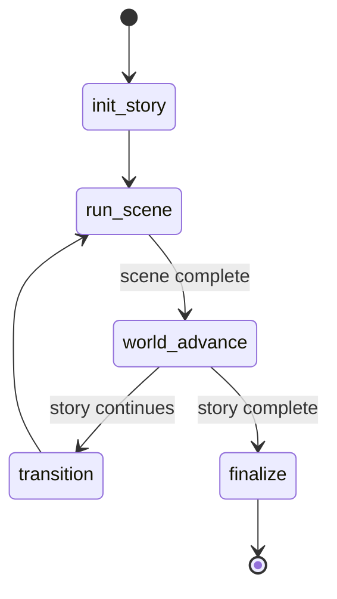

# Story Loop (Campaign Progression)

**Intent:** Manage the lifecycle of a story arc, connecting multiple scenes and ensuring the world evolves "off-screen" between major events.

## Flow Diagram

## Node Explanations
- **`init_story`**: Establishes the arc parameters and initial world state.
- **`run_scene`**: Hands control over to the [Scene Loop](./scene_loop.md).
- **`world_advance`**: Runs the `Simulacrum Agent` after scenes to simulate faction moves, NPC actions, and environmental changes based on elapsed time.
- **`transition`**: Updates continuity and plot threads before starting the next scene.
- **`finalize`**: Wraps up the story arc, ensuring all final world states are canonized.

## See Also
- [Loops Index](./_index.md)
- [Scene Loop](./scene_loop.md)
