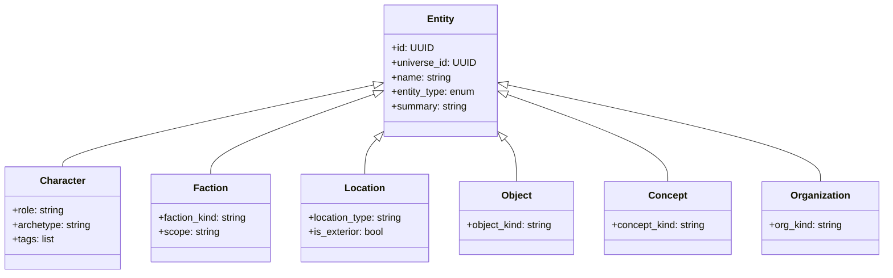

```mermaid
classDiagram
    class Entity {
        +id: UUID
        +universe_id: UUID
        +name: string
        +entity_type: enum
        +summary: string
    }

    class Character {
        +role: string
        +archetype: string
        +tags: list
    }

    class Faction {
        +faction_kind: string
        +scope: string
    }

    class Location {
        +location_type: string
        +is_exterior: bool
    }

    class Object {
        +object_kind: string
    }

    class Concept {
        +concept_kind: string
    }

    class Organization {
        +org_kind: string
    }

    Entity <|-- Character
    Entity <|-- Faction
    Entity <|-- Location
    Entity <|-- Object
    Entity <|-- Concept
    Entity <|-- Organization
```