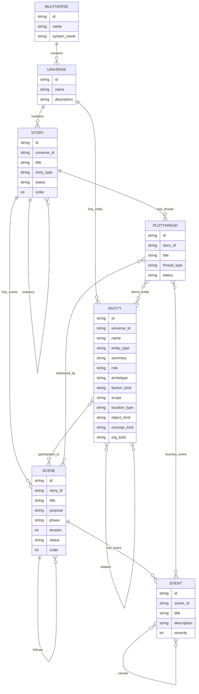

```mermaid
erDiagram

    MULTIVERSE {
        string id
        string name
        string system_name
    }

    UNIVERSE {
        string id
        string name
        string description
    }

    STORY {
        string id
        string universe_id
        string title
        string story_type
        string status
        int order
    }

    SCENE {
        string id
        string story_id
        string title
        string purpose
        string phase
        int tension
        string status
        int order
    }

    EVENT {
        string id
        string scene_id
        string title
        string description
        int severity
    }

    PLOTTHREAD {
        string id
        string story_id
        string title
        string thread_type
        string status
    }

    ENTITY {
        string id
        string universe_id
        string name
        string entity_type
        string summary
        string role
        string archetype
        string faction_kind
        string scope
        string location_type
        string object_kind
        string concept_kind
        string org_kind
    }

    MULTIVERSE ||--o{ UNIVERSE : contains
    UNIVERSE ||--o{ STORY : contains
    STORY ||--o{ STORY : substory
    STORY ||--o{ SCENE : has_scene
    SCENE ||--o{ SCENE : follows

    SCENE ||--o{ EVENT : has_event
    EVENT }o--o{ EVENT : causes

    UNIVERSE ||--o{ ENTITY : has_entity

    ENTITY }o--o{ SCENE : participates_in
    ENTITY }o--o{ ENTITY : member_of
    ENTITY }o--o{ ENTITY : located_in
    ENTITY }o--o{ ENTITY : relation

    STORY ||--o{ PLOTTHREAD : has_thread
    PLOTTHREAD }o--o{ SCENE : advanced_by
    PLOTTHREAD }o--o{ EVENT : touches_event
    PLOTTHREAD }o--o{ ENTITY : about_entity
```