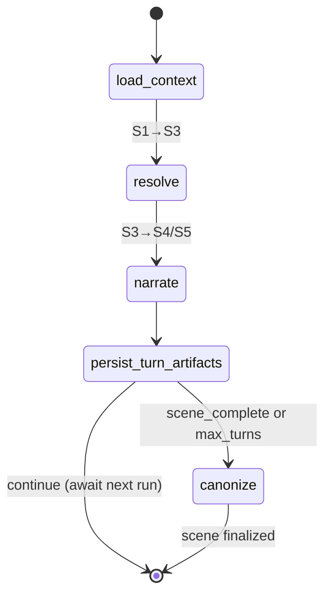
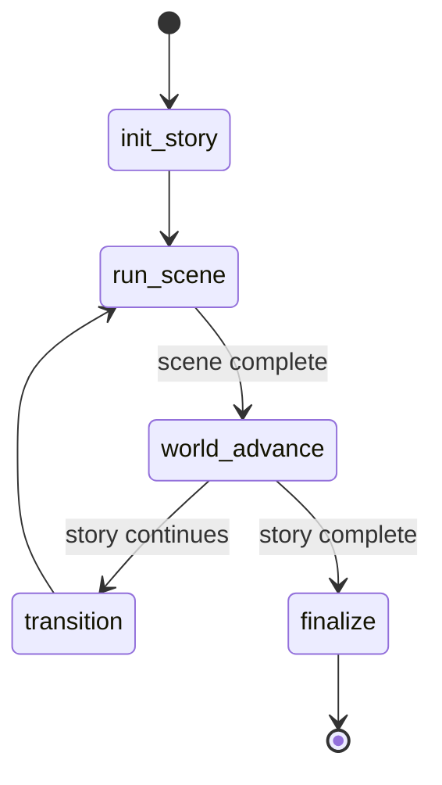

# Conversational Loops

MONITOR uses **LangGraph StateGraph** state machines to orchestrate complex, multi-turn interactions. This replaces the traditional monolithic "Orchestrator" pattern with a modular, checkpointed, and traceable graph-based flow.

---

## 1. Hierarchy of Loops

The system operates using four nested or specialized loops:

1. **Story Loop:** Manages high-level campaign progression, world-advancement (simulation), and scene transitions.
2. **Scene Loop:** The primary unit of play. Manages turn-by-turn interaction within a specific narrative context.
3. **Conversation Loop:** A specialized loop for deep, multi-turn dialogue sessions with one or more NPCs.
4. **World-Building Loop:** A collaborative session for defining setting elements (entities, axioms, lore).

---

## 2. Scene Loop (Core Play)

The Scene Loop implements the logic for a single interactive scene from start to canonization.

### Flow Diagram

### Nodes
- **`load_context`:** Calls the `ContextAssembly` agent to gather entities, facts, and memories relevant to the current scene and player action.
- **`resolve`:** Calls the `Resolver` agent to adjudicate the player's action against the game system rules (dice rolls, stat checks). Produces structured outcomes and `ProposedChange` documents.
- **`narrate`:** Calls the `Narrator` agent to generate immersive GM prose based on the context and resolution.
- **`persist_turn_artifacts`:** Saves the generated turn, resolution, and working state to MongoDB.
- **`canonize`:** Calls the `CanonKeeper` agent to evaluate all `ProposedChange` documents staged during the scene and commit accepted ones to the Neo4j Knowledge Graph.

---

## 3. Story Loop (Campaign Progression)

The Story Loop manages the lifecycle of a story arc, connecting multiple scenes and ensuring the world evolves "off-screen."

### Flow Diagram

### Key Features
- **Simulation (World Advance):** Runs the `Simulacrum Agent` after every scene to simulate faction moves and environmental changes based on the time passed.
- **Continuity:** Ensures that plot threads are tracked and updated as scenes progress.

---

## 4. Conversation Loop (NPC Dialogue)

A specialized loop for dedicated social interactions. Unlike the Scene Loop, it focuses on dialogue flow and relationship shifts.

### Nodes
- **`open_session`:** Bootstraps the dialogue context.
- **`player_turn`:** Awaits user input.
- **`npc_responses`:** Calls the `NPCVoice` agent for one or more NPCs.
- **`close_session`:** Summarizes the conversation and stages relationship-update proposals.

---

## 5. Durability & State Management

### Checkpointing
Both **Scene Loop** and **Story Loop** use LangGraph's `MongoDBSaver` checkpointer. 
- **Survives Restarts:** If the process crashes mid-turn, the system can resume from the exact node it was in.
- **Time Travel:** Enables the `/backtrack` command by allowing the system to revert to a previous checkpoint in the graph history.

### Thread Management
Every loop instance is tied to a `thread_id` (usually the `scene_id` or `story_id`). This ensures that multiple concurrent players or stories never bleed state into each other.

### Authority Enforcement
Loop execution is stateless; agents called by nodes perform database operations via MCP tools. These tool calls are gated by the **Authority Middleware** in the Data Layer, ensuring agents only write to their allowed collections/nodes.
