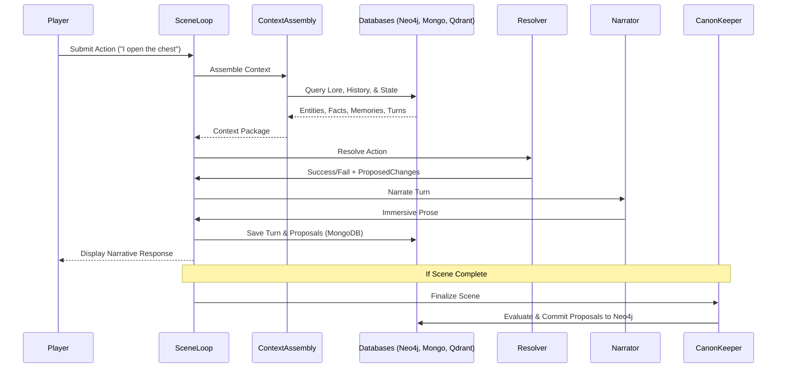
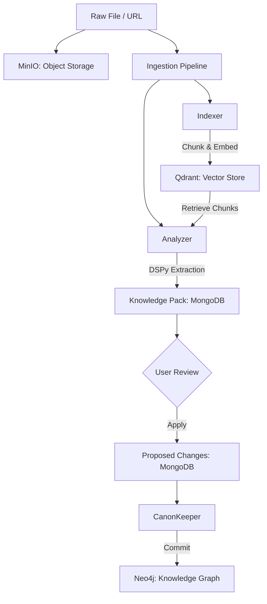

# Data Flows

This document details the primary data movement patterns in MONITOR, illustrating how information travels from user input or source documents into the canonical knowledge graph and back to the narrative interface.

---

## 1. Gameplay Turn Flow (The Core Narrative Loop)

This flow occurs every time a player submits an action in a Solo Play or Assisted session.

---

## 2. Document Ingestion Flow (Knowledge Extraction)

This flow describes how a raw PDF or URL is converted into structured world knowledge.

---

## 3. World Advance Flow (Simulation)

This flow occurs between scenes to ensure the world evolves even when the player is not present.

1. **Trigger:** `StoryLoop` detects a scene has completed.
2. **Context Gathering:** `StoryLoop` gathers active factions and high-impact world events from Neo4j.
3. **Simulation:** The `Simulacrum Agent` (acting as a council of NPCs) processes the time jump.
4. **Outcome:** Factions advance their agendas (clocks), and environmental state shifts.
5. **Persistence:** Simulation results are staged as `Facts` and committed to Neo4j via `CanonKeeper`.

---

## 4. Continuity & Memory (Retrieval Augmented Generation)

How the system "remembers" things during play:

- **Semantic Recall:** `ContextAssembly` queries Qdrant using the player's current action as a vector query. This pulls in character memories and lore snippets that "feel" relevant.
- **Structural Recall:** `ContextAssembly` queries Neo4j for the direct relationships of entities present in the current scene (e.g., "Who is this NPC's enemy?").
- **Narrative Recall:** `ContextAssembly` pulls the last 10-20 turns from MongoDB to maintain conversational coherence and immediate context.

---

## 5. Security & Authority Flow

Every data flow that results in a write operation is gated by the **Authority Middleware**:

1. **Request:** Agent calls a Tool (e.g., `neo4j_create_entity`).
2. **Identification:** Middleware identifies the calling Agent Type (e.g., `Narrator` vs `CanonKeeper`).
3. **Validation:** Middleware checks the `AUTHORITY_MATRIX`.
4. **Enforcement:**
   - If Authorized: Tool execution proceeds.
   - If Unauthorized: Returns a `403 Forbidden` error, preventing illegal writes to the Knowledge Graph.
