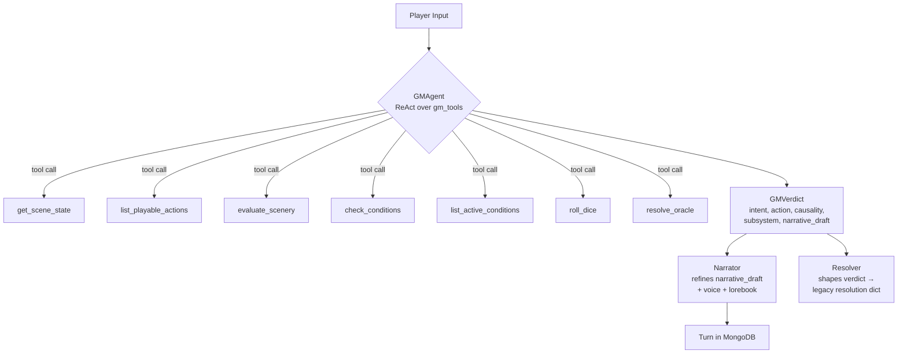

# GM as Authority — Inversion of Control

> Status: living document. Last updated 2026-07-17.

## The principle

The TTRPG GM is the LM authority on every turn. It reads player input,
considers the world state, decides whether a roll is needed, and
narrates consequences. The GMAgent LLM emits `intent_type`,
`roll_necessity`, and `action_type` **directly** in its verdict — these
were once separate embedding classifiers the resolver consulted before
the LLM saw the action; now the decider owns them. The remaining tools
(scene state, playable actions, scenery, conditions, dice, oracle) are
**sensors** the GM consults when uncertain — not referees the GM defers to.

Before this refactor the resolver composed a resolution dict from
classifier votes *before* the LLM saw the action. The LLM narrated
downstream of those votes. After the refactor the GMAgent owns a
ReAct loop over the gm_tools registry and calls sensors as tools.

> **2026-07-17 update.** The `classify_intent` / `classify_roll_necessity` /
> `route_action` tools were **removed** — the GMAgent LLM emits those fields
> directly, so an embedding-nearest sensor for them was redundant. The
> remaining schema/condition sensors were demoted onto a single embedding
> owner, `RetrievalService.nearest` (see
> ``docs/architecture/RETRIEVAL_SERVICE.md``). Embeddings now serve retrieval
> only.

## Three agents, three concerns

### `GMAgent` (`packages/agents/src/monitor_agents/gm_agent.py`)

The LM authority. Hosts `dspy.ReAct` over the gm_tools registry.

- **Inputs**: player_input, character_name, character_role, play_mode,
  roll_mode, established_facts, scene_entities, recent_turns,
  upstream_action_context (from the resolver), upstream_pending_roll.
- **Outputs (via trajectory + extract)**: intent_type, action_type,
  roll_necessity, causality_action, suggested_stat, suggested_dc,
  subsystem_hint, declares_outcome, pushback_prompt, narrative_draft,
  reasoning.
- **Fallback chain**:
  1. ReAct loop bounded at 5 tool calls. If the LLM doesn't converge,
     fall through.
  2. Run `GMAwarenessModule.predict()` (the deterministic seed) to
     produce a structured verdict.
  3. If the seed also fails, return a verdict with `intent_type=ACTION,
     causality_action=ACCEPT` and a populated `reasoning` field
     explaining the failure.
- **Never raises** out of `decide()`.

### `Narrator` (`packages/agents/src/monitor_agents/narrator.py`)

The downstream refiner. Polishes the GMAgent's narrative_draft into
voice-paced prose, reconciling it with the resolver's outcome.

- **Path 1 — 3-step reconcile (gm_verdict given)**: a small
  `dspy.Predict` (CompatCheckModule) judges draft↔outcome compatibility
  and dispatches — COMPATIBLE refines cleanly, DIVERGES refines with an
  outcome anchor so the polish step reconciles the contradiction,
  INCOMPATIBLE drops the draft and regenerates from the outcome. For
  non-rolled turns (trivial / forced_narrative / propose_roll /
  narrative) the compat check is skipped — the draft IS the story.
  Empty draft → falls back to legacy Path 2.
- **Path 2 — legacy generate (gm_verdict = None)**: runs the existing
  `_generate_narrative_and_proposals` from raw resolution. Used when
  GMAgent is unavailable or the test seam bypasses it.

**Which path runs where (current state):**

| Caller | Passes `gm_verdict`? | Narrator path |
|---|---|---|
| `scene_loop.narrate` (production play) | **Yes** — the resolver returns `(resolution, gm_verdict)`; the scene loop forwards the verdict. | Path 1 (3-step reconcile) |
| Direct `GMAgent.decide` callers + the LLM-vs-LLM harness | Yes | Path 1 (3-step reconcile) |
| Tests / seams that bypass GMAgent | No | Path 2 (legacy generate) |

So in production the GM is fully the **decision** authority (intent /
roll / causality / stat-DC come from the `GMVerdict`), **and** the
GM's `narrative_draft` is the seed of the final prose (the 3-step
reconcile checks the draft against the rolled outcome and either
refines, anchors-refines, or regenerates as needed).

### `Resolver` (`packages/agents/src/monitor_agents/resolver.py`)

The thin state-machine. Builds scene state, delegates to GMAgent,
shapes the verdict for downstream consumers.

- **Public API unchanged**: `resolve_turn(scene_id, user_input, context,
  game_context, play_mode, roll_mode, tension_score)`.
- **Internal flow**: build `ResolutionState` → `gm_agent.decide(...)`
  → shape `GMVerdict` into the legacy resolution dict.
- **Backward compat**: tests that patch
  `monitor_agents.resolver.check_gm_awareness` continue to work via a
  detected-patch path (the resolver honors the patched function and
  converts its GMAwareness result to a GMVerdict).

## The gm_tools registry

7 tools exposed via `monitor_agents.gm_tools.GM_TOOLS()`:

| Tool | Purpose | Used by GM for |
|---|---|---|
| `get_scene_state` | Schema + active conditions + resources | "what's true right now?" |
| `list_playable_actions` | Schema-anchored legal action set, filtered by conditions | "is this playable?" |
| `evaluate_scenery` | Scenery rule modifiers (via `RetrievalService.nearest`) | "does the scene shift this roll?" |
| `check_conditions` | Condition triggers vs events (via `RetrievalService.nearest`) | "did an event fire a tag?" |
| `list_active_conditions` | Active character conditions | "what's tagged on the player?" |
| `roll_dice` | `monitor_data.utils.dice.roll_dice` (sync RNG) | "actually roll" |
| `resolve_oracle` | `Oracle.resolve_question` | "answer a yes/no world truth" |

The former `classify_intent` / `classify_roll_necessity` / `route_action`
tools are gone — `intent_type` / `roll_necessity` / `action_type` come
straight off the GM verdict.

Looping model: DSPy `ReAct` is synchronous. Some tools are async (scene
state hits the DB; scenery/conditions hit `RetrievalService`). The GMAgent
runs ReAct inside `asyncio.to_thread` and installs a bridge
(`run_coroutine_threadsafe`) that submits coroutines to the host event loop
and blocks the ReAct thread on the result. Tests use `asyncio.run` as the
bridge so the async tools resolve synchronously in hermetic contexts. The
autouse test fixture resets that bridge around every test so a live-loop
bridge can't leak between tests.

## Fail-loud contract

Tools that reach embeddings (scenery/condition matching, via
`RetrievalService.nearest`) follow the same contract on missing embedding
provider: `EmbeddingProviderError` raised → tool wrapper catches → returns a
JSON `{"error": "fail_loud", ...}` payload.

The GMAgent's ReAct loop's observation field sees this fail_loud JSON,
treats it as "no useful signal here", and continues to its other
tools. The GMAgent's fallback chain (ReAct → seed → bare-bones default)
catches any structural failure so the resolver always receives a
verdict.

**No silent fallback. No fabricated verdicts. The loop never lies
about what it knows.**

## Latency budget

| Stage | Latency (live env) |
|---|---|
| ReAct loop (GMAgent.decide) | 5-25s for ≤5 tool calls |
| Narrator refinement | 5-15s (one ChainOfThought call) |
| Resolver shaping | negligible (~10ms) |
| MongoDB writes | 0.5-2s |
| **End-to-end turn** | **~15-60s** |

Pre-refactor median was ~14.8s; the new path is in the same order
of magnitude with clearer error paths.

## Migration guide for downstream consumers

Most callers don't need to change anything:

- **`scene_loop.run()`** — consumes a resolution dict. Unchanged shape.
- **`combat_loop.resolve_combat_action`** — calls
  `await gsr.infer_action_stat(...)`. Unchanged.
- **`live_session_observe.py`** — observes turns via the HTTP API.
  Unchanged.
- **Backend (HTTP routers)** — pass-through. Unchanged.

The only caller that should migrate is anyone who wants the **gm_verdict**
directly (e.g., the UI to show "GM rolled the dice" feedback). Call
`GMAgent.decide(...)` directly in that path; the resolver is not
involved.

## Files

- `packages/agents/src/monitor_agents/gm_agent.py`
- `packages/agents/src/monitor_agents/gm_tools/` (7 tools: scene_state, conditions, dice, oracle)
- `packages/agents/src/monitor_agents/resolver.py` (refactored thin)
- `packages/agents/src/monitor_agents/narrator.py` (refines GM verdict)
- `packages/agents/tests/test_gm_tools.py` (registry tests)
- `packages/agents/tests/test_gm_tools_properties.py` (hypothesis properties)
- `packages/agents/tests/test_gm_tools_mutations.py` (fault injection)
- `packages/agents/tests/test_gm_agent.py` (GMAgent ReAct tests)
- `packages/agents/tests/test_scene_state_tools.py` (per-tool tests)
- `packages/agents/tests/test_narrator_refines.py` (refinement path)
- `packages/agents/tests/test_resolver_gm_loop.py` (GM-driven resolver)
- `scripts/e2e_full_loop.py` (the E2E harness)
- `scripts/death_in_space_game_system.py` (DiS fixture)
- `docs/testing/E2E_GM_AUTHORITY_<date>.md` (per-session analysis)

## Post-refactor call: do we still need a small custom SLM?

Yes — for the **98% case the embeddings and the LLM don't handle well**:

1. **Multi-input reasoning**: action + character state + world
   context + recent turns → decision. Embeddings take one input;
   an LLM Reasoner takes one input *class*. A small trained model with
   structured features is what fills this.
2. **World-aware action understanding**: *feeding* at *frenzy* vs at
   *cold blood* in VtM is a different DC. Embeddings can't see frenzy.
   A trained classifier with character-state features can.
3. **Latency at scale**: a fine-tuned classifier at 10ms beats an
   embed call + cosine over hundreds of routes.

The tool surface already makes this drop-in easy: the schema/condition
sensors resolve through `RetrievalService.nearest`, so a trained SLM plugs
in at that single boundary — the GM is still the authority; the SLM just
answers "is this the right condition?" with finer context than embeddings.
(The standalone roll/intent classifiers are gone: the GMAgent LLM already
emits those fields, and an SLM for them would re-introduce a decider
competing with the LLM.)

That's a follow-up PR. The current refactor is the structural
prerequisite.

## Audit log

| Date | Action | Commit |
|---|---|---|
| 2026-07-15 | gm_tools T1 — registry + semantic tools wrapper | `7db50a91` |
| 2026-07-15 | gm_tools T2 — scene-state retrieval | `7bb50f91` |
| 2026-07-15 | gm_agent T3 — ReAct loop + GMVerdict | `0f8b411f` |
| 2026-07-15 | narrator T4 — downstream refiner | `e0101cb5` |
| 2026-07-15 | resolver T5 — thin state-machine | `a95cd122` |
| 2026-07-15 | resolver T6 — pushback-ignored-roll wires | `799b17c7` |
| 2026-07-15 | tests T7 — property + mutation tests | `a8f14927` |
| 2026-07-15 | scripts T8 — E2E harness + DiS fixture | `fc03d034` |
| 2026-07-15 | docs T9 (this file) | (pending) |
| 2026-07-17 | Removed `classify_intent`/`classify_roll_necessity`/`route_action` tools (LLM emits directly); demoted scenery/condition sensors onto `RetrievalService.nearest` | `gm-tool-authority` (P4–P5) |
