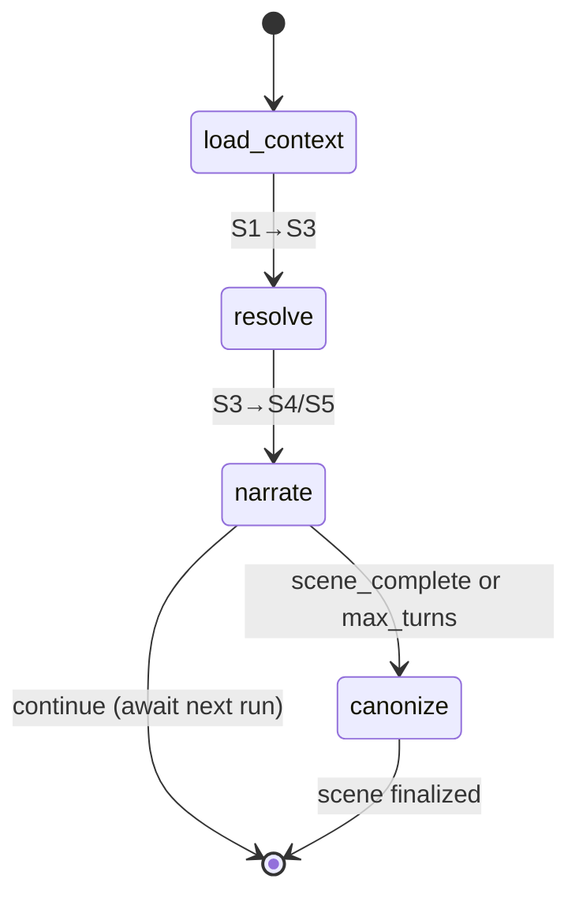
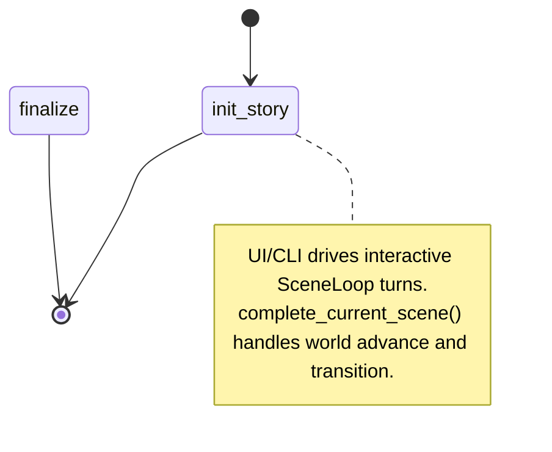
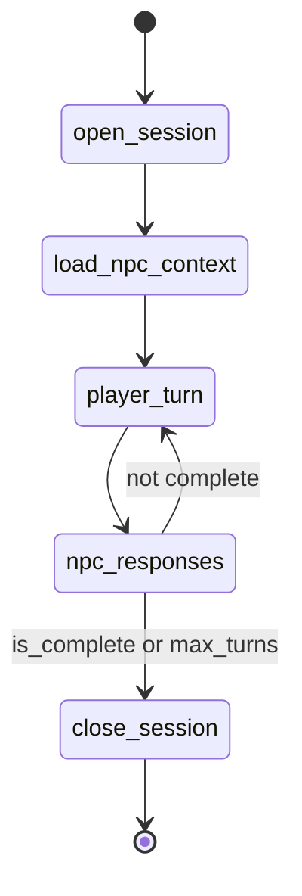
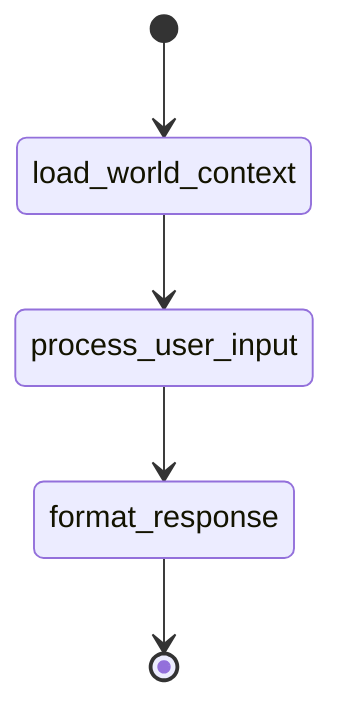

## Agent Specifications

### Loop Orchestration (LangGraph State Machines)

> **Implementation:** `packages/agents/src/monitor_agents/loops/`

Instead of a monolithic Orchestrator agent, MONITOR uses **LangGraph `StateGraph`** state machines. Each loop is a compiled graph whose nodes call the appropriate agents.

**SceneLoop** (core play loop):

- **Checkpointed:** Yes (`MongoDBSaver` — survives process restarts)
- **Nodes:** `load_context` (ContextAssembly) → `resolve` (Resolver) → `narrate` (Narrator) → `canonize` (CanonKeeper)

**StoryLoop** (campaign lifecycle):

- **Checkpointed:** Yes (`MongoDBSaver`)
- **Nodes:** `init_story`; scene completion calls `simulate_world_advance` + `transition_scene` from `complete_current_scene()`.

**TurnLoop removed:** single-turn play is handled directly by `SceneLoop` (`ContextAssembly` → `Resolver` → `Narrator` → persistence). Scene remains the durability boundary.

**ConversationLoop** (NPC dialogue — DIRECT or ACTOR mode):

- **No Resolver** (no dice rolls), **no CanonKeeper mid-loop** (proposals staged at session end)
- Uses **NPCVoice** agent with `ModelRole.LIGHT` for responsive dialogue

**WorldBuildingLoop** (collaborative setting creation):

- Uses **WorldArchitect** agent; auto-commits proposals via CanonKeeper
- No dice, no scenes — pure conversational world definition

---

