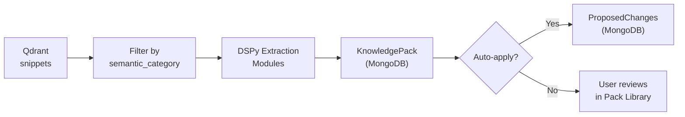

### 6. Analyzer Agent

> **Implementation:** `packages/agents/src/monitor_agents/analyzer.py`

**Responsibility:** Extract structured knowledge from ingested text chunks

**Authority:**
- Read: Qdrant (search chunks by `semantic_category` filter)
- Write: MongoDB (KnowledgePack, IngestionJob progress, ProposedChanges)
- Canonize: no (all writes go through CanonKeeper via ProposedChanges)

**What it does:**
- Retrieve chunks by semantic category (LLM-free, zero-noise) with fallback to semantic search
- Run 6 DSPy extraction modules:
  1. `GameSystemDetectionModule` — detect if this is a game system
  2. `AxiomExtractionModule` — ontological truths ("Magic exists")
  3. `EntityExtractionModule` — archetypes ("Wizard", "Dragon")
  4. `LoreFactExtractionModule` — specific facts ("The Sundering happened 1000 years ago")
  5. `GameRuleExtractionModule` — mechanical rules
  6. `CharacterSheetExtractionModule` — character creation procedures
- Create a `KnowledgePack` in MongoDB (status=ready) with all extracted content
- Optionally auto-apply the pack → creates ProposedChanges for CanonKeeper

**Pipeline:**

---

### 7. IngestionPipeline Agent

> **Implementation:** `packages/agents/src/monitor_agents/ingestion_pipeline.py`

**Responsibility:** Orchestrate the full document ingestion flow

**Authority:**
- Write: MinIO (upload raw file), MongoDB (Document, IngestionJob, KnowledgePack), Neo4j (Source node only via MCP)
- Delegates to: Indexer (chunking + embedding), Analyzer (knowledge extraction)

**What it does:**
- Upload raw file to MinIO
- Create Neo4j Source node
- Create MongoDB Document record + IngestionJob progress tracker
- Dispatch to Indexer for chunking + embedding
- Dispatch to Analyzer for knowledge extraction
- Track progress through stages: `upload → extract → embed → analyze`

**See:** [§3. File Ingestion Pipeline](#) in this doc for the full step-by-step diagram.

---

### 8. WorldArchitect Agent

> **Implementation:** `packages/agents/src/monitor_agents/world_architect.py`

**Responsibility:** Conversational world-building partner

**Authority:**
- Read: Neo4j (entities, axioms, facts)
- Write: Neo4j (via CanonKeeper auto-accept)

**What it does:**
- Guide users through collaborative world creation via conversation
- Run DSPy `WorldArchitectModule` to extract entities, axioms, and lore facts from descriptions
- Build structured proposals from extracted elements
- Auto-commit proposals via CanonKeeper (user is deliberately defining their world)
- Analyze gaps via `WorldGapAnalysisModule` and suggest what to define next

**Called by:** `WorldBuildingLoop`

---

### 9. NPCVoice Agent

> **Implementation:** `packages/agents/src/monitor_agents/npc_voice.py`

**Responsibility:** Speak directly as an NPC character

**Authority:**
- Read: Neo4j (entity + fact lookup)
- Write: MongoDB (conversation turns)
- Canonize: no (proposals staged for CanonKeeper)

**What it does:**
- **DIRECT mode:** Real-time in-character NPC dialogue using a LIGHT LLM model (Claude Haiku / GPT-4o-mini class)
- **ACTOR mode:** Out-of-character actor reflections for GM prep
- Persist conversation turns to MongoDB
- Stage relationship-change and profile-update proposals
- Multiple NPCs can participate sequentially in a single session

**LLM Role:** `ModelRole.LIGHT` (fast + cheap for responsive dialogue)

**Called by:** `ConversationLoop`

---

### 10. GameSystemRuntime (Logic Engine)

> **Implementation:** `packages/agents/src/monitor_agents/game_system.py`

**Responsibility:** Schema-driven rules engine

**Authority:** None (pure in-memory logic, no DB reads/writes)

**What it does:**
- Load a game system document from MongoDB and derive all behavior from the schema
- Infer action type, stat name, and difficulty class from player input
- Calculate modifiers from character attributes
- Produce compact rules summaries for Narrator and Resolver injection
- Roll characters according to the game system's creation procedure

**Used by:** Resolver (dice resolution), Narrator (rules context), chat router (character creation)

---

