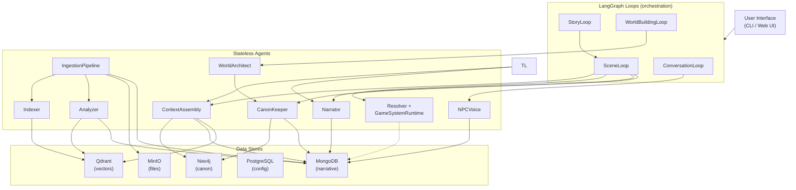

# MONITOR Agent Orchestration

*Multi-agent coordination for narrative intelligence: roles, responsibilities, and communication patterns.*

---

## Core Principle

MONITOR is **not a monolithic AI**.

It is a **coordinated system of specialized agents**, each with:
- Clear responsibilities
- Bounded authority
- Explicit communication protocols
- Access to shared memory systems

**There is no "one agent does everything."** Complexity is distributed.

---

## Agent Design Philosophy

### 1. Specialization over Generalization

Each agent is expert in **one thing**:
- Context assembly
- Narrative generation
- Rules resolution
- Continuity checking
- Memory management

**Anti-pattern:** "Universal GM agent that does everything"

### 2. Stateless Agents, Stateful Data

Agents are **computation units**.

State lives in the databases:
- Neo4j (canonical truth)
- MongoDB (narrative + proposals)
- Qdrant (semantic index)

Agents can be restarted, replaced, or scaled without data loss.

### 3. Explicit Communication

Agents communicate via:
- **Shared data stores** (primary)
- **Message passing** (coordination)
- **Event bus** (optional, for loose coupling)

No "hidden" agent-to-agent calls. All coordination is observable.

### 4. Authority Boundaries

Each agent has explicit **write authority**:
- What it can read
- What it can propose
- What it can canonize

**The canonization gate is the only place authority is enforced.**

> **Note:** This document is the orchestration reference model. For the currently implemented agent surface, verify `packages/agents/src/monitor_agents/` and the root canonical docs (`SYSTEM.md`, `STRUCTURE.md`, `ARCHITECTURE.md`).

---

## The Agent Roster

MONITOR uses **10 agent classes** plus **4 LangGraph loop state machines**:

> **Note:** There is no monolithic `Orchestrator` agent. Loop orchestration is handled by LangGraph `StateGraph` state machines in `packages/agents/src/monitor_agents/loops/`. Each loop is a compiled graph whose nodes call the appropriate agents.

## Verified Entry Surfaces (April 2026)

| Surface | File | What it dispatches |
|---------|------|--------------------|
| **Web play / chat** | `packages/ui/backend/src/monitor_ui/routers/chat.py` | session bootstrap, `WorldBuildingLoop`, pre-play character setup, and `SceneLoop` turns |
| **Document ingest** | `packages/ui/backend/src/monitor_ui/routers/ingest.py` | queued `IngestionPipeline` runs with MongoDB-backed job tracking and shutdown recovery |
| **CLI validation** | `packages/cli/src/monitor_cli/commands/playtest.py` | end-to-end live gameplay smoke and benchmark runs via `scripts/live_gameplay_smoke.py` |

> Older references to an `Orchestrator` in historical notes should now be read as **UI/session bootstrap plus LangGraph loop control**, not as a monolithic agent class.

---

