# 01 — Macro-Diagrama

> Vista completa del sistema MONITOR. Todos los agentes, loops, bases de datos,
> herramientas MCP, módulos de IA, y boundaries de autoridad en un solo canvas.

## Descripción

Este diagrama muestra la arquitectura completa de MONITOR en 6 zonas:

- **Usuarios**: Jugador, Game Master, World Architect
- **Capa 3 (Interface)**: CLI (Typer) + Web UI (FastAPI + Next.js)
- **Capa 2 (Agents)**: 6 LangGraph Loops + 12 Specialized Agents + AI Modules
- **Capa 1 (Data Layer)**: 8 grupos de MCP Tools + 5 DB Clients + Pydantic Schemas + Authority Middleware
- **Infrastructure**: Neo4j, MongoDB, Qdrant, PostgreSQL, MinIO
- **Externos**: LLM Providers (OpenAI, Anthropic, Gemini, etc.)

### Loops (LangGraph StateGraphs)

| Loop | Rol | Invocado por |
|------|-----|-------------|
| StoryLoop | Progresión de campaña, transiciones entre escenas | CLI / Web UI |
| SceneLoop | Turno narrativo interactivo (6 nodos) | StoryLoop / Web UI |
| CombatLoop | Combate táctico (embebido en SceneLoop) | SceneLoop |
| ConversationLoop | Diálogo NPC (modos DIRECT y ACTOR) | SceneLoop |
| WorldBuildingLoop | Creación colaborativa de mundo | Web UI |
| CharacterCreationLoop | Creación de personaje schema-driven | StoryLoop |

### Agentes (12)

ContextAssembly, Resolver, Narrator, CanonKeeper, Indexer, Analyzer,
IngestionPipeline, WorldArchitect, NPCVoice, RecapAgent, SimulacrumAgent,
NPCSceneGenerator

### Flujo SceneLoop (real, del código)

`load_context → resolve → narrate → check_events → persist_turn_artifacts → [canonize | END]`

Donde `check_events` es el nodo del ResourceEngine (Fase Alto).

## Diagrama

```mermaid
graph TB
    subgraph USERS["🎮 Usuarios"]
        PLAYER["Jugador (Solo Play)"]
        GM["Game Master (Asistido)"]
        ARCHITECT["World Architect"]
    end

    subgraph L3["🖥️ Layer 3: Interface (monitor-cli / monitor-ui)"]
        CLI["CLI (Typer)\nmonitor play | ingest | manage"]
        WEB["Web UI (FastAPI + Next.js)\nChat API + WebSocket"]
        REPL["REPL interactivo"]
    end

    subgraph L2["🧠 Layer 2: Agents (monitor-agents)"]
        subgraph LOOPS["LangGraph Loops"]
            STORY["StoryLoop\n(progresión de campaña)"]
            SCENE["SceneLoop\n(turnos narrativos)\nload_context → resolve → narrate\n→ check_events → persist → canonize"]
            COMBAT["CombatLoop\n(combate táctico)"]
            CONV["ConversationLoop\n(diálogo NPC)\nDIRECT · ACTOR"]
            WORLD["WorldBuildingLoop\n(creación de mundo)"]
            CHAR["CharacterCreationLoop\n(creación de personaje)"]
        end

        subgraph AGENTS["Specialized Agents (BaseAgent)"]
            CA["ContextAssembly\n(ensamblaje de contexto)\nTri-Modal RAG"]
            RES["Resolver\n(reglas y dados)"]
            NAR["Narrator\n(prosa narrativa)\n→ AgentToolAdapter"]
            CK["CanonKeeper\n(guardián de verdad)\nÚNICO escritor Neo4j"]
            IDX["Indexer\n(chunking + embedding)"]
            ANL["Analyzer\n(extracción DSPy)"]
            IP["IngestionPipeline\n(orquestación de ingesta)\n→ compone Indexer + Analyzer"]
            WA["WorldArchitect\n(construcción de mundo)"]
            NPCV["NPCVoice\n(voz de personaje)"]
            RECAP["RecapAgent\n(síntesis de historia)"]
            SIM["SimulacrumAgent\n(simulación de facciones)"]
            NPCG["NPCSceneGenerator\n(generación de escenas)"]
        end

        subgraph AI["AI Modules"]
            DSPY["DSPy Modules\n(razonamiento creativo)"]
            GSR["GameSystemRuntime\n(runtime de sistema de juego)"]
            INSTR["instructor\n(salida Pydantic estricta)"]
            LITELLM["LiteLLM\n(abstracción de proveedor)"]
        end
    end

    subgraph L1["💾 Layer 1: Data Layer (monitor-data-layer)"]
        subgraph MCP["MCP Tools"]
            N4J_T["Neo4j Tools\n(entidades, hechos, relaciones)"]
            MONGO_T["MongoDB Tools\n(escenas, turnos, propuestas)"]
            QDR_T["Qdrant Tools\n(búsqueda semántica)"]
            PG_T["PostgreSQL Tools\n(configuración, providers)"]
            MINIO_T["MinIO Tools\n(archivos fuente)"]
            INGEST_T["Ingest Tools\n(chunking, dedup, modelos)"]
            RPG_T["RPG Tools\n(dados, stats, recursos)"]
            PERC_T["Perception Tools\n(percepción de NPC)"]
            LAIN_T["Lain Tools\n(blast radius, traces, dead code)"]
        end

        subgraph CLIENTS["DB Clients"]
            N4J_C["Neo4jClient\n(Cypher, grafos)"]
            MONGO_C["MongoDBClient\n(documentos, state)"]
            QDR_C["QdrantClient\n(vectores, embeddings)"]
            PG_C["PostgreSQLClient\n(relacional, config)"]
            MINIO_C["MinioClient\n(S3, archivos)"]
        end

        subgraph SCHEMAS["Pydantic Schemas"]
            ENT["EntityCreate/Update\n(arquetipos, instancias)"]
            FACT["FactCreate/Update\n(hechos canónicos)"]
            TURN["TurnCreate/Response\n(acciones de jugador)"]
            PROP["ProposedChange\n(cambios pendientes)"]
            PACK["KnowledgePack\n(paquetes de conocimiento)"]
            JOB["IngestionJob\n(trazabilidad de ingesta)"]
        end

        MW["Authority Middleware\nmiddleware/auth.py\nCanonKeeper = único escritor Neo4j"]
    end

    subgraph INFRA["🗄️ Infrastructure (Docker)"]
        N4J[("Neo4j\nVerdad Canónica\nGrafos")]
        MONGO[("MongoDB\nMemoria Narrativa\nDocumentos + Estado")]
        QDR[("Qdrant\nMotor de Recall\nVectores")]
        PG[("PostgreSQL\nPlano de Control\nConfiguración")]
        MINIO[("MinIO\nAlmacenamiento\nArchivos Fuente")]
    end

    subgraph EXTERNAL["☁️ Externos"]
        LLM["Proveedores LLM\n(OpenAI, Anthropic, Gemini, etc.)"]
    end

    PLAYER --> CLI
    PLAYER --> WEB
    GM --> WEB
    GM --> CLI
    ARCHITECT --> CLI
    ARCHITECT --> WEB

    CLI --> STORY
    CLI --> IP
    WEB --> SCENE
    WEB --> WORLD
    WEB --> CONV

    STORY -->|"invoca por escena"| SCENE
    SCENE -->|"combate detectado"| COMBAT
    STORY -->|"creación de personaje"| CHAR
    SCENE -->|"diálogo profundo"| CONV

    SCENE --> CA
    SCENE --> RES
    SCENE --> NAR
    SCENE --> CK
    STORY --> SIM
    STORY --> RECAP
    WORLD --> WA
    CONV --> NPCV
    CHAR --> GSR

    CA --> N4J_T
    CA --> MONGO_T
    CA --> QDR_T
    RES --> GSR
    RES --> RPG_T
    NAR --> DSPY
    NAR --> INSTR
    CK --> N4J_T
    CK --> MONGO_T
    IDX --> QDR_T
    IDX --> INGEST_T
    ANL --> QDR_T
    ANL --> DSPY
    ANL --> INSTR
    IP --> IDX
    IP --> ANL
    IP --> MINIO_T
    IP --> N4J_T
    IP --> MONGO_T

    DSPY --> LITELLM
    INSTR --> LITELLM
    LITELLM --> LLM

    N4J_T --> N4J_C
    MONGO_T --> MONGO_C
    QDR_T --> QDR_C
    PG_T --> PG_C
    MINIO_T --> MINIO_C

    N4J_C --> N4J
    MONGO_C --> MONGO
    QDR_C --> QDR
    PG_C --> PG
    MINIO_C --> MINIO

    N4J_T --> MW
    MW -->|"solo CanonKeeper escribe"| N4J

    classDef user fill:#f9f,stroke:#333,stroke-width:2px
    classDef layer3 fill:#e1f5fe,stroke:#0288d1,stroke-width:2px
    classDef layer2 fill:#e8f5e9,stroke:#388e3c,stroke-width:2px
    classDef layer1 fill:#fff3e0,stroke:#f57c00,stroke-width:2px
    classDef infra fill:#f3e5f5,stroke:#7b1fa2,stroke-width:2px
    classDef external fill:#ffebee,stroke:#c62828,stroke-width:2px

    class PLAYER,GM,ARCHITECT user
    class CLI,WEB,REPL layer3
    class STORY,SCENE,COMBAT,CONV,WORLD,CHAR,CA,RES,NAR,CK,IDX,ANL,IP,WA,NPCV,RECAP,SIM,NPCG,DSPY,GSR,INSTR,LITELLM layer2
    class N4J_T,MONGO_T,QDR_T,PG_T,MINIO_T,INGEST_T,RPG_T,PERC_T,LAIN_T,N4J_C,MONGO_C,QDR_C,PG_C,MINIO_C,ENT,FACT,TURN,PROP,PACK,JOB,MW layer1
    class N4J,MONGO,QDR,PG,MINIO infra
    class LLM external
```

