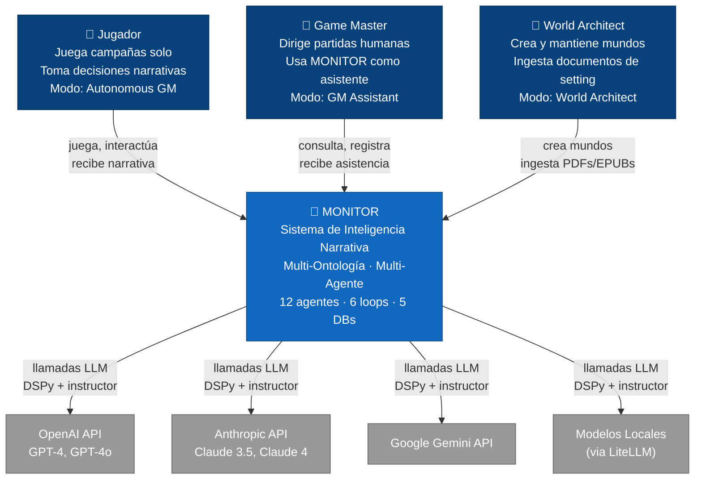

# 02 — C4 Contexto (Nivel 1)

> Diagrama de contexto del sistema según el modelo C4.
> Muestra MONITOR como caja negra, sus usuarios y sus dependencias externas.

## Descripción

**Alcance**: Una sola caja "MONITOR" con:
- **3 tipos de usuario**: Jugador (solo play), Game Master (asistido), World Architect (creación/ingesta)
- **4 dependencias externas**: APIs de LLM (OpenAI, Anthropic, Gemini) + modelos locales vía LiteLLM

Este es el punto de entrada para cualquier stakeholder que quiera entender
qué hace el sistema y con qué interactúa.

## Diagrama

