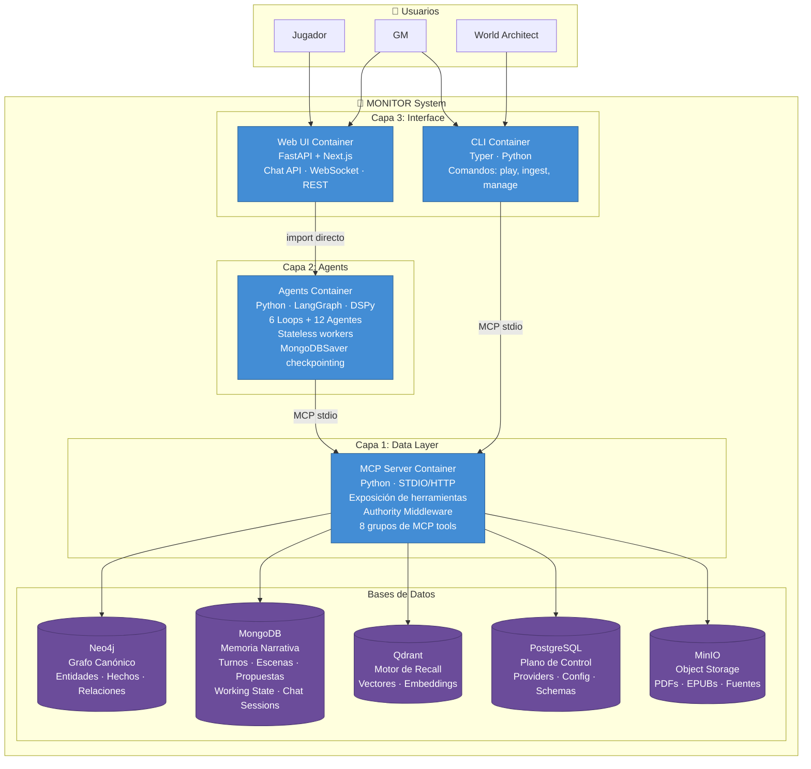

# 03 — C4 Contenedores (Nivel 2)

> Diagrama de contenedores del sistema MONITOR.
> Muestra las aplicaciones, servicios y bases de datos que componen el sistema.

## Descripción

MONITOR se despliega como 4 contenedores de aplicación + 5 bases de datos:

| Contenedor | Tecnología | Responsabilidad |
|-----------|-----------|----------------|
| CLI | Python (Typer) | Comandos: play, ingest, manage |
| Web UI | FastAPI + Next.js | Chat API, WebSocket, REST |
| Agents | Python (LangGraph + DSPy) | Loops + agentes especializados, stateless |
| MCP Server | Python (STDIO/HTTP) | Exposición de herramientas, authority middleware |

**Comunicación entre capas**:
- CLI → MCP Server: vía MCP stdio
- Web UI → Agents: import directo (mismo proceso)
- Agents → MCP Server: vía MCP stdio

## Diagrama

