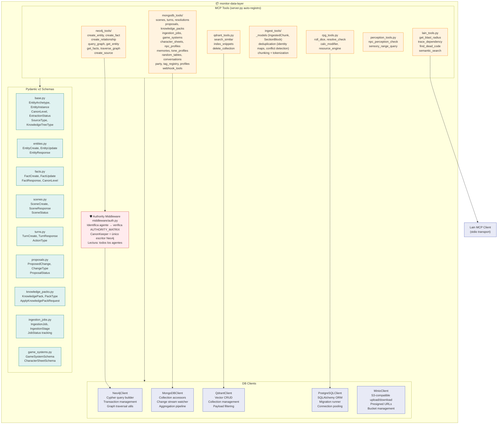

# 04 — C4 Componentes: Data Layer (Nivel 3)

> Componentes internos del Data Layer (`monitor-data-layer`).
> MCP Tools, DB Clients, Pydantic Schemas, y Authority Middleware.

## Descripción

El Data Layer expone todas las operaciones de base de datos como **MCP Tools**,
que son consumidas por los agentes de la Capa 2 vía el protocolo MCP.

### Estructura

| Grupo | Archivo(s) | Operaciones |
|-------|-----------|-------------|
| Neo4j Tools | `neo4j_tools/` | create_entity, create_fact, create_relationship, query_graph, get_entity, get_facts, traverse_graph, create_source |
| MongoDB Tools | `mongodb_tools/` | scenes, turns, resolutions, proposals, knowledge_packs, ingestion_jobs, game_systems, character_sheets, npc_profiles, memories, tone_profiles, random_tables, conversations, party, tag_registry, profiles, webhook_tools |
| Qdrant Tools | `qdrant_tools.py` | search_similar, index_snippets, delete_collection |
| Ingest Tools | `ingest_tools/` | chunking, tokenization, deduplication (identity maps, conflict detection) |
| RPG Tools | `rpg_tools.py` | roll_dice, resolve_check, calc_modifier, resource_engine |
| Perception Tools | `perception_tools.py` | npc_perception_check, sensory_range_query |
| Lain Tools | `lain_tools.py` | blast radius, dependency traces, dead code, semantic search |

### Authority Middleware

El middleware `middleware/auth.py` intercepta todas las llamadas a herramientas de escritura
de Neo4j. Solo el agente **CanonKeeper** tiene permiso de escritura en Neo4j.
Todos los demás agentes pueden escribir en MongoDB y Qdrant.

## Diagrama

