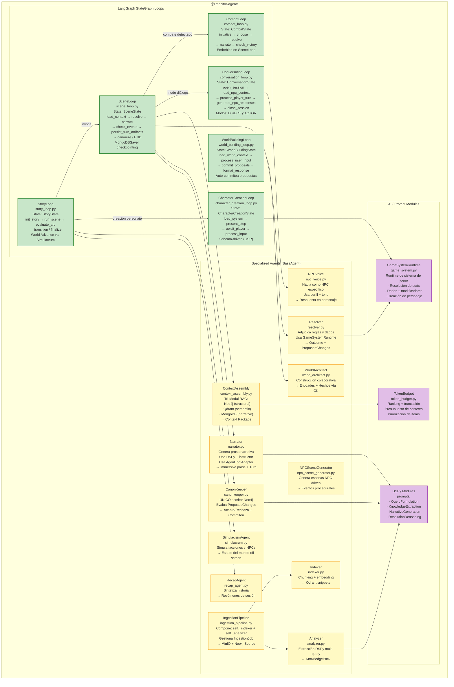
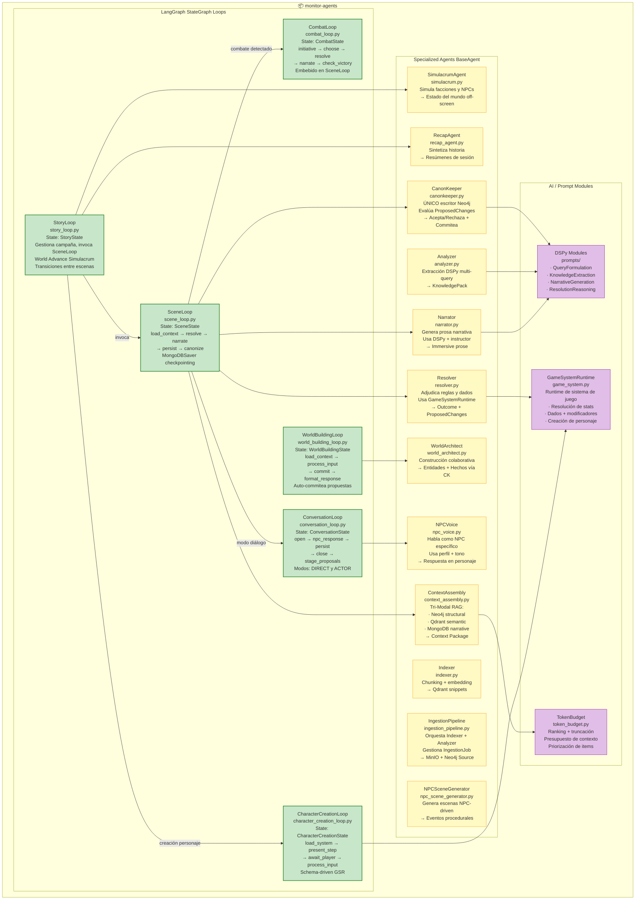

# 05 — C4 Componentes: Agent Layer (Nivel 3)

> Componentes internos del Agent Layer (`monitor-agents`).
> LangGraph Loops, Specialized Agents, y AI/Prompt Modules.

## Descripción

El Agent Layer contiene 6 StateGraphs de LangGraph, 12 agentes especializados,
y 3 módulos de IA. Todo es stateless — el estado se persiste en MongoDB vía MongoDBSaver.

### Loops (StateGraphs)

| Loop | Archivo | Estado | Nodos |
|------|---------|--------|-------|
| StoryLoop | `story_loop.py` | StoryState | init_story, run_scene, evaluate_arc, world_advance, transition, finalize |
| SceneLoop | `scene_loop.py` | SceneState | load_context, resolve, narrate, check_events, persist_turn_artifacts, canonize |
| CombatLoop | `combat_loop.py` | CombatState | roll_initiative, choose_combatant, resolve_action, narrate_combat, check_victory |
| ConversationLoop | `conversation_loop.py` | ConversationState | open_session, load_npc_context, process_player_turn, generate_npc_responses, close_session |
| WorldBuildingLoop | `world_building_loop.py` | WorldBuildingState | load_world_context, process_user_input, commit_proposals, format_response |
| CharacterCreationLoop | `character_creation_loop.py` | CharacterCreationState | load_system, present_step, await_player, process_input |

### Agentes

| Agente | Archivo | Rol | Escritura |
|--------|---------|-----|-----------|
| ContextAssembly | `context_assembly.py` | Tri-Modal RAG (Neo4j+Qdrant+MongoDB) | Read-Only |
| Resolver | `resolver.py` | Adjudica reglas y dados | MongoDB (Resolutions) |
| Narrator | `narrator.py` | Genera prosa narrativa (DSPy+instructor) | MongoDB (Turns) |
| CanonKeeper | `canonkeeper.py` | Guardián de verdad | **Neo4j (Exclusive)** |
| Indexer | `indexer.py` | Chunking + embedding | Qdrant |
| Analyzer | `analyzer.py` | Extracción DSPy multi-query | MongoDB (KnowledgePacks) |
| IngestionPipeline | `ingestion_pipeline.py` | Orquesta Indexer + Analyzer | MinIO, Neo4j (Source), MongoDB |
| WorldArchitect | `world_architect.py` | Construcción colaborativa | Neo4j (vía CanonKeeper) |
| NPCVoice | `npc_voice.py` | Habla como NPC específico | MongoDB (Turns) |
| RecapAgent | `recap_agent.py` | Sintetiza historia | Read-Only |
| SimulacrumAgent | `simulacrum.py` | Simula facciones y NPCs off-screen | MongoDB (Proposals) |
| NPCSceneGenerator | `npc_scene_generator.py` | Genera escenas procedurales | MongoDB (Scenes) |

### AI Modules

| Módulo | Archivo | Rol |
|--------|---------|-----|
| DSPy Modules | `prompts/` | QueryFormulation, KnowledgeExtraction, NarrativeGeneration, ResolutionReasoning |
| GameSystemRuntime | `game_system.py` | Resolución de stats, dados + modificadores, creación de personaje |
| TokenBudget | `token_budget.py` | Ranking + truncación de contexto, priorización de items |

### Composición Interna

- `IngestionPipeline` compone `Indexer` + `Analyzer` internamente (atributos `self._indexer`, `self._analyzer`)
- `Narrator` usa `AgentToolAdapter` internamente para adaptar llamadas MCP

## Diagrama

