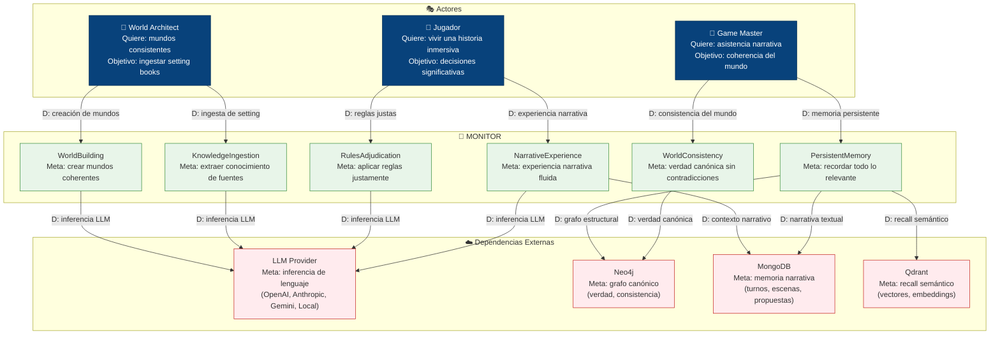
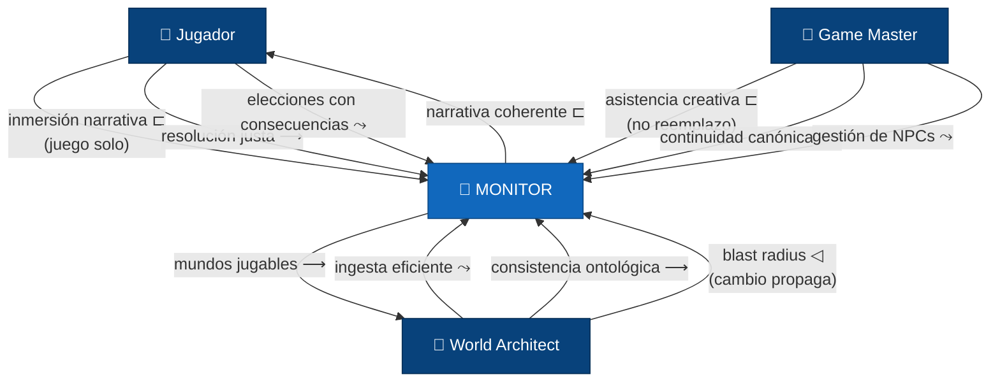

# 06 — i* Strategic Dependency (SD)

> Modelo de dependencias estratégicas entre actores y MONITOR.
> Muestra qué necesita cada actor del sistema y de qué dependencias externas depende MONITOR.

## Descripción

El modelo i* Strategic Dependency (SD) modela las relaciones de dependencia entre actores.
Cada flecha `D:` representa una dependencia: el actor origen depende del actor destino
para satisfacer un objetivo.

### Actores

| Actor | Objetivo principal |
|-------|-------------------|
| Jugador | Vivir una historia inmersiva con decisiones significativas |
| Game Master | Asistencia narrativa con coherencia del mundo |
| World Architect | Mundos consistentes creados desde setting books |

### Goals de MONITOR

| Goal | Descripción | Depende de |
|------|-------------|-----------|
| NarrativeExperience | Experiencia narrativa fluida | LLM Provider, MongoDB (contexto narrativo) |
| WorldConsistency | Verdad canónica sin contradicciones | Neo4j |
| PersistentMemory | Recordar todo lo relevante | Neo4j (estructural) + MongoDB (narrativo) + Qdrant (semántico) |
| RulesAdjudication | Aplicar reglas justamente | LLM Provider |
| KnowledgeIngestion | Extraer conocimiento de fuentes | LLM Provider |
| WorldBuilding | Crear mundos coherentes | LLM Provider |

## Diagrama

