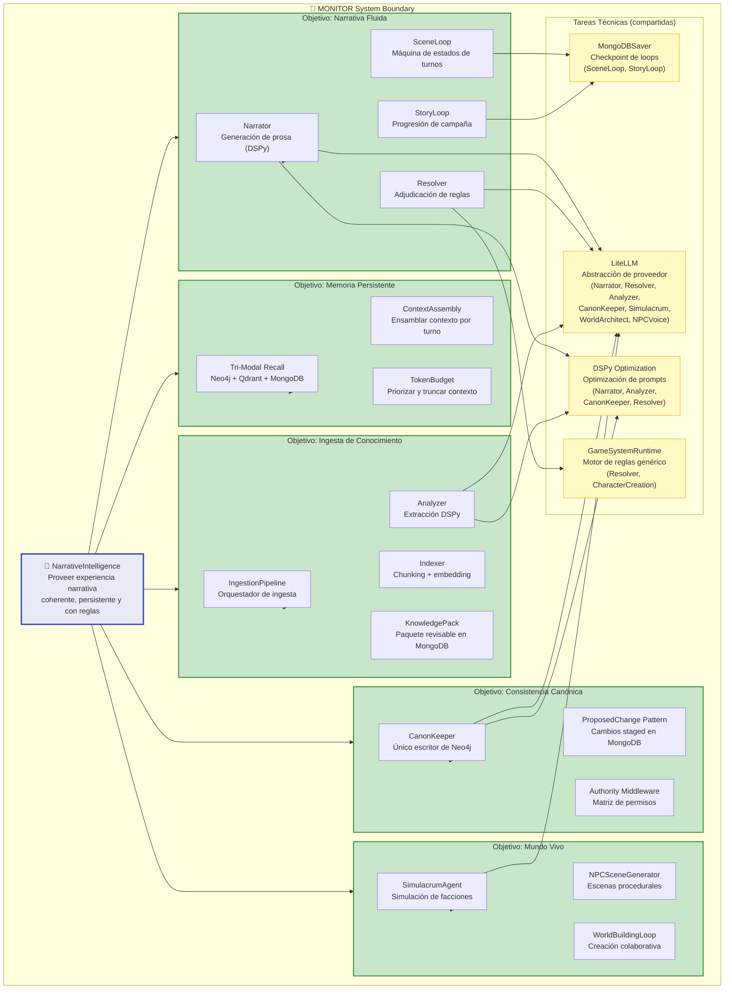

# 07 — i* Strategic Rationale (SR)

> Descomposición interna de objetivos del sistema MONITOR.
> Muestra cómo cada goal de alto nivel se descompone en sub-objetivos,
> tareas técnicas, y dependencias compartidas.

## Descripción

El modelo i* Strategic Rationale (SR) abre la caja negra de MONITOR y muestra
la estructura interna de goals, tasks, resources, y soft-goals.

### Estructura de Goals

| Goal | Sub-objetivos | Dependencias técnicas |
|------|---------------|----------------------|
| G1: Memoria Persistente | Tri-Modal Recall, ContextAssembly, TokenBudget | — |
| G2: Consistencia Canónica | CanonKeeper, ProposedChange Pattern, Authority Middleware | — |
| G3: Narrativa Fluida | Narrator, Resolver, SceneLoop, StoryLoop | MongoDBSaver, LiteLLM, DSPy, GameSystemRuntime |
| G4: Ingesta de Conocimiento | IngestionPipeline, Indexer, Analyzer, KnowledgePack | LiteLLM, DSPy |
| G5: Mundo Vivo | SimulacrumAgent, NPCSceneGenerator, WorldBuildingLoop | LiteLLM |

### Dependencias Compartidas

- **LiteLLM**: Usado por Narrator, Resolver, Analyzer, CanonKeeper, SimulacrumAgent, WorldArchitect, NPCVoice — todos los agentes que llaman LLMs
- **DSPy**: Usado por Narrator, Analyzer, CanonKeeper, Resolver — agentes que necesitan razonamiento creativo estructurado
- **GameSystemRuntime**: Usado por Resolver y CharacterCreationLoop
- **MongoDBSaver**: Usado por SceneLoop y StoryLoop para checkpointing

## Diagrama

