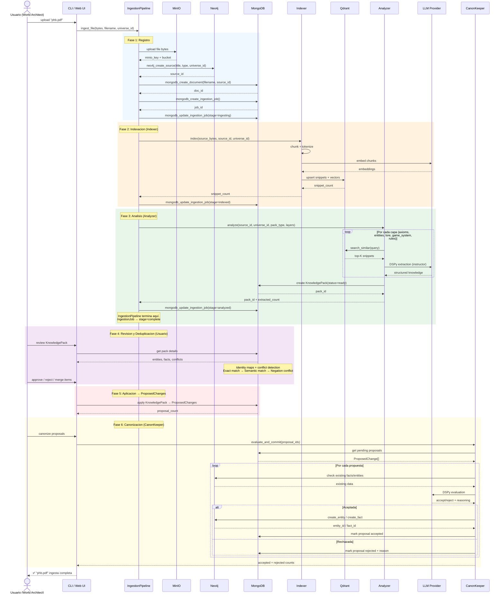

# 08 — Pipeline de Ingestión

> Flujo completo de ingesta de documentos: desde el archivo crudo hasta
> la canonización en Neo4j, pasando por indexación, análisis, y revisión.

## Descripción

El pipeline de ingesta convierte documentos fuente (PDFs, EPUBs, etc.) en
conocimiento canónico estructurado en el Knowledge Graph de Neo4j.

### Fases

| Fase | Responsable | Entrada | Salida |
|------|-------------|---------|--------|
| 1. Registro | IngestionPipeline | File bytes | MinIO key + Neo4j Source + MongoDB Document + IngestionJob |
| 2. Indexación | Indexer | Source bytes | Qdrant snippets (chunks + embeddings) |
| 3. Análisis | Analyzer | Qdrant snippets | KnowledgePack en MongoDB (status=ready) |
| 4. Revisión y Dedup | Usuario + Sistema | KnowledgePack | KnowledgePack revisado + deduplicado |
| 5. Aplicación | Usuario | KnowledgePack aprobado | ProposedChanges en MongoDB |
| 6. Canonización | CanonKeeper | ProposedChanges | Entidades y hechos en Neo4j |

### Notas importantes

- La **deduplicación** (`ingest_tools/deduplication.py`) ocurre durante la fase de
  aplicación del KnowledgePack, no como paso independiente del pipeline.
- El **IngestionJob** se marca como `stage=complete` después de la fase 3 (Analyzer).
  La canonización (fase 6) es un proceso separado disparado por el usuario.
- **CanonKeeper** es el único que escribe en Neo4j. Los ProposedChanges se
  crean en MongoDB y CanonKeeper los evalúa uno por uno.

## Diagrama

