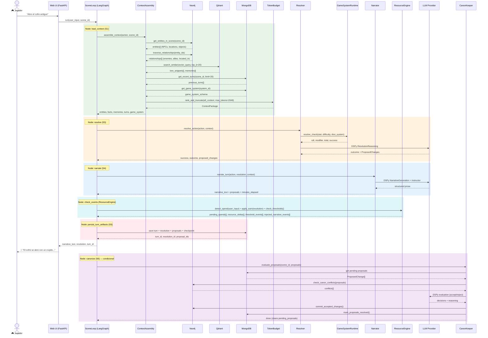

# 09 — Turno de Juego (Core Narrative Loop)

> Secuencia completa de un turno de juego: desde la acción del jugador hasta
> la canonización, pasando por ContextAssembly, Resolver, Narrator, y CanonKeeper.

## Descripción

Este diagrama muestra el flujo exacto de un turno narrativo en MONITOR.
Es el "core loop" que se ejecuta cada vez que un jugador realiza una acción.

### Nodos del SceneLoop (código real)

El grafo `build_scene_graph()` en `scene_loop.py` define estos nodos:

```
load_context → resolve → narrate → check_events → persist_turn_artifacts → [canonize | END]
```

### Fases del Turno

| Fase | Nodo | Agente | Qué hace |
|------|------|--------|----------|
| S1 | load_context | ContextAssembly | Tri-Modal RAG: Neo4j entities + Qdrant memories + MongoDB turns + game system |
| S3 | resolve | Resolver + GSR | Adjudica acción: parsea tipo, aplica reglas, tira dados, produce outcome + ProposedChanges |
| S4 | narrate | Narrator + DSPy | Genera prosa narrativa inmersiva basada en el outcome |
| — | check_events | ResourceEngine | Fase Alto: detecta spends, aplica earns, dispara thresholds |
| S5 | persist_turn_artifacts | — | Persiste turn + resolution + proposals + checkpoint en MongoDB |
| S6 | canonize | CanonKeeper | (Condicional) Evalúa ProposedChanges y commitea a Neo4j |

### Notas

- `check_events` (ResourceEngine / Fase Alto) se ejecuta entre `narrate` y `persist_turn_artifacts`
- La canonización solo ocurre si `scene_complete` o `turns_count >= max_turns`
- El usuario recibe la respuesta narrativa ANTES de la canonización

## Diagrama


