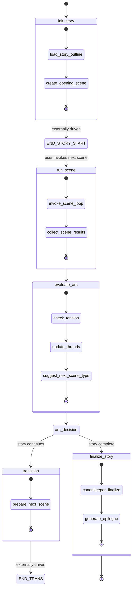
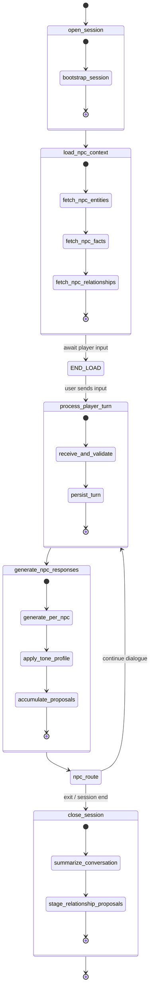
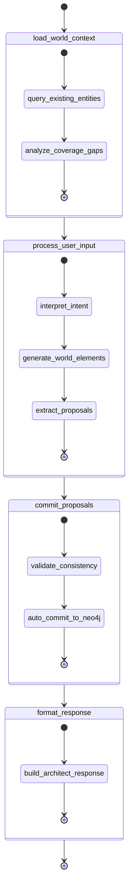
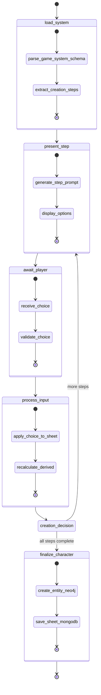

# 10 — Jerarquía de Loops LangGraph

> Máquinas de estado de los 6 StateGraphs de LangGraph.
> Cada diagrama muestra los nodos reales del grafo verificados contra el código fuente.

## Descripción

MONITOR usa LangGraph StateGraph para orquestar 6 loops. Cada loop tiene
checkpointing vía MongoDBSaver, permitiendo supervivencia a restarts y time travel.

### Jerarquía

```
StoryLoop
  ├── SceneLoop
  │     ├── CombatLoop (embebido)
  │     └── ConversationLoop (invocado desde SceneLoop)
  ├── CharacterCreationLoop
  └── WorldBuildingLoop (independiente)
```

---

## 10a. StoryLoop — Progresión de Campaña

**Archivo**: `packages/agents/src/monitor_agents/loops/story_loop.py`
**State**: `StoryState`
**Nodos reales** (de `build_story_graph()`):

```
init_story → END (externally driven)
run_scene → evaluate_arc → transition | finalize
transition → END
finalize → END
```

> **Nota**: `world_advance` (simulate_world_advance) está registrado como nodo pero
> no está conectado en los edges del grafo actual. SceneLoop se invoca externamente
> desde UI/CLI, no como sub-grafo.



---

## 10b. SceneLoop — Ciclo de Turno Narrativo

**Archivo**: `packages/agents/src/monitor_agents/loops/scene_loop.py`
**State**: `SceneState`
**Nodos reales** (de `build_scene_graph()`):

```
load_context → resolve → narrate → check_events → persist_turn_artifacts → canonize | END
canonize → END
```

> **Nota**: `check_events` es el nodo del ResourceEngine (Fase Alto).
> `await_user` NO es un nodo del grafo — el input del usuario se inyecta externamente
> entre invocaciones del grafo. `detect_combat` NO es un nodo del grafo.

```mermaid
stateDiagram-v2
    [*] --> load_context

    state load_context {
        [*] --> query_neo4j_entities
        query_neo4j_entities --> query_qdrant_memories
        query_qdrant_memories --> query_mongodb_turns
        query_mongodb_turns --> load_game_system
        load_game_system --> rank_and_budget
        rank_and_budget --> [*]
    }

    load_context --> resolve

    state resolve {
        [*] --> parse_action_type
        parse_action_type --> apply_game_rules
        apply_game_rules --> roll_dice_if_needed
        roll_dice_if_needed --> produce_outcome
        produce_outcome --> generate_proposed_changes
        generate_proposed_changes --> [*]
    }

    resolve --> narrate

    state narrate {
        [*] --> build_narrative_prompt
        build_narrative_prompt --> generate_narrative_prose
        generate_narrative_prose --> [*]
    }

    narrate --> check_events

    state check_events {
        [*] --> detect_spend_intent
        detect_spend_intent --> apply_earn_from_resolution
        apply_earn_from_resolution --> check_thresholds
        check_thresholds --> inject_narrative_events
        inject_narrative_events --> [*]
    }

    check_events --> persist_turn_artifacts

    state persist_turn_artifacts {
        [*] --> save_turn_mongodb
        save_turn_mongodb --> save_resolution_mongodb
        save_resolution_mongodb --> save_proposals_mongodb
        save_proposals_mongodb --> save_checkpoint
        save_checkpoint --> [*]
    }

    persist_turn_artifacts --> route_decision

    state route_decision <<choice>>
    route_decision --> canonize: scene_complete OR max_turns
    route_decision --> [*]: END (await next user input)

    state canonize {
        [*] --> load_pending_proposals
        load_pending_proposals --> canonkeeper_evaluate
        canonkeeper_evaluate --> commit_to_neo4j
        commit_to_neo4j --> clear_pending_proposals
        clear_pending_proposals --> [*]
    }

    canonize --> [*]
```



---

## 10c. ConversationLoop — Diálogo NPC

**Archivo**: `packages/agents/src/monitor_agents/loops/conversation_loop.py`
**State**: `ConversationState`
**Nodos reales** (de `build_conversation_graph()`):

```
open_session → load_npc_context → END (CLI injects player input)
process_player_turn → generate_npc_responses → close_session | process_player_turn
close_session → END
```

> **Nota**: `player_turn` se llama `process_player_turn` en el código.
> `npc_response` se llama `generate_npc_responses`. No existen nodos `persist_turn`
> ni `check_exit` separados — la persistencia está dentro de `process_player_turn`
> y el exit check es una función de routing.



---

## 10d. WorldBuildingLoop — Creación de Mundo

**Archivo**: `packages/agents/src/monitor_agents/loops/world_building_loop.py`
**State**: `WorldBuildingState`
**Nodos reales** (de `build_world_building_graph()`):

```
load_world_context → process_user_input → commit_proposals → format_response
```

> **Nota**: Auto-commitea propuestas (el usuario está definiendo su mundo deliberadamente).
> No usa ProposedChange — escribe directo a Neo4j vía CanonKeeper.



---

## 10e. CharacterCreationLoop — Creación de Personaje

**Archivo**: `packages/agents/src/monitor_agents/loops/character_creation_loop.py`
**State**: `CharacterCreationState`
**Nodos reales**:

```
load_system → present_step → await_player → process_input → present_step | finalize_character
```


