# 11 — Control & Flujo de Datos

> Jerarquía de loops anidados, roles de cada base de datos,
> y boundaries de autoridad del sistema MONITOR.

## Descripción

Este diagrama integra tres perspectivas:

1. **Jerarquía de Control**: Cómo se anidan e invocan los loops
2. **Flujo de Datos por DB**: Qué se almacena en cada base de datos y quién escribe
3. **Boundary de Autoridad**: El patrón ProposedChange y la matriz de permisos

### Entry Points Reales

No existe un "Main Loop" como clase. Los entry points desde UI/CLI son:

| Entry Point | Invocado desde | Despacha a |
|-------------|---------------|-----------|
| `chat.py` (WebSocket) | Web UI | SceneLoop, WorldBuildingLoop |
| `play.py` (CLI) | CLI | StoryLoop → SceneLoop |
| `ingestion_pipeline.py` | CLI / Web UI | Pipeline de ingesta |

### Roles de Escritura por DB

| Base de Datos | Quién escribe | Quién lee |
|---------------|---------------|-----------|
| **Neo4j** | Solo CanonKeeper (+ Source nodes vía IngestionPipeline) | Todos los agentes |
| **MongoDB** | Todos los agentes (turns, resolutions, proposals, packs, jobs) | Todos los agentes |
| **Qdrant** | Indexer, Analyzer | ContextAssembly, Analyzer |
| **PostgreSQL** | Scripts de admin / seed | LiteLLM routing, configuración |
| **MinIO** | IngestionPipeline | IngestionPipeline, UI |

### Patrón ProposedChange

```
Agente (Narrator, Resolver, Analyzer)
  → crea ProposedChange en MongoDB
    → CanonKeeper evalúa
      → Accept: commit a Neo4j
      → Reject: marca como rejected en MongoDB
```

## Diagrama

```mermaid
graph TB
    subgraph CONTROL["🔄 Jerarquía de Control"]
        direction TB
        CHAT["Chat Router\n(chat.py · WebSocket)\nEntry point principal"]
        CLI_PLAY["CLI play\n(play.py)\nEntry point CLI"]
        STORY["StoryLoop\n(campaña / arco)\ninit_story → run_scene → evaluate_arc\n→ transition / finalize"]
        SCENE["SceneLoop\n(escena interactiva)\nload_context → resolve → narrate\n→ check_events → persist → canonize"]
        COMBAT["CombatLoop\n(combate táctico)\nEmbebido en SceneLoop"]
        CONV["ConversationLoop\n(diálogo NPC)\nDIRECT · ACTOR"]
        CHAR["CharacterCreationLoop\n(creación PJ)\nSchema-driven (GSR)"]
        WORLD["WorldBuildingLoop\n(creación mundo)\nAuto-commitea"]

        CHAT -->|"despacha"| SCENE
        CHAT -->|"despacha"| WORLD
        CLI_PLAY -->|"despacha"| STORY
        STORY -->|"invoca por escena"| SCENE
        STORY -->|"creación personaje"| CHAR
        SCENE -->|"combate detectado"| COMBAT
        SCENE -->|"diálogo profundo"| CONV
    end

    subgraph FLOW["📊 Flujo de Datos por DB"]
        direction LR
        subgraph N4J_ROLE["Neo4j — Verdad Canónica"]
            N4J_W["✅ Escritura: CanonKeeper (único)\n✅ Escritura: Source nodes (IngestionPipeline)\n✅ Lectura: ContextAssembly, todos los agents\n❌ Escritura: Narrator, Resolver, Indexer, Analyzer\n📦 Nodos: Entity, Fact, Relationship, Source\n📦 Relaciones: PARTICIPATED_IN, ALLY_OF, LOCATED_IN..."]
        end
        subgraph MONGO_ROLE["MongoDB — Memoria Narrativa + Estado"]
            MONGO_W["✅ Escritura: Todos los agents\n✅ Lectura: Todos los agents\n📦 Colecciones:\n· scenes, turns, resolutions\n· proposed_changes, knowledge_packs\n· ingestion_jobs, game_systems\n· character_sheets, npc_profiles\n· working_state, chat_sessions\n· tone_profiles, random_tables\n· conversations, memories\n· party, tag_registry, profiles"]
        end
        subgraph QDR_ROLE["Qdrant — Recall Semántico"]
            QDR_W["✅ Escritura: Indexer, Analyzer\n✅ Lectura: ContextAssembly, Analyzer\n📦 Colecciones:\n· knowledge (lore, setting)\n· memories (characters)\n· snippets (source chunks)"]
        end
        subgraph PG_ROLE["PostgreSQL — Plano de Control"]
            PG_W["✅ Escritura: Admin scripts, seeders\n✅ Lectura: LiteLLM routing, config\n📦 Tablas:\n· providers, models, config\n· world_bindings, session_metadata\n· typed game/state records"]
        end
        subgraph MINIO_ROLE["MinIO — Archivos Fuente"]
            MINIO_W["✅ Escritura: IngestionPipeline\n✅ Lectura: IngestionPipeline, UI\n📦 Buckets:\n· source-documents (PDFs, EPUBs)\n· exports, backups"]
        end
    end

    subgraph AUTH["🛡️ Boundary de Autoridad"]
        direction TB
        AGENTS_OUT["Agentes (Narrator, Resolver, Analyzer, etc.)\nCrean ProposedChanges en MongoDB"]
        CK_EVAL["CanonKeeper\nEvalúa cada ProposedChange\nContra el canon existente en Neo4j"]
        PROPOSALS["ProposedChanges\n(staged en MongoDB)\n· entity proposals\n· fact proposals\n· relationship proposals\n· state changes"]
        NEO4J_FINAL["Neo4j Knowledge Graph\nSolo recibe writes de CanonKeeper"]

        AGENTS_OUT -->|"create"| PROPOSALS
        PROPOSALS -->|"evaluate"| CK_EVAL
        CK_EVAL -->|"commit accepted"| NEO4J_FINAL
        CK_EVAL -->|"mark rejected"| PROPOSALS
    end

    CONTROL --> FLOW
    FLOW --> AUTH

    classDef control fill:#e8f5e9,stroke:#388e3c,stroke-width:2px
    classDef neo4j fill:#e3f2fd,stroke:#1565c0
    classDef mongo fill:#fff3e0,stroke:#e65100
    classDef qdrant fill:#f3e5f5,stroke:#7b1fa2
    classDef pg fill:#e8eaf6,stroke:#283593
    classDef minio fill:#ffebee,stroke:#c62828
    classDef auth fill:#fff9c4,stroke:#f9a825

    class CHAT,CLI_PLAY,STORY,SCENE,COMBAT,CONV,CHAR,WORLD control
    class N4J_ROLE,N4J_W neo4j
    class MONGO_ROLE,MONGO_W mongo
    class QDR_ROLE,QDR_W qdrant
    class PG_ROLE,PG_W pg
    class MINIO_ROLE,MINIO_W minio
    class AGENTS_OUT,CK_EVAL,PROPOSALS,NEO4J_FINAL auth
```


