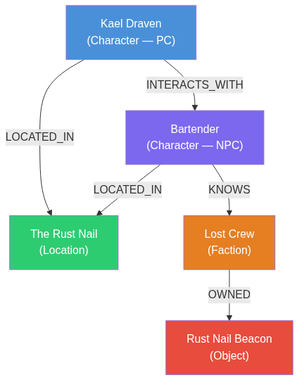

*Part 1 of a series about MONITOR, a narrative intelligence system for role-playing games.*

I’ve been building something for about half a year now. After a while of having no name, it became known (in honor of a certain DC Comics character) as **MONITOR**: a system capable of running a complete tabletop RPG campaign with persistent memory, coherent narration, and truly applied rules, without needing a human on the other side of the table. It doesn’t just narrate; it can also ingest books, texts, and learn the game it wants to play “on the fly.”

It’s not finished. But it is working, with tests to prove it. In these posts, I intend to document the process: the technical decisions, the problems I encountered, and why I built this from scratch instead of using any of the existing tools (and why I didn’t like them).

Let’s begin.

## Twenty Years of Role-Playing

I started in high school. D&D first, then Vampire: The Masquerade, and from there I ventured into more things: World of Darkness, Werewolf, Cyberpunk, the 2d20 system, narrative games like PbtA, City of Mist, Fiasco, 2d20, and more.

I always liked trying new systems. Some people stick to D&D their whole lives and that’s perfectly fine (no, actually I think it’s not fine, but that’s a topic for another post). I was the kind of player who, when something different came out, wanted to try it. “Ah, mages in modern times with a unique system.” “Ah, a specific system for ‘social combat’.” “Ah, a resource management system.” And so on.

The common thread connecting all these games is neither a genre nor a system. It’s the idea of **simulation**: creating rules to imagine and “simulate” the problems and obstacles these characters face, with the specific tools they have. It’s not just about being someone “different,” but having the capabilities to solve problems differently (Mage: The Ascension is a game that fascinates me because of this: the system forces you to justify your “magic” under a belief system).

Over the years, we’ve had many successful campaigns with friends. But the meme is also true: adult life allows us to gather once every six months in a leap year, provided we’ve made the appropriate sacrifices. It’s not easy. And that has led me to play less.

So, I started looking to my PC for a way to satisfy that RPG itch.

---

## The Problem with ChatGPT

When LLMs got good enough to impress, the first thing I did was try to use them to play. The experience was interesting, but short-lived.

The problem is structural. When you use ChatGPT, Gemini, or any chat interface, the agent does one thing every turn: **reread the entire conversation from the beginning**. Plain text, straight through, from message one to the last. It generates the next response based on that.

At first, it works. But the context (the “memory”) fills up. And when it does, the model starts hallucinating, “forgetting” what happened at the start, filling in with things that don’t belong. It’s not a bug — it’s the nature of the system.

Later, I tried more specialized platforms like character.ai, risuAI, and SillyTavern. Character cards are basically the same thing but with a fixed character loaded at the beginning, not very different from loading a skill. The most advanced thing I found was **Dreamgen**, which vectorizes the history to search by relevance — more consistency, longer sessions. But it’s still just a character within a story. It doesn’t control a world state, it doesn’t handle multiple characters with their own histories, it doesn’t verify if what it generates is consistent with the established lore. It’s an agent pretending to be a character, and this agent also has to carry the world’s responses.

The real problem wasn’t just memory. It was also **provenance**. Where did this info come from? Is this real? Because a database might find two things that are technically correct… but in the game, one actually happened, and the other was just a vision. With that alone, we break the entire temporal structure needed to answer. And when I hit that problem, it led me to something entirely different.

---

## An Assignment That Didn’t Go Well

All of this coincided with something I was seeing at university, in a software architecture class. We were studying semantic models: the semantic web, OWL, ontologies. I was also applying this at work, where I wanted to model project management processes ontologically.

In that class, we were given an assignment to create a semantic model. I didn’t do very well.

But it was that assignment that opened my mind. While trying to do it, I understood something: a semantic model isn’t a weird database. It’s **a way of thinking**.

If A implies B, and B implies C, then A implies C. You can infer relationships you never explicitly declared, just by climbing the network. Storage and search itself becomes the “reasoning.” Let’s think about it this way.

If you have a character A, and this character A is a member of family B, inevitably, by searching for node B (the “family” entity), you can also — through B — know who their siblings, parents, etc., are, since they are all related to the “family” entity. This kind of graph navigation allows us to load complex relationships between elements.

---

## Yggdrasil

<!-- IMAGE: Yggdrasil — engraving by Friedrich Wilhelm Heine (1886), public domain
     Source: https://commons.wikimedia.org/wiki/File:Yggdrasil.jpg -->

One day I was looking at book artwork and came across an illustration of **Yggdrasil**, the Norse world tree. The tree that connects the nine realms, with roots reaching the underworld and branches touching the sky.

I looked at it, and I remembered those university graphs.

*This is a DAG. A Directed Acyclic Graph.*



A “world” on a narrative level is a connection of entities. It is a universe containing rules and things: Entities, relationships, hierarchies, dependencies. If I can represent a world as a graph, I can represent the interrelations between its parts — characters, places, factions, objects, concepts — and how they connect to each other. And I can infer things I never explicitly declared.

---

## Temporality as an Extra Dimension

One problem remained: graphs are static. A world is not. How do you represent that something *changed*?

The answer came to me while playing video games, seeing how sprites are layered to change a character’s appearance: temporality is just **another dimension** in which interrelations mutate. You don’t need a different model — you need to record the changes, and when they occurred.

<!-- DIAGRAM: temporal_mutations.mmd
     Render on https://mermaid.live before uploading to Medium -->

The mechanics are simple:
1. You save a snapshot of the world state at a given moment
2. On top of that, you stack mutations — what changed, and when
3. That builds a state tree over time

And the most powerful part of this structure: you can **cut the tree at any point and branch off**. “What-ifs”, alternate universes, and simulations become trivial. It’s just copying a branch and continuing from there.

---

## The Two Problems I Decided to Solve

With all that on the table, the problem space became clear:

**First:** A data model capable of expressing an entire world: its entities, its histories, its interrelations, in a way that persists, is queryable, and evolves over time without losing coherence.

**Second:** A narrative system that doesn’t hallucinate. Everything the LLM generates must have provenance: it comes from a document, from a played session, or was explicitly declared. If it has no provenance, it doesn’t enter the canon. And if it tries to contradict something that is already canon, it is rejected before being saved.

I didn’t need a model with better memory. I needed a **barrier** against hallucinations.

---

## Where It Is Today

The system runs. There is a (barely) functional web interface and a set of CLI commands. The knowledge database persists between sessions. The agents narrate, resolve actions, roll dice, and save the state.

To test it stably, we run sessions where **a second LLM acts as the player**, the system acts as the GM, the model acts as the PC, and we see if the session holds up. The most recent log was a 13-entry session in the Millhaven world, `player_mode: llm`, 0 fallbacks, 0 clarification questions from the GM.

This is what the system generates in the opening of that session, before the player has declared anything:

> *The lantern's glow wavers as the mist curls in from the marshlands — thick, gray, and laced with something that smells of copper and old sorrow. You stand at the edge of Millhaven's market square where cobblestones gleam wet and the last stragglers hurry home with collars drawn high. A bell tolls somewhere distant. Then another. The lamplighter climbs his ladder with mechanical patience, his face hidden beneath a wide-brimmed hat, and the flame catches just as the murk swallows his silhouette.*
>
> *Old Tomas has been lighting these lamps for forty years. He has watched the mist take his neighbors and keeps to his rounds regardless. No one asks him why. In Millhaven, certain questions calcify in the throat before they reach the tongue.*

And this is what the mechanical layer looks like under each turn:

```json
{
  "type": "scene_turn",
  "resolution_type": "trivial",
  "intent_type": "dialogue",
  "success_level": "success",
  "roll_breakdown": "trivial — no roll needed",
  "effects": ["fiction_advances"],
  "narrative_pressure": "steady"
}
```

<!-- SOURCE: tests/e2e/logs/live_gameplay_llm_run01_20260621T165920Z.md (master)
     Opening + Turn 4 are the best for a screenshot -->

It’s not perfect. Things break, some flows are half-finished, edge cases are unhandled. But the session doesn’t crash, the narrative has coherence, and the world state updates at the end of each scene.

In the next post, I’ll explain how the system grew from a basic ontological model to what it is today — and what specific technical decisions I made along the way.

*Next: from a Neo4j CRUD to an agent system — how MONITOR grew.*
