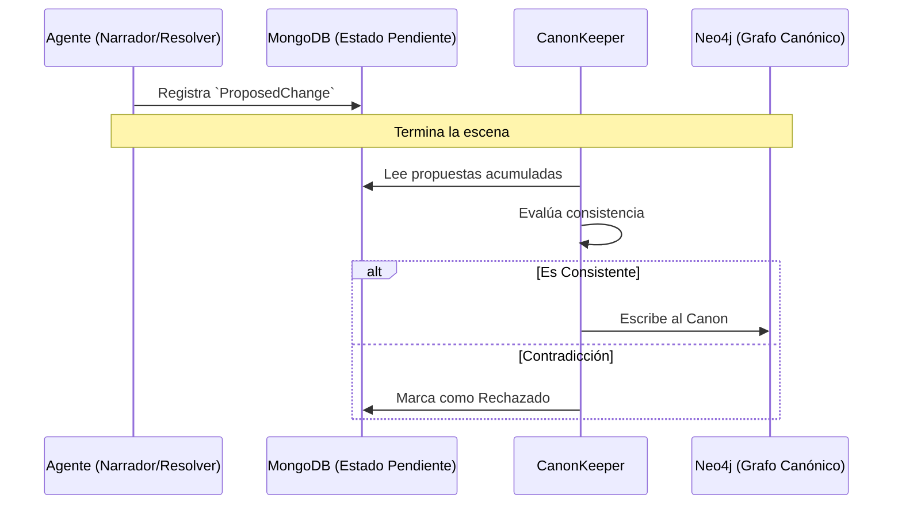

# De un modelo ontológico a un sistema de agentes: cómo creció MONITOR

*Segunda parte de la serie sobre MONITOR. Si no leíste la primera parte, empieza ahí — acá cuento cómo evolucionó el sistema desde sus primeras líneas de código hasta lo que es hoy.*

---

MONITOR no nació como un sistema de agentes con cuatro bases de datos y un pipeline de canonización. Nació como un modelo ontológico para narraciones. La arquitectura que tiene hoy es el resultado de varios años de agregar capas encima de lo que ya había — y de resolver los problemas que cada capa nueva dejaba al descubierto.

---

## el modelo ontológico

El primer artefacto fue conceptual: un modelo que describía cómo se estructuran los elementos de una narración.

Personajes, lugares, facciones, objetos, conceptos. Relaciones entre ellos: quién pertenece a qué, quién está dónde, quién es aliado o enemigo de quién. Hechos que ocurren, y qué entidades involucran. Una línea de tiempo que registra cuándo pasa cada cosa.

Nada de código todavía. Solo la pregunta: ¿cómo se ve un mundo si lo tratas como un grafo?


## Neo4j

El modelo conceptual necesitaba una implementación. La elección natural fue Neo4j — una base de datos de grafos donde los nodos son entidades y los bordes son relaciones.

Neo4j habla Cypher, un lenguaje de consulta diseñado para grafos. Una query como "dame todos los personajes aliados con esta facción que están actualmente en esta ciudad" se escribe en Cypher de forma mucho más directa que en SQL. Para un modelo de mundo con relaciones complejas, eso es bastante bueno.

```cypher
MATCH (c:Character)-[:ALLY_OF]->(f:Faction {name: "Silver Hand"})
WHERE "at_millhaven" IN c.state_tags
RETURN c.name, c.state_tags
```

Acá apareció la primera distinción importante del modelo: **EntityArchetype vs EntityInstance**.

- Un **Arquetipo** es una plantilla o concepto universal: "Mago", "Taberna", "La Fuerza"
- Una **Instancia** es algo concreto que existe en el mundo: "Gandalf el Gris", "El Pony Pisador", "La Fuerza tal como la usa Luke"

Un personaje jugador siempre es una Instancia. Una clase de personaje es un Arquetipo. La distinción parece obvia dicha así, pero modelarla correctamente evita una cantidad enorme de ambigüedades más adelante.

Así es como se ve el modelo ontológico completo (la capa canónica mapeada en Neo4j):

```mermaid
erDiagram
    OMNIVERSE {
        uuid id PK
        string name
        string description
        timestamp created_at
    }

    MULTIVERSE {
        uuid id PK
        uuid omniverse_id FK
        string name
        string system_name
        string description
        timestamp created_at
    }

    UNIVERSE {
        uuid id PK
        uuid multiverse_id FK
        string name
        string description
        string genre
        string tone
        string tech_level
        enum canon_level
        timestamp created_at
    }

    SOURCE {
        uuid id PK
        uuid universe_id FK
        string doc_id
        string title
        string edition
        string provenance
        enum source_type
        enum canon_level
        timestamp created_at
    }

    AXIOM {
        uuid id PK
        uuid universe_id FK
        string statement
        string domain
        float confidence
        enum canon_level
        enum authority
        timestamp created_at
    }

    AGENDA {
        uuid id PK
        uuid universe_id FK
        uuid owner_id FK
        string title
        string description
        enum agenda_type
        enum status
        int total_segments
        int current_segments
        timestamp created_at
        timestamp updated_at
    }

    ENTITY_AXIOMATICA {
        uuid id PK
        uuid universe_id FK
        string name
        enum entity_type
        string description
        map properties
        enum canon_level
        float confidence
        timestamp created_at
    }

    ENTITY_CONCRETA {
        uuid id PK
        uuid universe_id FK
        string name
        enum entity_type
        string description
        map properties
        list state_tags
        enum canon_level
        float confidence
        timestamp created_at
        timestamp updated_at
    }

    STORY {
        uuid id PK
        uuid universe_id FK
        string title
        enum story_type
        string theme
        string premise
        enum status
        timestamp start_time_ref
        timestamp end_time_ref
        timestamp created_at
        timestamp completed_at
    }

    SCENE {
        uuid id PK
        uuid story_id FK
        string title
        string purpose
        int order
        timestamp time_ref
        timestamp created_at
    }

    FACT {
        uuid id PK
        uuid universe_id FK
        string statement
        timestamp time_ref
        int duration
        float confidence
        enum canon_level
        enum authority
        uuid replaces FK
        timestamp created_at
    }

    EVENT {
        uuid id PK
        uuid scene_id FK
        string title
        string description
        timestamp time_ref
        int severity
        float confidence
        enum canon_level
        enum authority
        timestamp created_at
    }

    PLOTTHREAD {
        uuid id PK
        uuid story_id FK
        string title
        enum thread_type
        enum status
        timestamp created_at
    }

    %% Containment hierarchy
    OMNIVERSE ||--o{ MULTIVERSE : CONTAINS
    MULTIVERSE ||--o{ UNIVERSE : CONTAINS
    UNIVERSE ||--o{ SOURCE : HAS_SOURCE
    UNIVERSE ||--o{ AXIOM : HAS_AXIOM
    UNIVERSE ||--o{ ENTITY_AXIOMATICA : HAS_ENTITY
    UNIVERSE ||--o{ ENTITY_CONCRETA : HAS_ENTITY
    UNIVERSE ||--o{ STORY : HAS_STORY

    %% Story structure
    STORY ||--o{ STORY : PARENT_STORY
    STORY ||--o{ SCENE : HAS_SCENE
    STORY ||--o{ PLOTTHREAD : HAS_THREAD
    SCENE ||--o{ SCENE : NEXT

    %% Events
    SCENE ||--o{ EVENT : HAS_EVENT
    EVENT }o--o{ EVENT : CAUSES

    %% Entity derivation
    ENTITY_CONCRETA }o--o| ENTITY_AXIOMATICA : DERIVES_FROM

    %% Entity relationships
    ENTITY_CONCRETA }o--o{ ENTITY_CONCRETA : LOCATED_IN
    ENTITY_CONCRETA }o--o{ ENTITY_CONCRETA : MEMBER_OF
    ENTITY_CONCRETA }o--o{ ENTITY_CONCRETA : ALLY_OF
    ENTITY_CONCRETA }o--o{ ENTITY_CONCRETA : ENEMY_OF
    ENTITY_CONCRETA }o--o{ ENTITY_CONCRETA : OWNS

    %% Participation
    ENTITY_CONCRETA }o--o{ SCENE : PARTICIPATED_IN
    ENTITY_CONCRETA }o--o{ EVENT : INVOLVED_IN
    ENTITY_CONCRETA }o--o{ FACT : INVOLVED_IN

    %% Plot threads
    PLOTTHREAD }o--o{ SCENE : ADVANCED_BY
    PLOTTHREAD }o--o{ ENTITY_CONCRETA : INVOLVES

    %% Provenance (evidence)
    FACT }o--o{ SOURCE : SUPPORTED_BY
    FACT }o--o{ SCENE : SUPPORTED_BY
    EVENT }o--o{ SOURCE : SUPPORTED_BY
    EVENT }o--o{ SCENE : SUPPORTED_BY
    AXIOM }o--o{ SOURCE : SUPPORTED_BY

    %% Retcon
    FACT }o--o| FACT : REPLACES
```



---

## Fase 3: el CRUD y la primera capa de datos

Con el grafo funcionando, el siguiente paso fue construir la capa de acceso: funciones para crear, leer, actualizar y consultar entidades, hechos y relaciones.

Acá el modelo empezó a ganar estructura real. Cada entidad tiene un `canon_level` — una etiqueta que dice cuánto confiar en esa información:

| Nivel | Significado |
|-------|-------------|
| `canon` | Verdad verificada del mundo |
| `derived` | Deducido por el sistema a partir de otros hechos |
| `rumor` | Lo que un personaje *cree* que es verdad (puede ser falso) |
| `proposed` | Generado por un agente, pendiente de revisión |

Esto permite que el mundo contenga rumores, mentiras y creencias subjetivas sin que contaminen la verdad objetiva del grafo.


## El problema: las narrativas que colapsaban

Hasta acá el sistema sabía representar un mundo. Pero no sabía narrarlo.

El primer intento fue el más simple: pasarle todo el contexto relevante a un LLM y pedirle que narrara. Y funcionaba — por un rato.

El problema llegaba cuando la sesión se extendía. El LLM empezaba a inventar detalles que contradecían lo establecido. Un personaje que había muerto en la escena tres aparecía vivo en la siete. Un lugar que estaba al norte de la ciudad de repente quedaba al sur. Hechos que el jugador había establecido explícitamente desaparecían del relato.

Las narrativas colapsaban. Las historias quedaban a medias. Era frustrante — y no era un problema de los modelos. Era un problema de arquitectura.

El LLM no tenía forma de saber qué era verdad canónica y qué estaba inventando. Necesitaba una barrera.

---

## La solución: el CanonKeeper

La decisión de diseño que más cambió el sistema: **ningún agente puede escribir directamente al grafo de Neo4j. Solo uno puede hacerlo: el CanonKeeper.**

El flujo funciona así:

1. Durante la narración, los agentes detectan que algo cambió en el mundo — un personaje murió, una facción tomó el control de una ciudad, se reveló un secreto
2. En lugar de escribir ese cambio directamente, el agente crea un `ProposedChange` en MongoDB: una propuesta pendiente de evaluación
3. Al final de la escena, el CanonKeeper evalúa todas las propuestas acumuladas
4. Verifica que no contradigan hechos canónicos existentes
5. Acepta las válidas y las escribe a Neo4j. Rechaza las que rompen consistencia



El LLM puede generar lo que quiera durante la narración. Nada de eso toca el canon hasta que pasa por el CanonKeeper. La barrera existe.

---

## El segundo problema: no quería programar un sistema por juego

Mientras resolvía el problema de la alucinación, había otro problema esperando: la especificidad de los sistemas de juego.

D&D 5e tiene Fuerza, Destreza, Constitución, y tira 1d20 contra una Clase de Dificultad. Blades in the Dark tiene Position y Effect y tira un pool de d6. City of Mist no tiene stats numéricos — tiene Tags y Mystery. Vampire: The Masquerade tiene Atributos, Habilidades y pools de d10.

Cada sistema tiene su propia lógica para resolver acciones. Programar esa lógica manualmente para cada juego que quisiera soportar era inviable — y cerrado. Quería que el sistema pudiera aprender sistemas nuevos sin que yo tuviera que reescribir código.

La solución fue la **ingesta de documentos**, pero con un enfoque distinto al estándar de RAG.

Al principio intentamos lo básico: *naive chunking* (partir los PDFs en bloques de texto crudo y meterlos en la base vectorial). Eso fue un desastre. Un manual de rol no es una novela plana, es una estructura técnica. Tuvimos que descartar el chunking ingenuo y dedicarnos a entender la estructura del libro, etiquetar los elementos por tipo (esto es una regla, esto es lore, esto es una tabla de botín) y luego hacer la ingesta semántica.

Fue ahí donde me di cuenta de que este proceso no solo servía para extraer el "mundo" (lo que el texto describe como realidad de la ficción), sino el **sistema**. El pipeline podía sintetizar un sistema de dados, sus mecánicas de dificultad y sus tablas, y extraer esa lógica para que el agente Resolver la aplicara. 

Con eso logramos crear sistemas de juego 100% configurables expresables como esquemas de datos puros. (Si bien en la práctica usamos JSON vía los esquemas de Pydantic para guardarlos en MongoDB, la experiencia es tan declarativa como un archivo YAML). No hay límite en los juegos que el sistema puede soportar, porque no hay código duro para las reglas, solo esquemas descriptivos.

Para lograr esto, construimos un loop de ingestión multimodal usando LangGraph. El sistema no asume que todo es texto plano; en su lugar, detecta el formato y rutea el contenido a agentes especializados en extraer lo que realmente importa (reglas vs. lore vs. coordenadas):

```mermaid
stateDiagram-v2
    direction TB
    [*] --> DetectModality: Archivo / Documento
    
    DetectModality --> ProcessText : PDFs y Textos
    DetectModality --> ProcessVision : Mapas e Imágenes
    DetectModality --> ProcessSession : Transcripciones
    
    state ProcessText {
        Indexer --> Analyzer
        note right of Analyzer
            Separa mecánicas de juego,
            lore y tablas.
        end note
    }
    
    state ProcessVision {
        MapExtractor(DSPy) --> SpatialEntities
        note right of SpatialEntities
            Extrae relaciones LOCATED_IN
            y coordenadas.
        end note
    }
    
    state ProcessSession {
        SessionListener(DSPy) --> EventsAndFacts
    }
    
    ProcessText --> TemporalValidation
    ProcessVision --> TemporalValidation
    ProcessSession --> TemporalValidation
    
    TemporalValidation --> CompileKnowledgePack
    note right of CompileKnowledgePack
        Paquete de Conocimiento
        listo para ser aplicado al Canon.
    end note
    CompileKnowledgePack --> [*]
```



En general fue sorprendente que los sistemas sin dados fueron mucho mas faciles de absorber de lo esperado... pero, los sistemas que tuvieron mas problemas son los sistemas con puntos -por ejemplo, Vampiro la mascarada-. El gasto de puntos es un tema que todavia tiene ciertos detalles sobretodo con meritos y defectos, una mecanica que gasta puntos de creacion para crear condiciones especiales.

---

## Dónde dejó esto el sistema

Al final de estas tres fases, MONITOR tenía:

- Un grafo canónico en Neo4j con modelo ontológico completo
- Un patrón de escritura segura (ProposedChange → CanonKeeper)
- Una capa de búsqueda semántica para recuperar reglas de juego
- Los primeros agentes especializados

Lo que no tenía todavía era la arquitectura que orquestara todo eso de forma coherente. Eso vino después — y lo cuento en el siguiente post.

*Siguiente: las tres capas, los cinco sistemas de datos, y por qué los agentes no pueden hablar directamente con la base de datos.*
