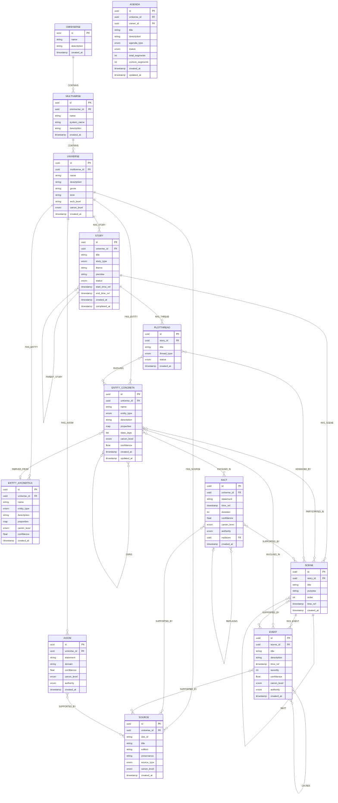
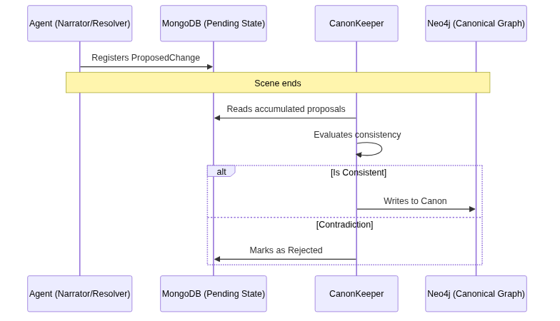
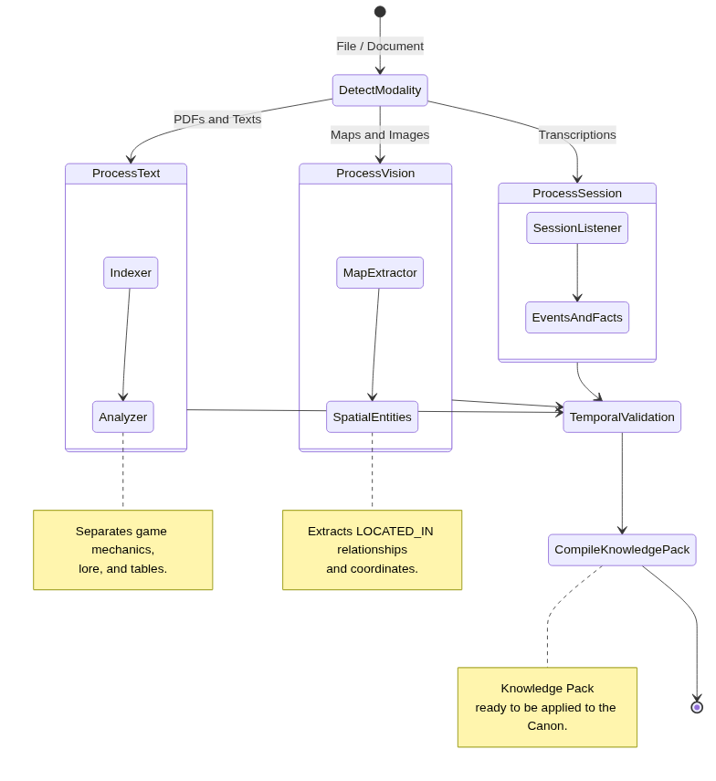

*Second part of the series on MONITOR. If you haven’t read the first part, start there — here I explain how the system evolved from its first lines of code to what it is today.*

---

MONITOR wasn’t born as an agent system with four databases and a canonization pipeline. It was born as an ontological model for narratives. The architecture it has today is the result of several years of adding layers on top of what was already there — and solving the problems that each new layer exposed.

---

## The Ontological Model

The first artifact was conceptual: a model describing how the elements of a narrative are structured.

Characters, locations, factions, objects, concepts. Relationships between them: who belongs to what, who is where, who is an ally or enemy of whom. Events that occur, and which entities they involve. A timeline that records when each thing happens.

No code yet. Just the question: what does a world look like if you treat it as a graph?

That ontological model lived on paper for two weeks before touching any code. I wanted to be sure the structure could support what I envisioned before committing to an implementation.



---

## Neo4j

The conceptual model needed an implementation. The natural choice was Neo4j — a graph database where nodes are entities and edges are relationships.

Neo4j speaks Cypher, a query language designed for graphs. A query like "give me all the characters allied with this faction who are currently in this city" is written much more directly in Cypher than in SQL. But the real reason for choosing Neo4j wasn’t just the syntax: I needed to be able to search directly by relationship types and subsets of trees. Thinking that I wanted to duplicate worlds, create what-ifs, branching paths, etc., it seemed much more appropriate and less complex than SQL.

For a world model with complex relationships, that’s pretty good.

```cypher
MATCH (c:Character)-[:ALLY_OF]->(f:Faction {name: "Silver Hand"})
WHERE "at_millhaven" IN c.state_tags
RETURN c.name, c.state_tags
```

Here appeared the first important distinction of the model: **EntityArchetype vs EntityInstance**.

- An **Archetype** is a template or universal concept: "Mage", "Tavern", "The Force"
- An **Instance** is something concrete that exists in the world: "Gandalf the Grey", "The Prancing Pony", "The Force as used by Luke"

The separation wasn’t theoretical — it was born from a bug. I had two universes: a medieval fantasy one and a space opera one. A player asked about "the council" and the system returned information about the Jedi Council mixed with the Council of Mages. The embedding for "council" was similar, but they were completely different entities. That’s when I understood: I needed "Mage" (archetype) and "Gandalf" (instance) to live in separate namespaces, or the vectors would contaminate each other across universes.

The distinction seems obvious when stated like this, but modeling it correctly prevents an enormous amount of ambiguity later on.

This is what the complete ontological model looks like (the canonical layer mapped in Neo4j):

[ERD DIAGRAM — keep the original mermaid or convert it to an image for Google Docs]

The hierarchy Omniverse → Multiverse → Universe → Source wasn't arbitrary: the idea was to create persistent worlds from the beginning. If I had a world, I wanted to be able to run more campaigns with the same data I had already built.

---

## Phase 3: CRUD and the First Data Layer

With the graph up and running, the next step was to build the access layer: functions to create, read, update, and query entities, facts, and relationships.

Here the model started to gain real structure. Each entity has a `canon_level` — a tag that dictates how much to trust that information:

| Level | Meaning |
|-------|---------|
| `canon` | Verified truth of the world |
| `derived` | Deduced by the system from other facts |
| `rumor` | What a character *believes* to be true (might be false) |
| `proposed` | Generated by an agent, pending review |

Rumors are modeled as a relationship: Character → Rumor → Fact. This allows the world to contain lies and subjective beliefs without contaminating the objective truth of the graph.

The `replaces` field in Fact makes retcons explicit: graphs aren't rewritten, they are merely replaced with a new version.

---

## The Problem: Collapsing Narratives

Up to this point, the system knew how to represent a world. But it didn’t know how to narrate it.

The first attempt was the simplest: pass all the relevant context to an LLM and ask it to narrate. And it worked — for a while.

The problem came when the session got longer. The LLM would start inventing details that contradicted established facts. A character who had died in scene three would appear alive in scene seven. A location that was north of the city suddenly ended up in the south. Facts that the player had explicitly established disappeared from the story.

The worst case was when a character entered a space station, crossed a door, and ended up drinking beer in a medieval tavern. He walked out, and his ship was no longer the same. The LLM had "forgotten" the setting between turns. It wasn’t hallucination — it was that the context window had overflowed and the model filled the gaps with statistics from its training data.

Before arriving at the final solution, I tried cheaper alternatives: providing more context each turn, making summaries and comparing against them, comparing against the entire conversation history. None of them really worked.

Narratives collapsed. Stories were left half-finished. It was frustrating — and it wasn’t a problem with the models. It was an architecture problem.

The LLM had no way of knowing what was canonical truth and what it was making up. It needed a barrier.

---

## The Solution: The CanonKeeper

The design decision that changed the system the most: **no agent can write directly to the Neo4j graph. Only one can do that: the CanonKeeper.**

The flow works like this:

1. During narration, agents detect that something changed in the world — a character died, a faction took control of a city, a secret was revealed.
2. Instead of writing that change directly, the agent creates a `ProposedChange` in MongoDB: a proposal pending evaluation.
3. At the end of the scene, the CanonKeeper evaluates all accumulated proposals.
4. It verifies that they don’t contradict existing canonical facts.
5. It accepts valid ones and writes them to Neo4j. It rejects those that break consistency.

Why MongoDB for pending changes and not a table in Neo4j? Partly because the JSON document structure fits ongoing conversations better than rigid graphs. But it was also a deliberate learning exercise: I wanted to force myself to operate multiple databases in parallel.

When there’s a contradiction between two proposals in the same scene, the CanonKeeper resolves it by degree of veracity, or the gamemaster breaks the tie.



The LLM can generate whatever it wants during narration. None of that touches the canon until it passes through the CanonKeeper. The barrier exists.

Here is the concrete JSON of a `ProposedChange` when it is first inserted into MongoDB:

```json
{
  "id": "123e4567-e89b-12d3-a456-426614174000",
  "scene_id": "f50b2401-4444-42b7-a36c-2f9543168888",
  "story_id": "b3f3b97b-8888-4222-969f-431e6783d777",
  "turn_id": "a90b6701-4c12-42b7-a36c-9f854316abcd",
  "status": "pending",
  "change_type": "fact",
  "content": {
    "statement": "The character has picked up a rusty sword from the goblin cave.",
    "fact_type": "inventory",
    "canon_level": "local"
  },
  "evidence": [
    {
      "type": "turn",
      "ref_id": "a90b6701-4c12-42b7-a36c-9f854316abcd"
    }
  ],
  "confidence": 0.95,
  "authority": "player",
  "proposer": "ContextAssembly",
  "created_at": "2026-06-28T15:00:00Z"
}
```

**What does the Agent detect in this case?**

1. `change_type`: "fact" — It knows this isn't a completely new entity (a new dragon hasn't appeared), but a fact or state: "the inventory has changed". It could have been "entity" if it wanted to register a new NPC.
2. `content` — It's a flexible JSON where the agent drops the extraction details. Design note: it's a `Dict[str, Any]` on purpose. I didn't want to create a rigid schema because I didn't know what kind of changes agents would propose in the future.
3. `evidence` — It points to the UUID of the exact chat turn that justified this change, making the decision traceable.
4. `authority` & `proposer` — Who proposed the change and how.

**What does the CanonKeeper evaluate?**

It searches MongoDB for all documents with `"status": "pending"`. Its job is to avoid contradictions:

1. **System Axioms**: If the player had no free hands, can they pick up the sword?
2. **Duplication**: Did we already know they had this sword from a previous turn?
3. **Hierarchy (Authority)**: Does a player’s comment clash with an official rulebook rule?

If it approves the change, it creates a node in Neo4j and updates the JSON:

```json
{
  "status": "accepted",
  "decision_metadata": {
    "decided_by": "CanonKeeper",
    "decided_at": "2026-06-28T15:05:22Z",
    "reason": "No conflict with existing inventory limits.",
    "canonical_ref": "d1e457f7-b89b-12d3-c456-426614176543"
  }
}
```

---

## The Second Problem: I Didn’t Want to Hardcode a System per Game

While solving the hallucination problem, another issue was waiting: the specificity of game systems.

D&D 5e has Strength, Dexterity, Constitution, and rolls a 1d20 against a Difficulty Class. Blades in the Dark has Position and Effect and rolls a pool of d6s. City of Mist has no numerical stats — it has Tags and Mysteries. Vampire: The Masquerade has Attributes, Skills, and pools of d10s.

Each system has its own logic for resolving actions. Manually programming that logic for every game I wanted to support was unviable — and closed. I wanted the system to be able to learn new systems without me having to rewrite code.

The solution was **document ingestion**, but with a different approach than standard RAG.

At first, we tried the basics: *naive chunking* (splitting PDFs into raw text blocks and feeding them into the vector database). That was a disaster. It broke rule tables and the logical order of things. You’d ask about a clan and it would bring back everything from fluff and background to appendix lists. We were filling everything with garbage.

We had to ditch naive chunking and dedicate ourselves to understanding the book’s structure. The agent first tags by sections, subsections, etc. Then each tag is interpreted according to what it is: this is a rule, this is lore, this is a loot table.

That’s when I realized this process wasn’t just useful for extracting the "world" (what the text describes as the fiction’s reality), but the **system** itself. The pipeline could synthesize a dice system, its difficulty mechanics, and its tables, and extract that logic for the Resolver agent to apply. 

With that, we managed to create 100% configurable game systems expressible as pure data schemas. (Although in practice we use JSON via Pydantic schemas to store them in MongoDB, the experience is as declarative as a YAML file). There’s no limit to the games the system can support, because there are no hardcoded rules, only descriptive schemas.

To achieve this, we built a multimodal ingestion loop using LangGraph. The system doesn’t assume everything is plain text; instead, it detects the format and routes the content to specialized agents to extract what really matters (rules vs. lore vs. coordinates):



In general, it was surprising that diceless systems were much easier to absorb than expected. City of Mist, purely narrative, became "choose moves, roll dice, count" — almost trivial. But the systems that had the most trouble were point-based systems, like Vampire: The Masquerade. The big issue is with disciplines, since each dot is a specific power. The same goes for the freedom to spend freebie points to buy things that aren’t on the character sheet. It’s technically "freeform" but freebie points are equivalencies, and it’s not the same as experience. That complicated the rule system a lot.

---

## Where This Left the System

At the end of these three phases, MONITOR had:

- A canonical graph in Neo4j with a complete ontological model
- A safe writing pattern (ProposedChange → CanonKeeper)
- A semantic search layer to retrieve game rules
- The first specialized agents

What I still didn’t have was an understanding of how these components were organized into layers that wouldn’t turn into spaghetti. Nor why I needed **four different databases** — each with a specific job: one for the absolute truth, another for pending changes, another for semantic memory, and another for files. That came later — and I’ll talk about it in the next post.

*Next: the three layers, the five data systems, and why agents can’t talk directly to the database.*
