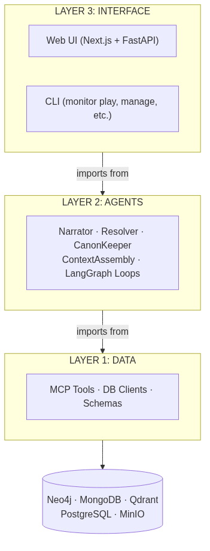
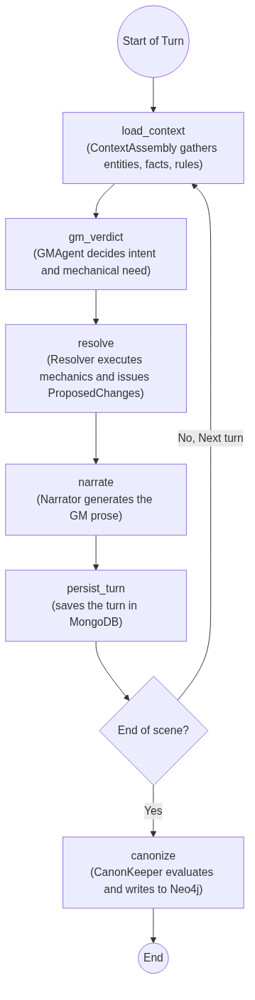

# The MONITOR Architecture: Three Layers, Five Databases, One Writer

*Part three of the series. Here is the complete architecture of the system — how it is organized, why it is organized this way, and what each piece does.*

---

When the system started to grow, a classic problem appeared: everything talked to everything. Agents queried the database directly. The user interface called functions that should only exist in the data layer. There were no clear boundaries.

That creates fragile systems. A database change breaks the agent. An agent change breaks the UI. And worse: it is impossible to know what part of the system is responsible for what.

The solution was to impose a three-layer architecture with a simple rule: **dependencies only flow downward**.

---

## The Three Layers



**Layer 1 — Data**: connects to databases, validates schemas, exposes tools. It doesn't know Layer 2 or Layer 3 exist.

**Layer 2 — Agents**: contains all the narrative intelligence logic. It imports tools from Layer 1. It doesn't know Layer 3 exists.

**Layer 3 — Interface**: the user surface. It imports agents from Layer 2. It should not touch Layer 1 directly.

The rule is absolute. If the CLI needs to query Neo4j, it doesn't do it directly — it calls an agent, which calls the data tool. The path is always downward. What does this allow? Separation of responsibility. Every narrative element exists only in Layer 2. Every data element - for fetching and saving - exists only in Layer 1. Layer 1 governs absolutely the entire data model, and the agents in Layer 2 do not work with their own memory: the state exists in the data model. With this, fetching data is much more robust: the LLM cannot hallucinate data that the data layer handed to it.

---

## Why Five Databases

The most frequent question when someone sees the stack: why five different storage systems? Couldn't it all just run on PostgreSQL?

It could. But every database in the stack does something it is specifically optimized for. Also, let's remember: This is a learning project. This means that certain decisions took the "scenic route" just to learn how to use certain tools.

### Neo4j — the canonical graph

The brain of the system. This is where the objective truth of the world lives: entities, relationships, canonical facts, timelines.

Neo4j is a graph database. Queries like "give me all the characters who are in this city, who are allies of this faction, and who participated in this battle" are natural in Cypher. In SQL, they would be three JOINs and a subquery.

**Only the CanonKeeper can write here.**

### MongoDB — state in motion

Everything that is transient or pending validation goes to MongoDB:
- `ProposedChange`: changes agents propose that the CanonKeeper hasn't evaluated yet.
- Active session state: current turn, narrative pressure, character resources.
- LangGraph checkpoints: the state of the agent loops between turns.

MongoDB is flexible and schemaless — ideal for data that changes shape between system versions.

### Qdrant — semantic memory

A vector index. When the system needs to find "the most relevant combat rules for this situation," it does a semantic search in Qdrant.

This is where the ingested rulebook chunks live, past scene summaries, and any text that needs to be retrieved by meaning similarity rather than exact match.

### PostgreSQL — configuration and metadata

Structured data that doesn't belong in the graph: universe configuration, users, historical sessions, ingestion logs. Things with a fixed structure that are queried relationally.

### MinIO — files

Object storage for binary files: ingested PDFs, images, exports. MinIO is S3-compatible, making an eventual cloud migration easy.

---

## The Agents

Layer 2 is made up of specialized, stateless agents — they do not hold state between calls. All state lives in the databases.

**ContextAssembly**: before each turn, it gathers the relevant context for the scene. It queries Neo4j to get present entities, recent facts, and relevant relationships. It queries Qdrant to bring in pertinent game rules. It builds the context package the other agents will use. Here is where the scene history goes as well.

**GMAgent**: the game director. It reads the player's intent, consults its tools (rule sensors, entity state), and issues a structured verdict. It decides if an action requires dice, what stat to use, and what the consequences are.

**Resolver**: a mechanical harness. It receives the GM's verdict, rolls the actual dice, and issues a `ProposedChange` for any state change (damage, resource use) resulting from the action.

**Narrator**: takes the context, the GM verdict, and the mechanical resolution, and generates the final prose narration. This is the agent that writes what the player reads. It uses DSPy to structure prompts so the output is narratively consistent.

**CanonKeeper**: the only agent that writes to Neo4j. At the end of every scene, it evaluates all accumulated `ProposedChange` docs in MongoDB, verifies consistency with the existing graph, and commits the ones that pass. Those that fail are marked as rejected with a reason.

---

## The Scene Loop

The scene loop is the heart of the system. It is a state graph implemented in LangGraph — a library that lets you define workflows as state machines with automatic checkpointing.



LangGraph checkpointing means that if the system crashes mid-turn, it can pick up exactly where it left off. The loop state lives in MongoDB between turns — that's why agents can be stateless.

---

## Why LangGraph and not X

I evaluated AutoGen and CrewAI. They are good for simulations where agents debate each other freely. But a tabletop RPG is not an unstructured debate. It is a strict state machine. First the player declares, then the GM evaluates, then mechanics resolve, then the GM narrates. If you break that order, the game collapses.

LangGraph doesn't assume agents are people in a chatroom. It assumes they are nodes in a graph. And that fits perfectly with the three-layer design: control flow lives in the graph code, not in the prompts. If the Resolver fails, the graph catches and handles it, not an LLM trying to apologize.

LangGraph allows defining the flow as a graph of nodes where each node is a Python function. Transitions between nodes can be conditional. The graph state is a Pydantic-typed dictionary that persists automatically.

In our source code (`scene_loop.py`), the loop is not a long conversational prompt, it is a literal LangGraph graph:
```python
def build_scene_graph() -> StateGraph:
    graph = StateGraph(SceneState)
    graph.add_node("load_context", load_context)
    graph.add_node("resolve", resolve_action)
    graph.add_node("narrate", narrate)
    graph.add_node("persist_memories", persist_memories_node)
    graph.add_node("check_consistency", check_consistency)
    # Conditional transitions handle mechanics strictly
```
 For a system that needs to handle mechanically branching flows (does the turn require a roll? is the scene over? did the player ask an out-of-character question?), that structured rigidity is exactly what I needed.

---

## The Unbreakable Rule (Or we go crazy when there are write errors)

Everything above is held together by a single rule:

**The CanonKeeper is the sole writer to Neo4j.**

That means every change to the world goes through evaluation before becoming permanent. The LLM can generate whatever it wants — contradictions, new facts, impossible states. None of that touches the canonical graph until the CanonKeeper approves it. With this, we have an absolute source of truth for "concrete" data of the world where the narration happens. Everything else is "subjective" and therefore lives in MongoDB.

*Next: where MONITOR is today, what's missing, and where it's going.*
