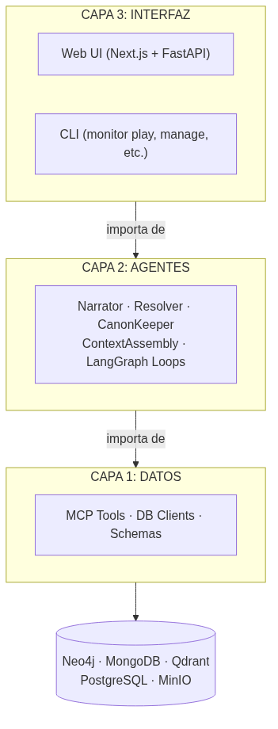
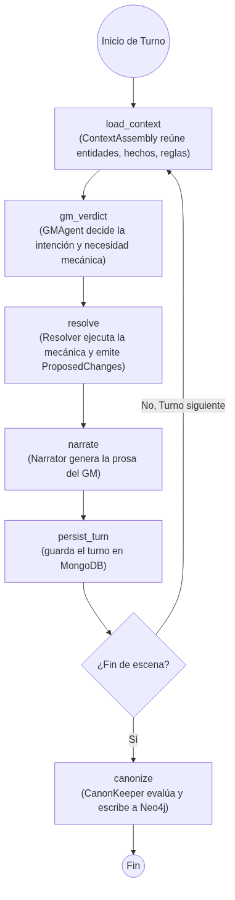

# La arquitectura de MONITOR: tres capas, cinco bases de datos, un solo escritor

*Tercera parte de la serie. Acá está la arquitectura completa del sistema — cómo está organizado, por qué está organizado así, y qué hace cada pieza.*

---

Cuando el sistema empezó a crecer, apareció un problema clásico: todo hablaba con todo. Los agentes consultaban directamente la base de datos. La interfaz de usuario llamaba funciones que solo deberían existir en la capa de datos. No había fronteras claras.

Eso crea sistemas frágiles. Un cambio en la base de datos rompe el agente. Un cambio en el agente rompe la UI. Y peor: es imposible saber qué parte del sistema es responsable de qué.

La solución fue imponer una arquitectura de tres capas con una regla simple: **las dependencias solo fluyen hacia abajo**.

---

## Las tres capas

**Capa 1 — Datos**: se conecta a las bases de datos, valida esquemas, expone herramientas. No sabe que existe la Capa 2 ni la Capa 3.

**Capa 2 — Agentes**: contiene toda la lógica de inteligencia narrativa. Importa herramientas de la Capa 1. No sabe que existe la Capa 3.

**Capa 3 — Interfaz**: la superficie de usuario. Importa agentes de la Capa 2. No debería tocar la Capa 1 directamente.

La regla es absoluta. Si la CLI necesita consultar Neo4j, no lo hace directamente — llama a un agente, que llama a la herramienta de datos. El camino es siempre descendente. ¿Que permite esto? separación de responsabilidad. Cada elemento de narracion existe solo en la capa 2. cada elemento de datos -para obtener y guardar- solo existen en la capa 1. la capa 1 gobierna absolutamente todo el modelo de datos, y los agentes en 2 no trabajan con su propia memoria: el estado existe en el modelo de datos. Con esto, traer datos es muchisimo mas robusto: la LLM no puede alucinar datos que la capa de datos le entregó.

---

## Por qué cinco bases de datos

La pregunta más frecuente cuando alguien ve el stack: ¿por qué cinco sistemas de almacenamiento distintos? ¿No podría funcionar todo con PostgreSQL?

Podría. Pero cada base de datos del stack hace algo para lo que está específicamente optimizada. Ademas, recordemos: Es un proyecto de aprendizaje. Esto significa que ciertas decisiones tomaron la "ruta turistica" solo para aprender a usar ciertas herramientas.

### Neo4j — el grafo canónico

El cerebro del sistema. Aquí vive la verdad objetiva del mundo: entidades, relaciones, hechos canónicos, líneas de tiempo.

Neo4j es una base de datos de grafos. Las consultas de tipo "dame todos los personajes que estén en esta ciudad, que sean aliados de esta facción, y que hayan participado en esta batalla" son naturales en Cypher. En SQL serían tres JOINs y una subquery.

**Solo el CanonKeeper puede escribir acá.**

### MongoDB — el estado en movimiento

Todo lo que es transitorio o pendiente de validación va a MongoDB:
- `ProposedChange`: cambios que los agentes proponen y que el CanonKeeper aún no ha evaluado
- Estado de sesión activa: turno actual, presión narrativa, recursos del personaje
- Checkpoints de LangGraph: el estado de los loops de agentes entre turnos

MongoDB es flexible y sin esquema estricto — ideal para datos que cambian de forma entre versiones del sistema.

### Qdrant — la memoria semántica

Un índice de vectores. Cuando el sistema necesita encontrar "las reglas de combate más relevantes para esta situación", hace una búsqueda semántica en Qdrant.

Acá viven los fragmentos de manuales de juego que el sistema ingesta, los resúmenes de escenas pasadas, y cualquier texto que necesite ser recuperado por similitud de significado en lugar de por coincidencia exacta.

### PostgreSQL — configuración y metadatos

Datos estructurados que no pertenecen al grafo: configuración de universos, usuarios, sesiones históricas, registros de ingesta. Cosas que tienen estructura fija y se consultan de forma relacional.

### MinIO — archivos

Almacenamiento de objetos para los archivos binarios: los PDFs que se ingestaron, imágenes, exportaciones. MinIO es compatible con la API de S3, lo que facilita una eventual migración a cloud.

---

## Los agentes

La Capa 2 está compuesta por agentes especializados y stateless — no guardan estado entre llamadas. Todo el estado vive en las bases de datos.

**ContextAssembly**: antes de cada turno, reúne el contexto relevante para la escena. Consulta Neo4j para obtener las entidades presentes, los hechos recientes, las relaciones relevantes. Consulta Qdrant para traer reglas de juego pertinentes. Arma el paquete de contexto que los demás agentes van a usar. Aca tambien va el historial de la escena.

**GMAgent**: el director de juego. Lee la intención del jugador, consulta sus herramientas (sensores de reglas, estado de entidades) y emite un veredicto estructurado. Decide si una acción requiere dados, qué stat usar y cuáles son las consecuencias.

**Resolver**: un arnés mecánico. Recibe el veredicto del GMAgent, ejecuta las tiradas de dados reales y emite `ProposedChange` para cualquier cambio de estado (daño, uso de recursos) que resulte de la acción.

**Narrator**: toma el contexto, el veredicto del GM y la resolución mecánica y genera la narración final en prosa. Este es el agente que escribe lo que el jugador lee. Usa DSPy para estructurar los prompts de forma que la salida tenga consistencia narrativa.

**CanonKeeper**: el único agente que escribe a Neo4j. Al final de cada escena, evalúa todos los `ProposedChange` acumulados en MongoDB, verifica consistencia con el grafo existente, y commit las que pasan. Las que fallan quedan marcadas como rechazadas con el motivo.

---

## El scene loop

El loop de escena es el corazón del sistema. Es un grafo de estados implementado en LangGraph — una librería que permite definir workflows como máquinas de estado con checkpointing automático.

El checkpointing de LangGraph significa que si el sistema cae en medio de un turno, puede retomar exactamente donde quedó. El estado del loop vive en MongoDB entre turnos — por eso los agentes pueden ser stateless.

---

## Por qué LangGraph y no X

Evalué AutoGen y CrewAI. Son buenos para simulaciones donde los agentes debaten entre sí de forma libre. Pero un juego de rol de mesa no es un debate desestructurado. Es una máquina de estados estricta. Primero el jugador declara, luego el GM evalúa, luego la mecánica resuelve, luego el GM narra. Si rompes ese orden, la partida colapsa.

LangGraph no asume que los agentes son personas en una sala de chat. Asume que son nodos en un grafo. Y eso encaja perfectamente con el diseño de las tres capas: el control del flujo vive en el código del grafo, no en los prompts. Si el Resolver falla, el grafo lo atrapa y lo maneja, no un LLM intentando pedir disculpas.

LangGraph permite definir el flujo como un grafo de nodos donde cada nodo es una función Python. Las transiciones entre nodos pueden ser condicionales. El estado del grafo es un diccionario tipado con Pydantic que se persiste automáticamente. Para un sistema que necesita manejar flujos con ramificaciones mecánicas (¿el turno requiere tirada? ¿la escena terminó? ¿el jugador hizo una pregunta fuera de juego?), esa rigidez estructurada es exactamente lo que necesitaba.

---

## La regla que no se puede romper (o nos volvemos locos cuando hay errores de escritura)

Todo lo anterior tiene una sola regla que lo mantiene coherente:

**El CanonKeeper es el único escritor de Neo4j.**

Eso significa que todo cambio al mundo pasa por evaluación antes de ser permanente. El LLM puede generar lo que quiera — contradicciones, hechos nuevos, estados imposibles. Nada de eso toca el grafo canónico hasta que el CanonKeeper lo aprueba. Con esto, tenemos una fuente de verdad absoluta para datos "concretos" del mundo donde la narración ocurre. Todo lo demas, es "subjetivo" y por ende vive en mongoDB.

*Siguiente: dónde está MONITOR hoy, qué falta, y hacia dónde va.*
