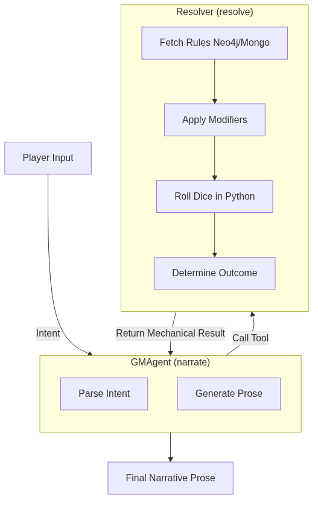

# The Split Brain of a Game Master: Why an LLM Can't Roll Dice and Tell Stories Simultaneously

Being a Game Master requires two cognitive modes that are in direct conflict.

On one hand, you have to be a creative storyteller: describing how rain beats against cobblestones, roleplaying a corrupt guard, and maintaining the pacing of a scene. On the other hand, you have to be a mechanical referee: calculating cover modifiers, adding dice pools, and applying damage rules strictly and impartially.

When I started building MONITOR, I made a rookie mistake: I tried to make the model do both at the same time. I wrote a massive *system prompt*. "You are the GM. Describe the scene. Then, if the player attacks, calculate their Strength bonus plus proficiency, roll a 1d20 against the goblin's Armor Class, and resolve the damage."

It was an absolute disaster.

If the model focused on prose, it forgot to add the proficiency bonus. If it focused on math and respected the rules, the prose became robotic and dull. LLMs are predictive stochastic engines. Asking them to alternate between stochastic poetry and deterministic arithmetic in the same token-generation block guarantees they will fail at both.

The solution wasn't a better prompt. It was tearing the problem in half.

## The Two-Hemisphere Architecture

### The Theoretical Basis: Neuro-Symbolic AI and System 1 / System 2
The inspiration for this comes directly from two places. First, Daniel Kahneman's cognitive psychology (*Thinking, Fast and Slow*). The LLM acts as **System 1**: fast, intuitive, associative, excellent at generating language but terrible at precise math. The Python code acts as **System 2**: slow, deliberate, logical, and deterministic.
Second, this is fundamentally a **Neuro-Symbolic AI** approach. Recent research papers demonstrate that pure neural networks (LLMs) fail at strict reasoning. By coupling a neural network (for natural language interpretation) with a symbolic engine (to execute rigid rules), we get the best of both worlds.

In MONITOR, the GM is not one agent. It's two distinct agents inside a LangGraph graph, operating in separate phases.



### 1. The GMAgent (Narrator)
This is the right hemisphere. Its only job is to understand the player's **intent** and generate prose. It doesn't know how to roll dice. It doesn't know how to calculate damage.
When a player says *"I throw a chair at the guard's head"*, the GMAgent doesn't resolve the impact. Its job is to package that intent into a clear JSON structure and pass control to the mechanical system:

```json
{
  "intent_type": "combat_action",
  "actor": "Kael Draven",
  "target": "Gate Guard",
  "action": "improvised attack"
}
```

### 2. The Resolver (Referee)

```python
async def resolve_action(state: SceneState) -> Dict[str, Any]:
    """
    S3: Resolver evaluates the user action and produces a ResolutResolverOutcome.
    Writes: ProposedChange documents to MongoDB (via MCP tool).
    """
    if not state.user_input:
        return {"resolution": None}
    
    factory = get_agent_factory()
    resolver = factory.create_resolver()
    # resolve_turn returns (resolution_dict, gm_verdict)
    # The verdict carries the narrative_draft so the Narrator downstream can refine it.
    ...
```
This `resolve_action` function is the pure Referee in code that executes in our graph, guaranteeing that the `GMAgent` doesn't bear the responsibility of manipulating state.

This is the left hemisphere. It is a purely deterministic engine executing Python code. It receives the Narrator's intent, queries the game rules in the database (e.g., the D&D 5e schema), fetches modifiers from Neo4j, rolls virtual dice using a real random number generator (no asking the LLM to "invent" a result), and returns a hard mathematical verdict.

```json
{
  "success_level": "success",
  "roll_breakdown": "1d20 (14) + STR (3) = 17 vs AC 15",
  "effects": ["target_takes_damage", "target_stunned"]
}
```

## The Reassembly

Once the Resolver finishes, control returns to the GMAgent. But this time, the GMAgent already has the hard result in its context. It knows the attack was successful and that the guard is stunned.

Now, the LLM does what it does best: write.

> *The oak chair smashes against the guard's helm with a dull crack. The impact dents the metal (17 vs AC 15) and sends him stumbling backward, dropping his halberd as he struggles to keep his footing.*

By separating mechanical resolution from prose generation, the system stopped making math errors and narrative quality skyrocketed. Hard rules are resolved in Python. Prose in the LLM.

Trying to force a neural network to act like a calculator is a waste of compute cycles. Let the code do the math, and let the model tell the story.


## References and Code Links
If you want to see what the "Split Brain" looks like in practice, here are the direct links to MONITOR's source code:
- **[scene_loop.py](https://github.com/spuentesp/monitor_dm_system/blob/main/packages/agents/src/monitor_agents/loops/scene_loop.py)**: Here you can see how the LangGraph graph enforces strict ordering: the `resolve_action` node (Resolver) always executes and mathematically resolves the action before yielding control to the `narrate` node (GMAgent).
- *Thinking, Fast and Slow* by Daniel Kahneman (For a deep dive into System 1 and System 2 theory).
- *Neuro-symbolic AI*: General academic literature on combining deep learning with symbolic inference engines.
