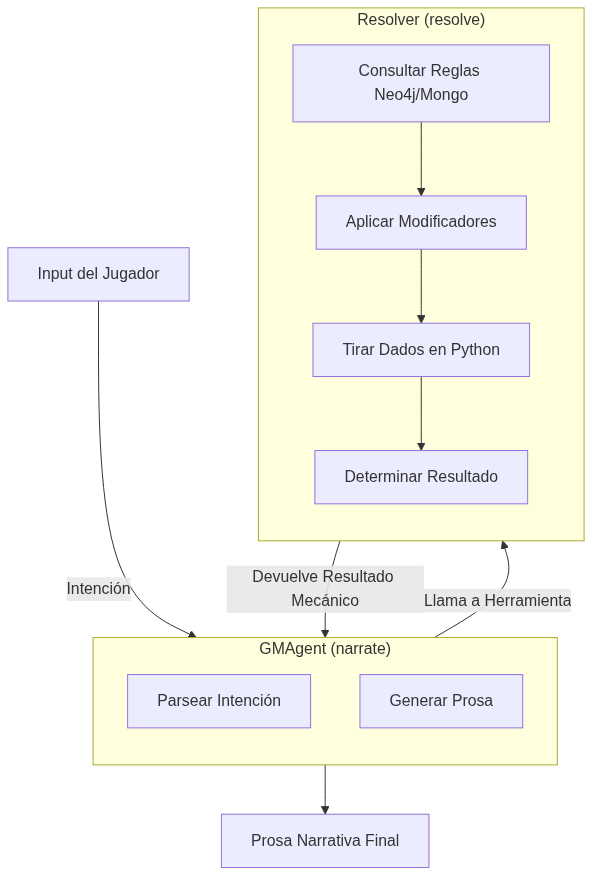

# El cerebro dividido de un Game Master: Por qué un LLM no puede tirar dados y contar historias a la vez

Ser un Game Master requiere dos modos cognitivos que están en conflicto directo. 

Por un lado, tienes que ser un narrador creativo: describir cómo la lluvia golpea los adoquines, interpretar a un guardia corrupto, y mantener el ritmo de la escena. Por otro lado, tienes que ser un árbitro mecánico: calcular modificadores de cobertura, sumar reservas de dados, y aplicar reglas de daño de forma estricta e imparcial.

Cuando empecé a construir MONITOR, cometí el error de novato: intenté que el modelo hiciera ambas cosas al mismo tiempo. Escribí un *system prompt* masivo. "Eres el GM. Describe la escena. Luego, si el jugador ataca, calcula su bono de Fuerza más su competencia, tira 1d20 contra la Clase de Armadura del goblin, y resuelve el daño".

Fue un desastre absoluto.

Si el modelo se enfocaba en la prosa, olvidaba sumar el bono de competencia. Si se enfocaba en la matemática y respetaba las reglas, la prosa se volvía robótica y aburrida. Los LLMs son motores estocásticos predictivos. Pedirles que alternen entre poesía estocástica y aritmética determinista en el mismo bloque de generación de tokens garantiza que van a fallar en ambas.

La solución no fue un mejor prompt. Fue romper el problema por la mitad.

## La arquitectura de dos hemisferios

### La base teórica: IA Neuro-Simbólica y el Sistema 1 / Sistema 2
La inspiración para esto viene directamente de dos lugares. Primero, la psicología cognitiva de Daniel Kahneman (*Pensar rápido, pensar despacio*). El LLM actúa como el **Sistema 1**: rápido, intuitivo, asociativo, excelente para generar lenguaje pero terrible para matemáticas precisas. El código Python actúa como el **Sistema 2**: lento, deliberado, lógico, y determinista.
Segundo, esto es fundamentalmente un enfoque de **IA Neuro-Simbólica**. Los papers recientes de investigación demuestran que las redes neuronales puras (LLMs) fallan en razonamiento estricto. Al acoplar una red neuronal (para interpretar lenguaje) con un motor simbólico (para ejecutar reglas rígidas), logramos lo mejor de ambos mundos.

En MONITOR, el GM no es un agente. Son dos agentes distintos dentro de un grafo de LangGraph, operando en fases separadas.



### 1. El GMAgent (Narrador)
Este es el hemisferio derecho. Su único trabajo es entender la **intención** del jugador y generar prosa. No sabe tirar dados. No sabe calcular daño. 
Cuando un jugador dice *"Le lanzo una silla a la cabeza al guardia"*, el GMAgent no resuelve el impacto. Su trabajo es empaquetar esa intención en una estructura JSON clara y pasarle el control al sistema mecánico:

```json
{
  "intent_type": "combat_action",
  "actor": "Kael Draven",
  "target": "Guardia de la puerta",
  "action": "ataque improvisado"
}
```

### 2. El Resolver (Árbitro)

```python
async def resolve_action(state: SceneState) -> Dict[str, Any]:
    """
    S3: Resolver evaluates the user action and produces a ResolutResolverOutcome.
    Writes: ProposedChange documents to MongoDB (via MCP tool).
    """
    if not state.user_input:
        return {"resolution": None}
    
    factory = get_agent_factory()
    resolver = factory.create_resolver()
    # resolve_turn returns (resolution_dict, gm_verdict)
    # The verdict carries the narrative_draft so the Narrator downstream can refine it.
    ...
```
Esta función `resolve_action` es el Árbitro puro en código que se ejecuta en nuestro grafo, garantizando que el `GMAgent` no tenga la responsabilidad de manipular el estado.

Este es el hemisferio izquierdo. Es un motor puramente determinista que ejecuta código Python. Recibe la intención del Narrador, consulta las reglas del juego en la base de datos (por ejemplo, el esquema de D&D 5e), busca los modificadores en Neo4j, tira los dados virtualmente usando un generador de números aleatorios real (nada de pedirle al LLM que "invente" un resultado), y devuelve un veredicto matemático duro.

```json
{
  "success_level": "success",
  "roll_breakdown": "1d20 (14) + STR (3) = 17 vs AC 15",
  "effects": ["target_takes_damage", "target_stunned"]
}
```

## El re-ensamblaje

Una vez que el Resolver termina, el control vuelve al GMAgent. Pero esta vez, el GMAgent ya tiene el resultado duro en su contexto. Sabe que el ataque fue exitoso y que el guardia está aturdido. 

Ahora sí, el LLM hace lo que hace mejor: escribir. 

> *La silla de roble se estrella contra el yelmo del guardia con un crujido sordo. El impacto abolla el metal (17 vs AC 15) y lo hace retroceder trastabillando, soltando su alabarda mientras intenta mantener el equilibrio.*

Al separar la resolución mecánica de la generación de prosa, el sistema dejó de cometer errores matemáticos y la calidad de la narración se disparó. Las reglas duras se resuelven en Python. La prosa en el LLM. 

Intentar forzar a una red neuronal a comportarse como una calculadora es un desperdicio de ciclos de cómputo. Deja que el código haga el cálculo, y que el modelo cuente la historia.


## Referencias y Enlaces al Código
Si quieres ver cómo se ve el "Cerebro Dividido" en la práctica, aquí tienes los enlaces directos al código fuente de MONITOR:
- **[scene_loop.py](https://github.com/spuentesp/monitor_dm_system/blob/main/packages/agents/src/monitor_agents/loops/scene_loop.py)**: Aquí puedes ver cómo el grafo de LangGraph impone el orden estricto: el nodo `resolve_action` (Resolver) siempre se ejecuta y resuelve matemáticamente la acción antes de ceder el control al nodo `narrate` (GMAgent).
- *Thinking, Fast and Slow* por Daniel Kahneman (Para profundizar en la teoría del Sistema 1 y Sistema 2).
- *Neuro-symbolic AI*: Literatura académica general sobre la combinación de deep learning con motores de inferencia simbólica.
