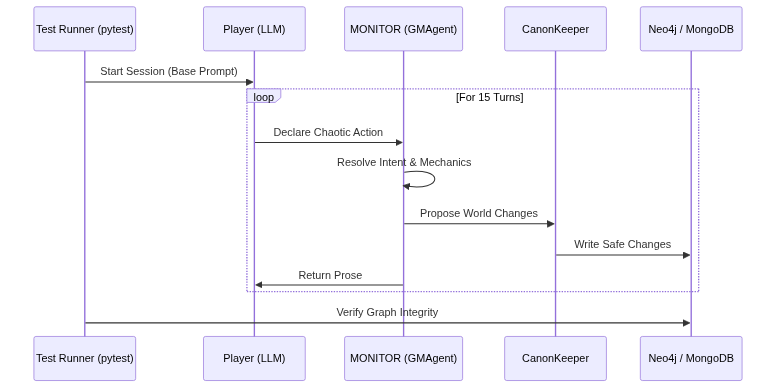

# How Do You Unit-Test a Game Master? E2E Testing with LLM vs LLM

Traditional software engineering has a golden rule: code must be testable. You write a function, pass it a known input, and assert that the output is exactly what you expected.

But how do you test an AI-driven Game Master? How do you make assertions on a system that generates prose non-deterministically and must react to a player who might decide to attack a guard, set the tavern on fire, or just sit down for a beer?

If the only way to prove MONITOR wouldn't crash was to play two-hour manual sessions, the project was dead. I needed automation. I needed to run `pytest` and know if the system remained stable.

## The Problem of Simulating Chaos

### The Theoretical Basis: Adversarial Agents and LLM-as-a-Judge
If you have read papers on *Multi-Agent Debate* or the concept of *LLM-as-a-Judge* (using one model to evaluate another), you'll understand where this comes from. Traditionally, we evaluate AI by comparing it to humans. But in a complex system, the only way to scale testing is using **adversarial evaluation**. Much like in Generative Adversarial Networks (GANs) where one network tries to trick another, here we use an LLM (the player) optimized to generate chaos, forcing the primary system (the GM) to defend its ontological state.

At first, I tried using static fixtures. A script that injected pre-recorded messages:
1. "I look around the room."
2. "I open the chest."
3. "I attack the goblin."

This proved the pipelines weren't broken (the Python code didn't throw exceptions), but it didn't test **state coherence**. A real human player asks stupid questions, changes their mind, or attempts ambiguous actions. I needed to subject the system to real narrative stress to see if the `CanonKeeper` did its job and kept the Neo4j database safe.

## The Solution: The Automaton Player

The answer was obvious: if I have an LLM acting as a Game Master, I need another LLM acting as a player.

I built an E2E (End-to-End) testing framework where I boot the full MONITOR instance and attach a *mock* client on the other end. I pass this client a very specific *prompt*:

> *You are Kael Draven. You are testing an automated RPG system. You will be presented with a scene. Your goal is to interact with the environment and advance the plot. Perform dialogue, exploration, and combat actions. The test will run for 15 turns. Try to be unpredictable but consistent with your character.*



## Evaluating the Results

At the end of the 15 turns, the test doesn't assert the quality of the prose. It asserts the **state of the world**:

For example, instead of testing prose, our async tests in `tests/e2e/test_04_gm_loop.py` verify hard state transitions:
```python
    async def test_scene_loop_finalize_triggers_canonization_checkpoint(self, ...):
        """P-8: Finalizing a scene triggers the canonization checkpoint."""
        from monitor_agents.canonkeeper import CanonKeeper
        from monitor_agents.loops.scene_loop import SceneLoop
        # ... turn simulation ...
        # Asserting changes moved from MongoDB to Neo4j correctly
```


```python
def test_e2e_world_state_integrity():
    # 1. Run 15-turn LLM vs LLM simulation
    run_llm_simulation(turns=15)
    
    # 2. Verify Neo4j has no orphaned nodes
    assert check_graph_integrity() == True
    
    # 3. Verify no Canon changes bypassed ProposedChange
    assert verify_canonkeeper_audit_log() == True
    
    # 4. Verify mechanical fallback didn't trigger >10%
    assert metric_fallbacks < 0.1
```

Reading the logs generated by these sessions is fascinating. It's like watching two intelligences trapped in a sandbox playing dice.

Sometimes, the Player-LLM gets incredibly aggressive and tries to break the game via *metagaming*. That's where I see MONITOR shine: when the GMAgent realizes the player is attempting the impossible, it mechanically rejects it, the Resolver issues a failure, and the story continues without the ontological state corrupting.

You can't use traditional TDD (Test-Driven Development) with generative AI. But you can build a deterministic cage (Neo4j and the CanonKeeper) and use another generative AI to try and break the bars. If the bars hold, the system is ready for production.


## References and Code Links
To explore how this deterministic cage works, check out the E2E tests in the repository:
- **[e2e_full_loop.py](https://github.com/spuentesp/monitor_dm_system/blob/main/scripts/e2e_full_loop.py)**: The automation script that spins up the 15-turn simulation between the Player-LLM and the GMAgent.
- **[tests/e2e/test_07_live_gameplay.py](https://github.com/spuentesp/monitor_dm_system/blob/main/tests/e2e/test_07_live_gameplay.py)**: The pytest suite where you can see the hard `assert` checks validating the integrity of Neo4j nodes rather than the LLM's prose.
- Zheng et al., *Judging LLM-as-a-Judge with MT-Bench and Chatbot Arena* (On using LLMs to evaluate outputs).
