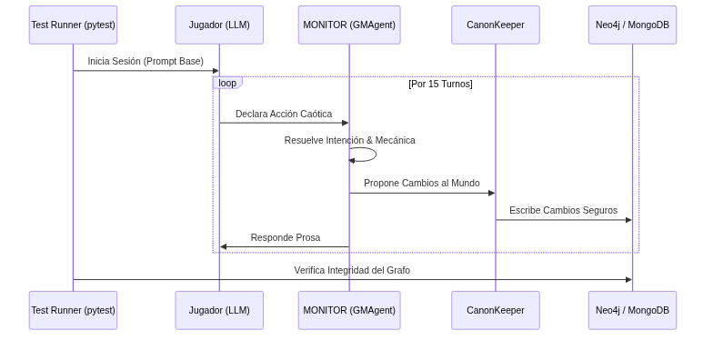

# ¿Cómo haces testing unitario de un Game Master? Pruebas E2E con LLM vs LLM

La ingeniería de software tradicional tiene una regla de oro: el código debe ser testeable. Escribes una función, le pasas un input conocido, y afirmas (`assert`) que el output sea exactamente el esperado.

Pero, ¿cómo testeas a un Game Master impulsado por inteligencia artificial? ¿Cómo haces aserciones sobre un sistema que genera prosa de forma no determinista y que tiene que reaccionar a un jugador que puede decidir atacar a un guardia, prenderle fuego a la taberna, o sentarse a pedir una cerveza?

Si la única forma de probar que MONITOR no colapsaba era jugar sesiones de dos horas a mano, el proyecto estaba muerto. Necesitaba automatización. Necesitaba poder correr `pytest` y saber si el sistema se mantenía estable.

## El problema de simular el caos

### La base teórica: Agentes Adversarios y LLM-as-a-Judge
Si has leído los papers sobre *Multi-Agent Debate* o el concepto de *LLM-as-a-Judge* (usar un modelo para evaluar a otro), entenderás de dónde viene esto. Tradicionalmente, evaluamos a la IA comparándola con humanos. Pero en un sistema complejo, la única forma de escalar las pruebas es usar **evaluación adversarial**. Al igual que en las Redes Generativas Antagónicas (GANs), donde una red intenta engañar a otra, aquí usamos un LLM (el jugador) optimizado para generar caos, obligando al sistema primario (el GM) a defender su estado ontológico.

Al principio intenté usar fixtures estáticos. Un script que inyectaba mensajes pre-grabados:
1. "Miro alrededor de la habitación."
2. "Abro el cofre."
3. "Ataco al goblin."

Esto probaba que las tuberías no estuvieran rotas (el código Python no lanzaba excepciones), pero no probaba la **coherencia del estado**. Un jugador humano real hace preguntas estúpidas, cambia de opinión, o intenta acciones ambiguas. Necesitaba someter al sistema a estrés narrativo real para ver si el `CanonKeeper` hacía su trabajo y mantenía a salvo la base de datos Neo4j.

## La solución: El Jugador Autómata

La respuesta fue obvia: si tengo un LLM actuando como Game Master, necesito otro LLM actuando como jugador.

Construí un framework de testing E2E (End-to-End) donde levanto la instancia completa de MONITOR y conecto un cliente *mock* en el otro extremo. A este cliente le paso un *prompt* muy específico:

> *Eres Kael Draven. Estás testeando un sistema automatizado de rol. Se te presentará una escena. Tu objetivo es interactuar con el entorno y avanzar la trama. Realiza acciones de diálogo, exploración y combate. El test se ejecutará por 15 turnos. Trata de ser impredecible pero coherente con tu personaje.*



## Evaluando los resultados

Al final de los 15 turnos, el test no asiente sobre la calidad de la prosa. Afirma sobre el **estado del mundo**:

Por ejemplo, en lugar de testear prosa, nuestros tests asíncronos en `tests/e2e/test_04_gm_loop.py` verifican transiciones de estado duras:
```python
    async def test_scene_loop_finalize_triggers_canonization_checkpoint(self, ...):
        """P-8: Finalizing a scene triggers the canonization checkpoint."""
        from monitor_agents.canonkeeper import CanonKeeper
        from monitor_agents.loops.scene_loop import SceneLoop
        # ... simulación de turnos ...
        # Se aserta que los cambios pasaron de MongoDB a Neo4j correctamente
```


```python
def test_e2e_world_state_integrity():
    # 1. Correr simulación LLM vs LLM de 15 turnos
    run_llm_simulation(turns=15)
    
    # 2. Verificar que Neo4j no tiene nodos huérfanos
    assert check_graph_integrity() == True
    
    # 3. Verificar que no hubo cambios al Canon sin pasar por ProposedChange
    assert verify_canonkeeper_audit_log() == True
    
    # 4. Verificar que el fallback mecánico no se disparó más de un 10%
    assert metric_fallbacks < 0.1
```

Leer los logs generados por estas sesiones es fascinante. Es como ver a dos inteligencias atrapadas en una caja de arena jugando a los dados. 

A veces, el LLM-Jugador se vuelve increíblemente agresivo y trata de romper el juego haciendo *metagaming*. Y es ahí donde veo brillar a MONITOR: cuando el GMAgent se da cuenta de que el jugador está intentando algo imposible, lo rechaza mecánicamente, el Resolver emite un fallo, y la historia continúa sin que el estado ontológico se corrompa.

No puedes usar TDD (Test-Driven Development) tradicional con IA generativa. Pero sí puedes construir una jaula determinista (Neo4j y el CanonKeeper) y usar otra IA generativa para intentar romper los barrotes. Si los barrotes aguantan, el sistema está listo para producción.


## Referencias y Enlaces al Código
Para explorar cómo funciona esta jaula determinista, revisa los tests E2E en el repositorio:
- **[e2e_full_loop.py](https://github.com/spuentesp/monitor_dm_system/blob/main/scripts/e2e_full_loop.py)**: El script de automatización donde se levanta la simulación de 15 turnos entre el LLM-Jugador y el GMAgent.
- **[tests/e2e/test_07_live_gameplay.py](https://github.com/spuentesp/monitor_dm_system/blob/main/tests/e2e/test_07_live_gameplay.py)**: La suite de pytest donde puedes ver las aserciones duras (`assert`) que validan la integridad de los nodos de Neo4j en lugar de la prosa del LLM.
- Zheng et al., *Judging LLM-as-a-Judge with MT-Bench and Chatbot Arena* (Sobre el uso de LLMs para evaluar salidas).
