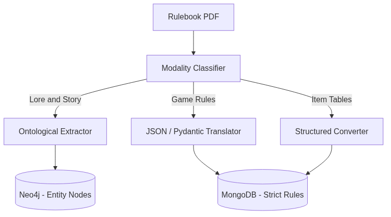

# Teaching an AI to Read the Rulebook (And Why Traditional RAG Fails)

One of the promises of modern Artificial Intelligence is the RAG (Retrieval-Augmented Generation) pattern. You feed a PDF into a system, it chops it up into hundreds of chunks, converts them to mathematical vectors, and when you ask a question, the system finds the most relevant chunks and passes them to the LLM to answer.

For reading legal contracts or pulling HR manual data, RAG is magic.

For RPG rulebooks, RAG is garbage.

## The Problem of Naive Chunking

Imagine taking the *Vampire: The Masquerade* rulebook. You do a standard 500-token chunking. Mid-game, a player uses the *Celerity* discipline. The system searches for "Celerity".

What does the vector database return to the agent?
- A chunk from Chapter 3 where a character in a background story uses Celerity.
- A chunk from the Index listing the page number for Celerity.
- A chunk from Chapter 6 containing the first half of the mechanical rule, but cutting off right before explaining how much Blood it costs to activate.

The agent receives this text soup, gets confused, and invents that Celerity costs 3 Willpower points because it read a neighboring power's rule in an adjacent chunk. The game breaks.

I didn't want to hardcode the rules for every game I wanted to run in MONITOR. I needed the system to ingest PDFs. But RAG wasn't going to work. I needed **Multimodal Semantic Ingestion**.

## Understanding Game Structure

### The Theoretical Basis: From RAG to GraphRAG
Academia has already realized that naive chunking is insufficient. Recent papers from Microsoft Research on **GraphRAG** (Graph Retrieval-Augmented Generation) suggest exactly this: before searching text, the text must be pre-processed, structured, and converted into a Knowledge Graph. We took that concept one step further. We don't just extract nodes and relationships (lore); we extract *executable logic* (Pydantic schemas). It is the evolution from extracting passive information to extracting computable functions.

An RPG rulebook isn't just text. It's an interwoven mix of three completely distinct things:
1. **Lore / Setting**: "The city of Millhaven is perpetually shrouded in mist..."
2. **Hard Mechanics**: "To attack, roll 1d20 + your Strength modifier."
3. **Reference Tables**: Lists of weapons with their prices, weights, and damage profiles.

If you mix these three into a search engine, the agent collapses. So we built a specific LangGraph *pipeline* to pre-process documents before they ever touch the active game database.



### 1. The Modality Tagger
When we pass text to MONITOR, the first agent that touches it saves nothing. It just classifies. It reads each section and decides: Is this narrative prose? Is this a hard mathematical rule? Is this a table?

### 2. Extraction to Schemas (Pydantic)
If the agent determines a text block is a mechanical rule, we don't save it as plain text. We pass it through another LLM whose sole job is to map that natural language rule into a strict JSON schema validated by Pydantic.

The text: *"When a character uses a heavy melee weapon, they suffer a -2 penalty to their initiative, but add +4 to base damage."*

Becomes:
```json
{
  "mechanic_id": "heavy_melee_weapon",
  "triggers_on": ["combat_action", "melee"],
  "modifiers": [
    {"target": "initiative", "value": -2},
    {"target": "damage", "value": 4}
  ]
}
```

### 3. Canonical Storage
Lore goes to Neo4j as ontological entities and relationships.
Structured mechanics go to MongoDB as `GameRules`, ready to be ingested and calculated by the `Resolver` agent in pure code, not prose.

## The Result

The initial effort to build this pipeline was massive. But the ROI is absolute.

Today, MONITOR doesn't programmatically know how *City of Mist* or *Dungeons & Dragons* work. There are no `dnd5e_rules.py` files in the source code. The ingested rules only exist in the database.

Forcing the system to understand the *intent* of the text and translating it into hard mechanical schemas before playing allows us to support (almost) any tabletop system without writing a single new line of code. Except when dealing with point-buy systems. But that's another story.


## References and Code Links
The separation of lore and mechanics in the codebase:
- **[monitor_data/tools/ingest_tools/](https://github.com/spuentesp/monitor_dm_system/tree/main/packages/data-layer/src/monitor_data/tools/ingest_tools/)**: The directory where ingestion tools are isolated, separating text processing from rules and spatial tables.
- Edge, D., Trinh, H., et al. (2024). *From Local to Global: A Graph RAG Approach to Query-Focused Summarization* (Microsoft Research). The academic basis behind GraphRAG vs traditional RAG.
