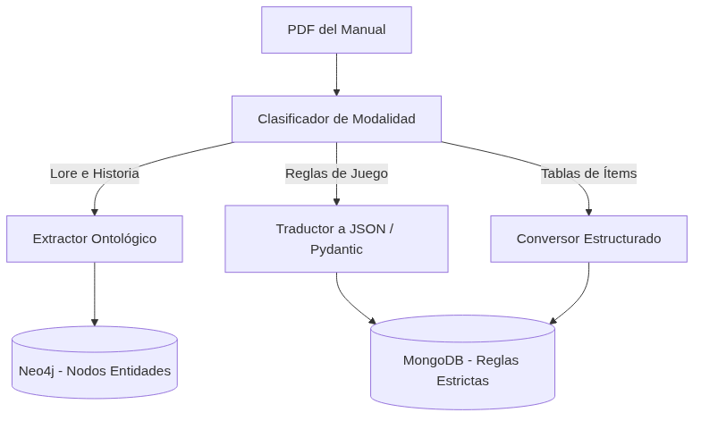

# Cómo enseñarle a una IA a leer un manual de rol (y por qué RAG tradicional no sirve)

Una de las promesas de la Inteligencia Artificial moderna es el patrón RAG (Retrieval-Augmented Generation). Le pasas un PDF a un sistema, este lo corta en cientos de pedacitos (chunks), los convierte a vectores matemáticos, y cuando haces una pregunta, el sistema busca los pedacitos más relevantes y se los pasa al LLM para que conteste.

Para leer contratos legales o buscar datos en manuales de recursos humanos, RAG es mágico.

Para manuales de rol, RAG es una basura.

## El problema del Chunking Ingenuo

Imagina que tomas el manual de *Vampiro: La Mascarada*. Haces un chunking estándar de 500 tokens. Un jugador en medio de una partida usa la disciplina *Celeridad*. El sistema busca "Celeridad".

¿Qué le devuelve la base de datos vectorial al agente?
- Un pedazo del Capítulo 3 donde un personaje en una historia de trasfondo usa Celeridad.
- Un pedazo del Índice donde se lista la página de Celeridad.
- Un pedazo del Capítulo 6 que contiene la primera mitad de la regla mecánica, pero corta justo antes de explicar cuánta Sangre cuesta activarlo.

El agente recibe esta sopa de texto, se confunde, e inventa que Celeridad cuesta 3 puntos de Voluntad porque leyó la regla de otro poder en un chunk adyacente. La partida se rompe.

No quería tener que programar en duro (hardcodear) las reglas de cada juego que quisiera correr en MONITOR. Necesitaba que el sistema pudiera ingerir PDFs. Pero RAG no iba a funcionar. Necesitaba **Ingestión Semántica Multimodal**.

## Entendiendo la estructura de un juego

### La base teórica: De RAG a GraphRAG
La academia ya se dio cuenta de que el chunking ingenuo es insuficiente. Papers recientes de Microsoft Research sobre **GraphRAG** (Graph Retrieval-Augmented Generation) sugieren exactamente esto: antes de buscar en un texto, el texto debe ser pre-procesado, estructurado, y convertido en un grafo de conocimiento (Knowledge Graph). Nosotros llevamos ese concepto un paso más allá. No solo extraemos nodos y relaciones (lore), sino que extraemos *lógica ejecutable* (esquemas Pydantic). Es la evolución de extraer información pasiva a extraer funciones computables.

Un manual de rol no es solo texto. Es una mezcla entrelazada de tres cosas completamente distintas:
1. **Lore / Ambientación**: "La ciudad de Millhaven siempre está cubierta de niebla..."
2. **Mecánicas Claras**: "Para atacar, tira 1d20 + tu modificador de Fuerza."
3. **Tablas de Referencia**: Listas de armas con sus precios, pesos y daños.

Si mezclas estas tres cosas en un motor de búsqueda, el agente colapsa. Así que construimos un *pipeline* en LangGraph específico para pre-procesar documentos antes de siquiera tocar la base de datos de juego.



### 1. El Etiquetador de Modalidad
Cuando le pasamos un texto a MONITOR, el primer agente que lo toca no guarda nada. Solo clasifica. Lee cada sección y decide: ¿Esto es prosa narrativa? ¿Esto es una regla matemática dura? ¿Esto es una tabla?

### 2. Extracción a Esquemas (Pydantic)
Si el agente determina que un bloque de texto es una regla mecánica, no lo guardamos como texto plano. Lo pasamos por otro LLM cuyo único trabajo es mapear esa regla de lenguaje natural a un esquema estricto en JSON validado por Pydantic.

El texto: *"Cuando un personaje usa un arma cuerpo a cuerpo pesada, sufre un penalizador de -2 a su iniciativa, pero suma +4 al daño base."*

Se convierte en:
```json
{
  "mechanic_id": "heavy_melee_weapon",
  "triggers_on": ["combat_action", "melee"],
  "modifiers": [
    {"target": "initiative", "value": -2},
    {"target": "damage", "value": 4}
  ]
}
```

### 3. Almacenamiento en el Canon
El lore va a Neo4j como entidades y relaciones ontológicas.
Las mecánicas estructuradas van a MongoDB como `GameRules`, listas para ser ingeridas y calculadas por el agente `Resolver` en código puro, no en prosa.

## El resultado

El esfuerzo inicial de construir este pipeline fue enorme. Pero el retorno de inversión es absoluto. 

Hoy, MONITOR no sabe programáticamente cómo funciona *City of Mist* o *Dungeons & Dragons*. No hay archivos `dnd5e_rules.py` en el código fuente. Solo existen las reglas ingeridas en base de datos. 

Forzar al sistema a entender la *intención* del texto y traducirlo a esquemas mecánicos duros antes de jugar nos permite soportar (casi) cualquier sistema de juego de mesa sin escribir una sola línea nueva de código. Excepto cuando hay que lidiar con sistemas que usan compra por puntos. Pero esa es otra historia.


## Referencias y Enlaces al Código
La separación de lore y mecánicas en el código:
- **[monitor_data/tools/ingest_tools/](https://github.com/spuentesp/monitor_dm_system/tree/main/packages/data-layer/src/monitor_data/tools/ingest_tools/)**: El directorio donde se aíslan las herramientas de ingestión, separando el procesamiento de texto, de reglas, y de tablas espaciales.
- Edge, D., Trinh, H., et al. (2024). *From Local to Global: A Graph RAG Approach to Query-Focused Summarization* (Microsoft Research). La base académica detrás del GraphRAG vs RAG tradicional.
