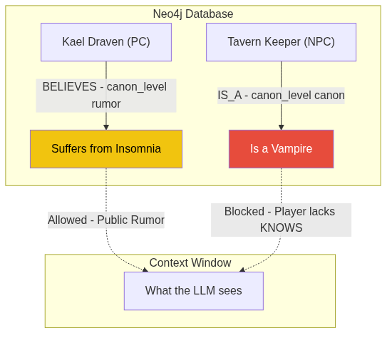

# The Ontology of Truth: Preventing an AI from Leaking Plot Secrets

When you use ChatGPT as a rudimentary Game Master, a rather annoying phenomenon occurs: it can't keep a secret.

If you explicitly declare in your *prompt* or initial context: *"The tavern keeper is secretly a vampire, but the players don't know it"*, the very first time a player asks the tavern keeper ("Why are you up so late?"), the LLM will generate a response like: *"Ah, well, as you know, I am a vampire and I do not sleep."*

The model is a predictive machine. If the word "vampire" is in its context window associated with "tavern keeper," the probability of that information leaking into the response is extremely high.

If MONITOR was going to run serious mystery, intrigue, or horror campaigns, it needed to understand the fundamental difference between **what is true in the world** and **what the characters know to be true**. It needed an ontology of truth.

## Canon Levels

### The Theoretical Basis: Epistemic Logic and Possible Worlds
This isn't just a database trick; it's grounded in analytical philosophy. Specifically, in **Epistemic Logic** (Jaakko Hintikka's work on the logic of knowledge and belief) and Kripke's **Possible Worlds** semantics. In epistemic logic, the fact that a player *believes* X does not mean X is true in the real world.
By modeling the graph, we separate modal truth (what is canon) from epistemic truth (what the character perceives). The LLM operates strictly within the "possible world" defined by the player's beliefs, mathematically isolating it from the real world (the hidden canon).

In MONITOR's Neo4j database, no `Fact` or relationship exists simply as an absolute datapoint. Every piece of information is required to carry an architectural tag called `canon_level`.

It's not a minor metadata tag. It is the heart of the AI's narrative permissions system.



### 1. `canon` (Absolute Truth)
This is what is actually happening in the world, dictated by the author, the game rulebook, or the CanonKeeper upon confirming a mechanical resolution. The tavern keeper *is* a vampire. This information is isolated and the narrating agent (GMAgent) **is not allowed to use it** unless the player character has an explicit `KNOWS` relationship to this fact.

### 2. `derived` (Deduced Truth)
Logical facts inferred by the system, but never explicitly declared by anyone. If the tavern keeper is in the tavern at 3 AM, and the player enters the tavern at 3 AM, the system infers the player can see the tavern keeper. It is temporary canonical truth.

### 3. `rumor` (Subjective Truth)
This is where the magic happens. A `rumor` is information a character *believes* to be true, but which remains unverified, or is outright false.

Instead of creating a loose `Fact` node in the graph, we model this as a sub-graph:
`(Character: Player) -[:BELIEVES]-> (Rumor: "The tavern keeper is an insomniac")`

When the player interacts with the world, the GMAgent **only loads public `canon` facts, or `rumors` the player believes, into its context**. The secret that he's a vampire never enters the context window of the LLM generating conversational prose. You can't leak a secret you don't know.

### 4. `proposed` (Stream of Consciousness)
As discussed in the CanonKeeper post, this is what the LLM is imagining in real time. It's not true yet. It's just a rough draft awaiting deterministic approval.

In fact, if you look at the agent's internal definition in `packages/agents/src/monitor_agents/canonkeeper.py`, the pipeline enforces strict control:
```python
"""
CRITICAL RULE: Only CanonKeeper writes to Neo4j (enforced by middleware).

Pipeline per proposal:
  1. PolicyCheckModule (fast gate — catches hard blocks)
  2. CanonKeeperReasoningModule (canon consistency reasoning chain)
  3. call_llm_structured(CanonKeeperVerdict) — strict verdict via instructor
  4. If ACCEPT → neo4j_create_entity/neo4j_create_fact via MCP
"""
```
This pipeline ensures that a false statement by the player never passes the `PolicyCheckModule` as a canon fact.


## Modeling Lies in Vector Space

Handling lies in an AI system is one of the hardest architectural problems I faced. If a player character lies (fails a persuasion check but the system must remember the lie), how do you prevent the database from absorbing it as an actual historical fact?

By isolating the `canon_level`, you allow the world to contain structured falsehoods. A lie doesn't corrupt Neo4j's truth; it is simply registered as a fact under the `rumor` authority, tied to the characters who heard it.

This allows MONITOR to run campaigns where information discovery is the primary game mechanic. When a player successfully investigates (validated by the `Resolver` rolling dice), the CanonKeeper executes a mutation on the graph: it takes the `BELIEVES` relationship to a false `rumor`, destroys it, and grants the player a `KNOWS` relationship to the true `canon` fact.

The LLM never had to perform mental gymnastics to hide the secret. The graph architecture did it for it.


## References and Code Links
If you are interested in seeing how degrees of truth are modeled in Pydantic:
- **[base.py (Schemas)](https://github.com/spuentesp/monitor_dm_system/blob/main/packages/data-layer/src/monitor_data/schemas/base.py)**: This is where the `canon_level` Enum (`canon`, `derived`, `rumor`, `proposed`) is defined, which restricts all information in the graph.
- **[canonkeeper.py](https://github.com/spuentesp/monitor_dm_system/blob/main/packages/agents/src/monitor_agents/canonkeeper.py)**: The guardian agent that evaluates `ProposedChange` documents in MongoDB and dictates if a falsehood should be registered as a `rumor` or if it has the merit to alter the Neo4j canon.
- Hintikka, Jaakko (1962). *Knowledge and Belief: An Introduction to the Logic of the Two Notions* (For a deep dive into the logic of possible worlds).
