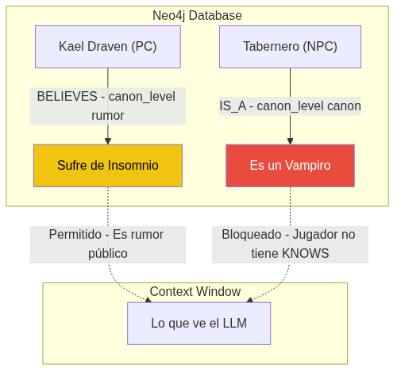

# La ontología de la Verdad: Cómo evitar que una IA filtre secretos de la trama

Cuando usas ChatGPT como un Game Master rudimentario, ocurre un fenómeno bastante molesto: no sabe guardar secretos.

Si en tu *prompt* o en tu contexto inicial declaras explícitamente: *"El tabernero es en secreto un vampiro, pero los jugadores no lo saben"*, a la primera pregunta que le haga el jugador al tabernero ("¿Qué haces despierto tan tarde?"), el LLM va a generar una respuesta como: *"Ah, bueno, como sabes, soy un vampiro y no duermo."*

El modelo es una máquina predictiva. Si la palabra "vampiro" está en su ventana de contexto relacionada con "tabernero", la probabilidad de que esa información gotee hacia la respuesta es altísima.

Si MONITOR iba a dirigir campañas serias de misterio, intriga o terror, necesitaba entender la diferencia fundamental entre **lo que es verdad en el mundo** y **lo que los personajes saben que es verdad**. Necesitaba una ontología de la verdad.

## Los niveles de Canon

### La base teórica: Lógica Epistémica y Mundos Posibles
Esto no es solo un truco de bases de datos; está fundamentado en la filosofía analítica. Específicamente, en la **Lógica Epistémica** (el trabajo de Jaakko Hintikka sobre la lógica del conocimiento y la creencia) y la semántica de los **Mundos Posibles** de Kripke. En lógica epistémica, que el jugador *crea* X no significa que X sea verdadero en el mundo real. 
Al modelar el grafo, separamos la verdad modal (lo que es canon) de la verdad epistémica (lo que el personaje percibe). El LLM opera estrictamente dentro del "mundo posible" definido por las creencias del jugador, aislándolo matemáticamente del mundo real (el canon oculto).

En la base de datos Neo4j de MONITOR, ningún `Fact` o relación existe simplemente como un dato absoluto. Cada pieza de información está obligada a portar una etiqueta arquitectónica llamada `canon_level`. 

No es un metadato menor. Es el corazón del sistema de permisos narrativos de la IA.

### 1. `canon` (La Verdad Absoluta)
Esto es lo que realmente está pasando en el mundo, dictado por el autor, el manual del juego, o el CanonKeeper al confirmar una resolución mecánica. El tabernero *es* un vampiro. Esta información está aislada y el agente narrador (GMAgent) **no tiene permitido usarla** si el personaje del jugador no tiene una relación explícita de `KNOWS` hacia este hecho.

### 2. `derived` (La Verdad Deducida)
Hechos lógicos inferidos por el sistema, pero que nadie ha declarado explícitamente. Si el tabernero está en la taberna a las 3 AM, y el jugador entra a la taberna a las 3 AM, el sistema infiere que el jugador puede ver al tabernero. Es verdad canónica temporal.

### 3. `rumor` (La Verdad Subjetiva)
Aquí es donde ocurre la magia. Un `rumor` es información que un personaje *cree* que es verdad, pero que no está verificada, o es derechamente mentira. 

En lugar de crear un nodo `Fact` suelto en el grafo, modelamos esto como un sub-grafo:
`(Character: Jugador) -[:BELIEVES]-> (Rumor: "El tabernero es insomne")`

Cuando el jugador interactúa con el mundo, el GMAgent **solo carga en su contexto los hechos que son `canon` públicos, o los `rumor` que el jugador cree**. El secreto de que es un vampiro nunca entra a la ventana de contexto del LLM que genera la prosa de la conversación. No puedes filtrar un secreto que no conoces.

### 4. `proposed` (El Flujo de Pensamiento)
Como discutimos en el post del CanonKeeper, esto es lo que el LLM se está imaginando en tiempo real. No es verdad todavía. Es solo un borrador esperando aprobación determinista.

## Modelando la mentira en el espacio vectorial

Manejar mentiras en un sistema de IA es uno de los problemas arquitectónicos más duros que enfrenté. Si un personaje de jugador miente (falla una tirada de persuasión pero el sistema debe recordar la mentira), ¿cómo evitas que la base de datos lo asuma como un hecho histórico real?

Al aislar el `canon_level`, permites que el mundo contenga falsedades estructuradas. Una mentira no corrompe la verdad de Neo4j; simplemente se registra como un hecho bajo la autoridad `rumor`, atado a los personajes que lo escucharon. 

Esto le permite a MONITOR ejecutar campañas donde el descubrimiento de información es la mecánica principal del juego. Cuando un jugador hace una investigación exitosa (validado por el `Resolver` tirando dados), el CanonKeeper ejecuta una mutación en el grafo: toma la relación `BELIEVES` de un `rumor` falso, la destruye, y le otorga al jugador una relación `KNOWS` hacia el hecho `canon` verdadero. 

El LLM nunca tuvo que hacer gimnasia mental para ocultar el secreto. La arquitectura de grafos lo hizo por él.

## Referencias y Enlaces al Código
Si te interesa ver cómo están modelados los grados de verdad en Pydantic:
- **[base.py (Schemas)](https://github.com/spuentesp/monitor_dm_system/blob/main/packages/data-layer/src/monitor_data/schemas/base.py)**: Aquí es donde se define el Enum de `canon_level` (`canon`, `derived`, `rumor`, `proposed`) que restringe toda la información del grafo.
- **[canonkeeper.py](https://github.com/spuentesp/monitor_dm_system/blob/main/packages/agents/src/monitor_agents/canonkeeper.py)**: El agente guardián que evalúa los `ProposedChange` en MongoDB y dicta si una falsedad debe ser registrada como un `rumor` o si tiene los méritos para alterar el canon de Neo4j.
- Hintikka, Jaakko (1962). *Knowledge and Belief: An Introduction to the Logic of the Two Notions* (Para profundizar en la lógica de mundos posibles).
