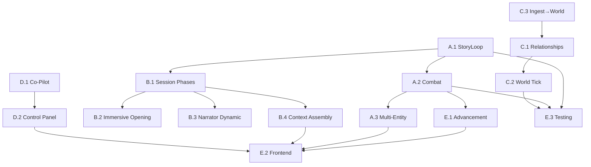

## Dependency Map



**Parallelizable tracks:**
- Phase A (core loops) and Phase C (living world) can run in parallel after A.1
- Phase B (GM craft) depends on B.1 (session phases) but B.2-B.4 are parallel
- Phase D (co-pilot) is mostly independent of A-C
- Phase E (polish) depends on everything else

---

## Timeline

```
Week  1-3:   Phase A — Core Loop Completion
Week  4-5:   Phase B — Immersive GM Craft
Week  6-7:   Phase C — Living World
Week  8-9:   Phase D — Co-Pilot Mode
Week 10-12:  Phase E — Professional Polish
```

**Total: ~12 weeks to full GM system.**

**Playable at every phase boundary:**
- After Phase A: full combat + multi-scene campaigns
- After Phase B: immersive session openings + responsive narration
- After Phase C: living world that evolves between sessions
- After Phase D: usable by human GMs as co-pilot tool
- After Phase E: production-ready

---

## Risk Register

| Risk | Probability | Impact | Mitigation |
|------|------------|--------|------------|
| LLM cost spike (combat = many turns) | Medium | Medium | Use cheap models (Gemini Flash) for combat narration, reserve expensive models for story beats |
| Combat loop complexity grows unbounded | Medium | High | Start with simple D&D-like initiative. Advanced systems (spell points, reactions) deferred to E.1+ |
| DSPy module quality inconsistent | Medium | Medium | Establish benchmark test set for each module. Measure before/after quality |
| Frontend scope creep | High | Medium | Define minimum viable views first. Polish iteratively |
| CanonKeeper rejects too many proposals | Low | High | Add confidence scoring. Auto-accept high-confidence proposals, flag low-confidence for review |
| Token budget exceeded in long sessions | Medium | Medium | Phase B.4 (context assembly) addresses this. Aggressive summarization after 20+ turns |

---

## Quick Wins (Do First, 1-3 days each)

These are high-impact, low-effort tasks that can be done immediately while planning Phase A:

| # | Task | File | Effort | Impact |
|---|------|------|--------|--------|
| 1 | StoryLoop `run_scene` delegation | `story_loop.py` | 1 day | Unblocks campaign play |
| 2 | Opposed check support | `resolver.py` | 1 day | Unblocks combat |
| 3 | Session phase routing | `chat.py` | 2 days | Fixes opening flow |
| 4 | Dynamic narration length | `prompts/narrator.py` | 1 day | Better GM voice |
| 5 | Temporal relevance decay | `context_assembly.py` | 1 day | Better long-session context |
| 6 | Relationship extraction in WorldArchitect | `world_architect.py` | 2 days | Richer world graphs |
| 7 | World template scaffolds | NEW `world_templates.py` | 1 day | Instant world creation |
| 8 | Basic combat sub-graph | NEW `combat_loop.py` | 3 days | Unblocks combat play |
