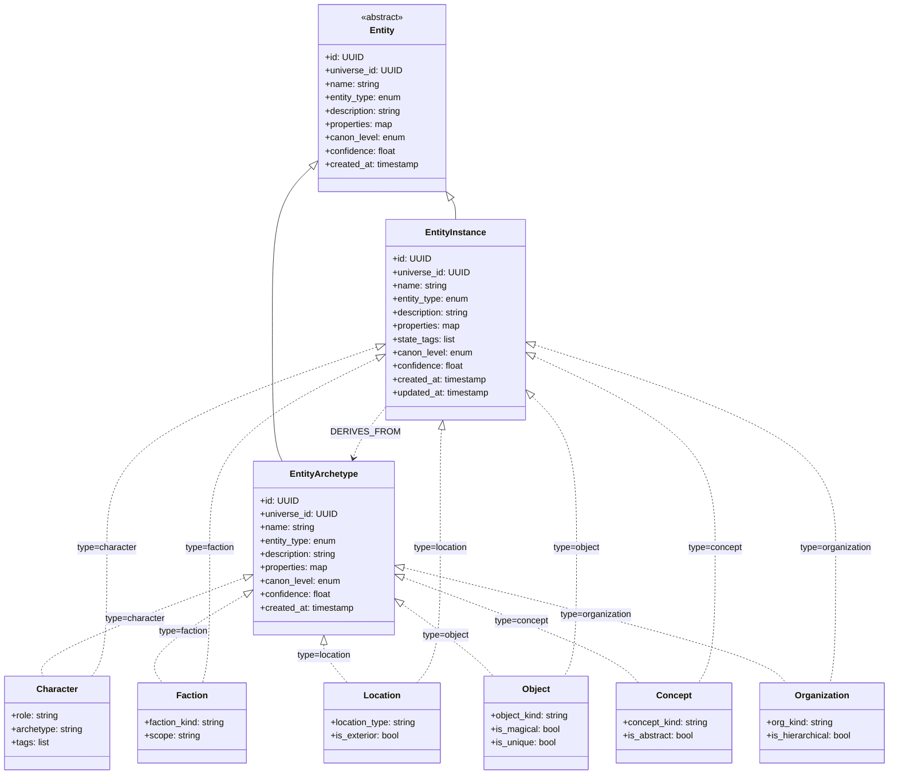

# MONITOR Entity Taxonomy

*Complete entity classification system for MONITOR, including canonization metadata and axiomatic vs concrete distinction.*

---

## Overview

MONITOR uses a **two-tier entity system**:

1. **EntityArchetype** - Archetypes, concepts, universal truths
2. **EntityInstance** - Specific instances that exist in the universe

This separation enables:
- Template-based entity creation (PC derives from "Wizard" archetype)
- Canonical concept management ("The Force" is a concept, Luke's use of it is concrete)
- Species/class distinction (Orc archetype vs "Ugluk the Orc")

---

## 1. Entity Hierarchy



---

## 2. EntityArchetype (Archetypes)

**Purpose:** Templates, archetypes, concepts, and universal truths.

**When to use:**
- Defining a character class/archetype ("Wizard", "Barbarian")
- Defining a species ("Orc", "Elf")
- Defining a concept ("The Force", "Honor")
- Defining a generic location type ("Tavern", "Castle")

**Examples:**
- Character: "Wizard" (archetype), "Jedi Knight" (archetype)
- Faction: "Senate" (institution concept), "Democracy" (system)
- Location: "Tavern" (generic), "City" (generic)
- Object: "Lightsaber" (type), "Magic Sword" (type)
- Concept: "The Force", "Honor", "Justice"
- Organization: "Guild" (structure), "Military" (type)

**Properties:**

### Common Properties (all types)
```json
{
  "id": "uuid",
  "universe_id": "uuid",
  "name": "Wizard",
  "entity_type": "character",
  "description": "A practitioner of arcane magic",
  "properties": {
    // type-specific properties (see below)
  },
  "canon_level": "canon",
  "confidence": 1.0,
  "created_at": "2025-01-01T00:00:00Z"
}
```

### Type-Specific Properties

**character:**
```json
{
  "properties": {
    "archetype": "wizard | warrior | rogue | cleric",
    "default_abilities": ["spellcasting", "ritual magic"],
    "typical_traits": ["intelligent", "bookish"]
  }
}
```

**faction:**
```json
{
  "properties": {
    "faction_kind": "political | military | religious | criminal",
    "scope": "local | regional | global | universal",
    "typical_structure": "hierarchical | flat | networked"
  }
}
```

**location:**
```json
{
  "properties": {
    "location_type": "city | building | region | planet | dimension",
    "is_exterior": true,
    "typical_features": ["walls", "gates", "marketplace"]
  }
}
```

**object:**
```json
{
  "properties": {
    "object_kind": "weapon | artifact | tool | resource",
    "is_magical": true,
    "is_consumable": false
  }
}
```

**concept:**
```json
{
  "properties": {
    "concept_kind": "belief | law | force | principle",
    "is_abstract": true,
    "manifestations": ["light side", "dark side"]
  }
}
```

**organization:**
```json
{
  "properties": {
    "org_kind": "guild | company | cult | government",
    "is_hierarchical": true,
    "typical_roles": ["leader", "member", "initiate"]
  }
}
```

---

## 3. EntityInstance (Instances)

**Purpose:** Specific entities that exist in the universe.

**When to use:**
- An actual PC or NPC ("Gandalf", "Frodo")
- A specific location ("Rivendell", "Mordor")
- A unique object ("The One Ring", "Excalibur")
- A concrete faction ("Roman Senate 44 BC", "Rebel Alliance")

**Examples:**
- Character: "Gandalf the Grey", "Luke Skywalker", "Player Character: Aelara"
- Faction: "The Rebel Alliance", "Roman Senate 44 BC"
- Location: "Rivendell", "Tatooine", "The Shire"
- Object: "The One Ring", "Luke's Lightsaber", "Mjolnir"
- Concept: "The Force as manifested in Luke" (concrete usage)
- Organization: "The Jedi Order c. 32 BBY"

**Properties:**

### Common Properties (all types)
```json
{
  "id": "uuid",
  "universe_id": "uuid",
  "name": "Gandalf the Grey",
  "entity_type": "character",
  "description": "Istari wizard sent to Middle-earth",
  "properties": {
    // type-specific properties (see below)
  },
  "state_tags": ["alive", "traveling", "wielding_glamdring"],
  "canon_level": "canon",
  "confidence": 1.0,
  "created_at": "2025-01-01T00:00:00Z",
  "updated_at": "2025-01-15T12:00:00Z"
}
```

**Key difference from Archetype:** `state_tags` - dynamic state that changes over time.

**Derivation (optional):**
```cypher
(:EntityInstance {name: "Gandalf"})-[:DERIVES_FROM]->(:EntityArchetype {name: "Wizard"})
```

### Type-Specific Properties

**character:**
```json
{
  "properties": {
    "role": "PC | NPC | antagonist | ally | neutral",
    "archetype": "wizard",  // optional reference to archetype
    "tags": ["wise", "powerful", "ancient"]
  },
  "state_tags": ["alive", "wounded", "at_rivendell", "wielding_staff"]
}
```

**faction:**
```json
{
  "properties": {
    "faction_kind": "political | military | religious | criminal",
    "scope": "local | regional | global",
    "current_leader_id": "uuid"  // optional EntityInstance reference
  },
  "state_tags": ["active", "at_war", "declining_influence"]
}
```

**location:**
```json
{
  "properties": {
    "location_type": "city | building | region | planet",
    "is_exterior": false,
    "coordinates": {"x": 100, "y": 200}  // optional
  },
  "state_tags": ["occupied", "under_siege", "abandoned"]
}
```

**object:**
```json
{
  "properties": {
    "object_kind": "weapon | artifact | tool",
    "is_magical": true,
    "is_unique": true,
    "current_owner_id": "uuid"  // optional EntityInstance reference
  },
  "state_tags": ["worn", "cursed", "glowing"]
}
```

**concept:**
```json
{
  "properties": {
    "concept_kind": "belief | law | force",
    "is_abstract": false,  // concrete manifestation
    "manifested_in_id": "uuid"  // optional EntityInstance reference
  },
  "state_tags": ["waxing", "waning", "corrupted"]
}
```

**organization:**
```json
{
  "properties": {
    "org_kind": "guild | company | cult",
    "is_hierarchical": true,
    "headquarters_id": "uuid"  // optional EntityInstance reference
  },
  "state_tags": ["active", "recruiting", "in_conflict"]
}
```

---

## 4. State Tags (EntityInstance only)

State tags are **dynamic** and change during play. They represent current conditions.

### Common State Tags

| Domain | Tags |
|--------|------|
| **Life** | `alive`, `dead`, `unconscious`, `dying` |
| **Health** | `healthy`, `wounded`, `injured`, `poisoned`, `diseased` |
| **Mental** | `sane`, `insane`, `charmed`, `frightened`, `enraged` |
| **Position** | `standing`, `prone`, `flying`, `hidden` |
| **Social** | `hostile`, `friendly`, `neutral`, `allied`, `enemy` |
| **Equipment** | `armed`, `armored`, `wielding_<item>` |
| **Location** | `at_<location>`, `traveling`, `imprisoned` |
| **Activity** | `resting`, `fighting`, `fleeing`, `negotiating` |

**Examples:**
- Character: `["alive", "wounded", "at_rivendell", "wielding_sword", "hostile_to_sauron"]`
- Faction: `["active", "at_war", "allied_with_rohan"]`
- Location: `["occupied", "under_siege", "fortified"]`
- Object: `["cursed", "broken", "owned_by_frodo"]`

**State tag changes trigger ProposedChanges:**
```javascript
{
  "type": "state_change",
  "content": {
    "entity_id": "uuid",
    "tag": "wounded",
    "action": "add" | "remove",
    "timestamp": "..."
  }
}
```

---

## 5. Canonization Metadata

All entities (Axiomatic and Concrete) have canonization metadata.

### canon_level

| Value | Meaning | When to Use |
|-------|---------|-------------|
| `proposed` | Suggested but not accepted | Entity extracted from doc, awaiting review |
| `canon` | Accepted as truth | Entity confirmed and canonized |
| `retconned` | Superseded by newer entity | Entity was true, now replaced |

### confidence

| Range | Meaning |
|-------|---------|
| 1.0 | Absolutely certain (from authoritative source) |
| 0.8-0.9 | High confidence (GM explicit, player confirmed) |
| 0.5-0.7 | Medium confidence (system inferred, player implied) |
| 0.0-0.4 | Low confidence (speculative, needs review) |

### authority

| Value | Who Asserted | Example |
|-------|-------------|---------|
| `source` | From manual/document | "Wizards can cast spells" from D&D PHB |
| `gm` | GM explicit declaration | GM creates NPC on the fly |
| `player` | Player action/creation | Player creates PC |
| `system` | System inference | NPC extracted from narrative context |

---

## 6. Entity Relationships

### Derivation (Axiomatic → Concrete)

```cypher
(:EntityInstance {name: "Luke Skywalker"})-[:DERIVES_FROM]->(:EntityArchetype {name: "Jedi Knight"})
(:EntityInstance {name: "The One Ring"})-[:DERIVES_FROM]->(:EntityArchetype {name: "Ring of Power"})
```

### Spatial Hierarchy

```cypher
(:EntityInstance {name: "Helm's Deep"})-[:LOCATED_IN]->(:EntityInstance {name: "Rohan"})
(:EntityInstance {name: "Rohan"})-[:LOCATED_IN]->(:EntityInstance {name: "Middle-earth"})
```

### Membership

```cypher
(:EntityInstance {name: "Legolas"})-[:MEMBER_OF]->(:EntityInstance {name: "Fellowship of the Ring"})
(:EntityInstance {name: "Fellowship"})-[:MEMBER_OF]->(:EntityInstance {name: "Free Peoples of Middle-earth"})
```

### Social Relations

```cypher
(:EntityInstance {name: "Frodo"})-[:ALLY_OF]->(:EntityInstance {name: "Sam"})
(:EntityInstance {name: "Gondor"})-[:ENEMY_OF]->(:EntityInstance {name: "Mordor"})
```

### Ownership

```cypher
(:EntityInstance {name: "Frodo"})-[:OWNS]->(:EntityInstance {name: "The One Ring"})
```

### Participation

```cypher
(:EntityInstance {name: "Aragorn"})-[:PARTICIPATED_IN]->(:Scene {name: "Battle of Helm's Deep"})
(:EntityInstance {name: "Gandalf"})-[:INVOLVED_IN]->(:Fact {statement: "Defeated the Balrog"})
```

---

## 7. Entity Type Use Cases

### Character

**Axiomatic Examples:**
- "Wizard" - class/archetype
- "Orc" - species
- "Hero" - role archetype

**Concrete Examples:**
- "Gandalf the Grey" - specific wizard
- "Ugluk" - specific orc
- "Aragorn" - specific hero

**When character becomes concrete:**
- PC creation (always concrete)
- NPC first appearance (if important to continuity)
- Named character in source material

---

### Faction

**Axiomatic Examples:**
- "Senate" - type of governing body
- "Rebellion" - type of movement

**Concrete Examples:**
- "Roman Senate 44 BC" - specific instance
- "Rebel Alliance" - specific rebellion

**When faction becomes concrete:**
- When specific membership matters
- When faction has unique properties
- When faction participates in events

---

### Location

**Axiomatic Examples:**
- "Tavern" - generic building type
- "Forest" - generic terrain type

**Concrete Examples:**
- "The Prancing Pony" - specific tavern
- "Fangorn Forest" - specific forest

**When location becomes concrete:**
- When scene occurs there
- When location has unique properties
- When location is referenced in facts

---

### Object

**Axiomatic Examples:**
- "Sword" - generic weapon type
- "Potion" - generic item type

**Concrete Examples:**
- "Andúril" - specific sword
- "Potion of Healing #3" - specific potion instance

**When object becomes concrete:**
- When object is unique (artifacts)
- When ownership/location matters
- When object participates in events

---

### Concept

**Axiomatic Examples:**
- "Magic" - universal concept
- "The Force" - universal energy field

**Concrete Examples:**
- "The Force as wielded by Luke" - specific manifestation
- "Dark Magic in Mordor" - specific corruption

**When concept becomes concrete:**
- When manifestation has unique properties
- When concept participates in events
- When concept has measurable state

---

### Organization

**Axiomatic Examples:**
- "Guild" - generic organization type
- "Military" - generic structure

**Concrete Examples:**
- "Thieves' Guild of Waterdeep" - specific guild
- "Imperial Army" - specific military

**When organization becomes concrete:**
- When membership is tracked
- When organization has leadership
- When organization participates in events

---

## 8. Entity Creation Workflow

### From Document Ingestion

1. Extract entity references from text → MongoDB ProposedChange
2. Determine if Axiomatic or Concrete
3. User review → accept/reject
4. CanonKeeper → create EntityArchetype or EntityInstance in Neo4j
5. Link SUPPORTED_BY → Source/Snippet

### From Gameplay

1. NPC appears in narrative → MongoDB ProposedChange
2. Resolver/Narrator determines properties
3. End of scene → CanonKeeper evaluates
4. Create EntityInstance with canon_level=canon
5. Link SUPPORTED_BY → Scene/Turn

### Manual Creation

1. User/GM creates entity via UI
2. Write directly to Neo4j (skip proposal stage)
3. Set authority=gm, confidence=1.0, canon_level=canon

---

## 9. Entity Modification Workflow

**State tag changes:**
1. Narrative implies change (e.g., "orc dies")
2. Create ProposedChange: `{ type: "state_change", content: { entity_id, tag: "dead", action: "add" } }`
3. End of scene → CanonKeeper updates EntityInstance.state_tags
4. Link Fact to entity: `(:Fact {statement: "Orc died"})-[:INVOLVES]->(:EntityInstance)`

**Property changes:**
1. Similar to state tags, but modifies properties map
2. Versioning: consider creating new entity with REPLACES edge for major changes

**Retcon:**
1. Mark old entity: `canon_level: "retconned"`
2. Create new entity with `replaces: old_entity_id`
3. Preserve both for audit trail

---

## 10. Invariants

1. **Universe boundary:** All entities belong to exactly one Universe
2. **Type consistency:** entity_type cannot change after creation
3. **Derivation:** EntityInstance can derive from EntityArchetype of same type
4. **State tags:** Only EntityInstance has state_tags (EntityArchetype is timeless)
5. **Confidence:** All entities have confidence ∈ [0.0, 1.0]
6. **Canon level:** All entities have canon_level ∈ {proposed, canon, retconned}
7. **No deletion:** Entities are never deleted, only marked retconned

---

## 11. Query Patterns

### Find all canonical characters in a universe

```cypher
MATCH (u:Universe {id: $universe_id})-[:HAS_ENTITY]->(e:EntityInstance)
WHERE e.entity_type = 'character' AND e.canon_level = 'canon'
RETURN e
```

### Find character's current state

```cypher
MATCH (e:EntityInstance {id: $entity_id})
RETURN e.state_tags
```

### Find all entities derived from archetype

```cypher
MATCH (ec:EntityInstance)-[:DERIVES_FROM]->(ea:EntityArchetype {name: "Wizard"})
RETURN ec
```

### Find entities at a location

```cypher
MATCH (e:EntityInstance)-[:LOCATED_IN]->(loc:EntityInstance {id: $location_id})
RETURN e
```

### Find entity's allies

```cypher
MATCH (e:EntityInstance {id: $entity_id})-[:ALLY_OF]->(ally:EntityInstance)
RETURN ally
```

---

## References

- [ONTOLOGY.md](ONTOLOGY.md) - Complete data model
- [ERD_DIAGRAM.md](ERD_DIAGRAM.md) - Entity-relationship diagrams
- [DATABASE_INTEGRATION.md](../architecture/DATABASE_INTEGRATION.md) - Data layer architecture
