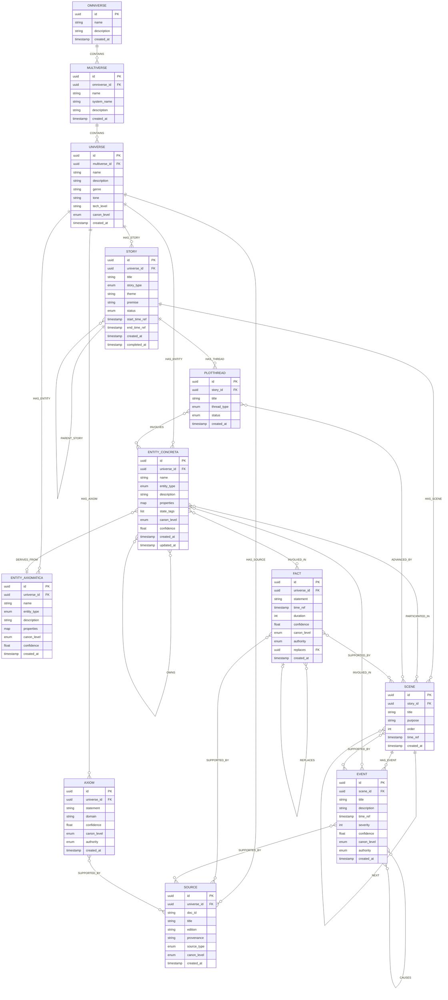
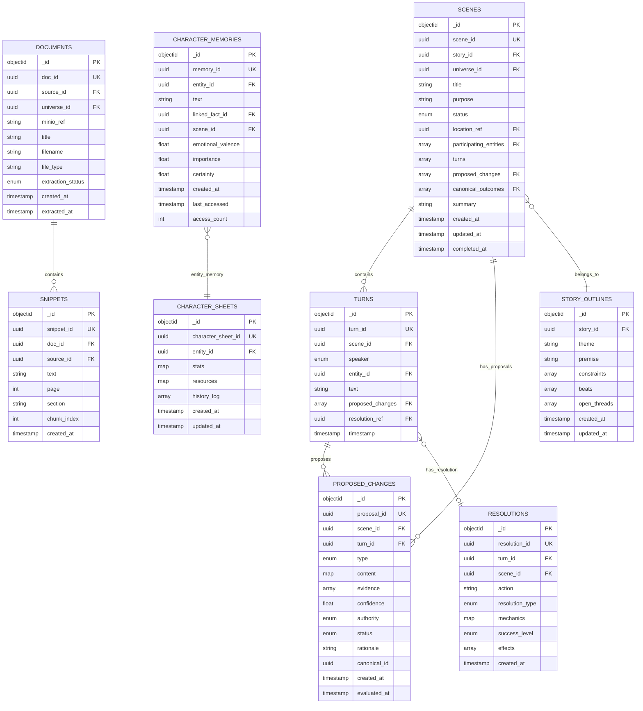

# MONITOR ERD Diagrams

*Entity-Relationship diagrams for the complete MONITOR data model across Neo4j, MongoDB, and Qdrant.*

---

## 1. Neo4j Canonical Layer (Graph)

This is the **canonical truth layer** - what is objectively true in the universe.



**Key Notes:**
- All nodes have `canon_level` and `confidence` for graduated canonization
- `SUPPORTED_BY` edges provide evidence/provenance
- `REPLACES` allows safe retcons
- Scene nodes are **optional** (only created if needed for continuity)

---

## 2. MongoDB Narrative Layer (Documents)

This is the **narrative artifacts layer** - scenes, turns, proposals, memories.



**Key Notes:**
- `scene_id`, `story_id`, `entity_id` etc. are **references to Neo4j UUIDs**
- `proposed_changes` array stores proposal_ids
- `canonical_outcomes` stores Neo4j Fact/Event IDs
- `status` tracks workflow (active → finalizing → completed)

---

## 3. Qdrant Semantic Index Layer (Vectors)

This is the **derived index layer** - embeddings for retrieval.

```
Collection: scene_chunks
  ├─ id: uuid
  ├─ vector: [1536 floats]
  └─ payload:
       ├─ scene_id → references MongoDB scenes.scene_id
       ├─ story_id → references Neo4j Story.id
       ├─ universe_id → references Neo4j Universe.id
       ├─ text: string
       ├─ type: "scene_summary" | "turn"
       └─ timestamp: iso8601

Collection: memory_chunks
  ├─ id: uuid
  ├─ vector: [1536 floats]
  └─ payload:
       ├─ memory_id → references MongoDB character_memories.memory_id
       ├─ entity_id → references Neo4j EntityConcreta.id
       ├─ text: string
       ├─ importance: float
       └─ timestamp: iso8601

Collection: snippet_chunks
  ├─ id: uuid
  ├─ vector: [1536 floats]
  └─ payload:
       ├─ snippet_id → references MongoDB snippets.snippet_id
       ├─ doc_id → references MongoDB documents.doc_id
       ├─ source_id → references Neo4j Source.id
       ├─ universe_id → references Neo4j Universe.id
       ├─ text: string
       ├─ page: int
       └─ section: string
```

**Key Notes:**
- Qdrant is **never authoritative** - always points to Neo4j or MongoDB
- Indices can be rebuilt from source data
- Filters use payload metadata (universe_id, importance, etc.)

---

## 4. Cross-Layer Reference Flow

```
┌─────────────────────────────────────────────────────────┐
│                      USER INPUT                         │
└────────────────────────┬────────────────────────────────┘
                         │
                         ▼
              ┌──────────────────────┐
              │   MONGODB: Turn      │
              │   (narrative log)    │
              └──────────┬───────────┘
                         │
                         ▼
              ┌──────────────────────┐
              │ MONGODB: Proposed    │
              │ Change (staging)     │
              └──────────┬───────────┘
                         │
                    [canonization gate]
                         │
                         ▼
              ┌──────────────────────┐
              │   NEO4J: Fact/Event  │
              │   (canonical truth)  │
              └──────────┬───────────┘
                         │
                         ▼
              ┌──────────────────────┐
              │ QDRANT: Embedding    │
              │ (semantic index)     │
              └──────────────────────┘
```

**Key principle:** Data flows MongoDB → Neo4j → Qdrant. Never Neo4j → MongoDB.

---

## 5. Entity-Type Specific Properties

### EntityConcreta.properties by entity_type

**character:**
```json
{
  "role": "PC | NPC | antagonist | ally",
  "archetype": "wizard | warrior | ...",
  "tags": ["alive", "wounded", "hostile"]
}
```

**faction:**
```json
{
  "faction_kind": "political | military | religious",
  "scope": "local | regional | global"
}
```

**location:**
```json
{
  "location_type": "city | building | region | planet",
  "is_exterior": true
}
```

**object:**
```json
{
  "object_kind": "weapon | artifact | tool",
  "is_magical": true,
  "is_unique": true
}
```

**concept:**
```json
{
  "concept_kind": "belief | law | force",
  "is_abstract": true
}
```

**organization:**
```json
{
  "org_kind": "guild | company | cult",
  "is_hierarchical": true
}
```

---

## 6. Enumerations

### canon_level
- `proposed` - suggested but not accepted
- `canon` - accepted as truth
- `retconned` - superseded by newer fact

### authority
- `source` - from manual/document
- `gm` - explicit GM declaration
- `player` - from player action via resolution
- `system` - inferred by system

### story_type
- `campaign` - long-form multi-arc
- `arc` - story arc within campaign
- `episode` - single episode
- `one_shot` - standalone session

### status (Story)
- `planned` - not yet started
- `active` - currently running
- `completed` - finished
- `abandoned` - discontinued

### status (Scene - MongoDB)
- `active` - currently running, turns being added
- `finalizing` - canonization in progress
- `completed` - canonized and closed

### status (ProposedChange)
- `pending` - awaiting evaluation
- `accepted` - canonized to Neo4j
- `rejected` - not canonized

### entity_type
- `character`
- `faction`
- `location`
- `object`
- `concept`
- `organization`

### speaker (Turn)
- `user` - player out-of-character
- `gm` - game master
- `entity` - in-character (entity_id required)

---

## 7. Index Strategy

### Neo4j Constraints
```cypher
CREATE CONSTRAINT entity_concreta_id ON (n:EntityConcreta) ASSERT n.id IS UNIQUE;
CREATE CONSTRAINT entity_axiomatica_id ON (n:EntityAxiomatica) ASSERT n.id IS UNIQUE;
CREATE CONSTRAINT universe_id ON (n:Universe) ASSERT n.id IS UNIQUE;
CREATE CONSTRAINT story_id ON (n:Story) ASSERT n.id IS UNIQUE;
CREATE CONSTRAINT fact_id ON (n:Fact) ASSERT n.id IS UNIQUE;
CREATE CONSTRAINT event_id ON (n:Event) ASSERT n.id IS UNIQUE;
CREATE CONSTRAINT source_id ON (n:Source) ASSERT n.id IS UNIQUE;
CREATE CONSTRAINT axiom_id ON (n:Axiom) ASSERT n.id IS UNIQUE;
```

### Neo4j Indexes
```cypher
CREATE INDEX entity_universe ON :EntityConcreta(universe_id);
CREATE INDEX fact_universe ON :Fact(universe_id);
CREATE INDEX fact_canon_level ON :Fact(canon_level);
CREATE INDEX story_universe ON :Story(universe_id);
```

### MongoDB Indexes
```javascript
// scenes
db.scenes.createIndex({ scene_id: 1 }, { unique: true });
db.scenes.createIndex({ story_id: 1, order: 1 });
db.scenes.createIndex({ status: 1 });

// proposed_changes
db.proposed_changes.createIndex({ proposal_id: 1 }, { unique: true });
db.proposed_changes.createIndex({ scene_id: 1, status: 1 });
db.proposed_changes.createIndex({ status: 1 });

// turns (if separate collection)
db.turns.createIndex({ turn_id: 1 }, { unique: true });
db.turns.createIndex({ scene_id: 1, timestamp: 1 });

// character_memories
db.character_memories.createIndex({ memory_id: 1 }, { unique: true });
db.character_memories.createIndex({ entity_id: 1, importance: -1 });

// snippets
db.snippets.createIndex({ snippet_id: 1 }, { unique: true });
db.snippets.createIndex({ doc_id: 1, chunk_index: 1 });
```

### Qdrant Indexes
```python
# Payload indexes for filtering
client.create_payload_index(
    collection_name="scene_chunks",
    field_name="universe_id",
    field_schema="keyword"
)

client.create_payload_index(
    collection_name="memory_chunks",
    field_name="entity_id",
    field_schema="keyword"
)

client.create_payload_index(
    collection_name="snippet_chunks",
    field_name="source_id",
    field_schema="keyword"
)
```

---

## References

- [ONTOLOGY.md](ONTOLOGY.md) - Complete data model specification
- [DATABASE_INTEGRATION.md](../architecture/DATABASE_INTEGRATION.md) - Data layer architecture
- [CONVERSATIONAL_LOOPS.md](../architecture/CONVERSATIONAL_LOOPS.md) - Loop state machines
