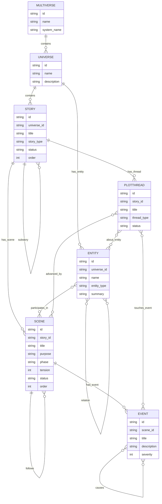
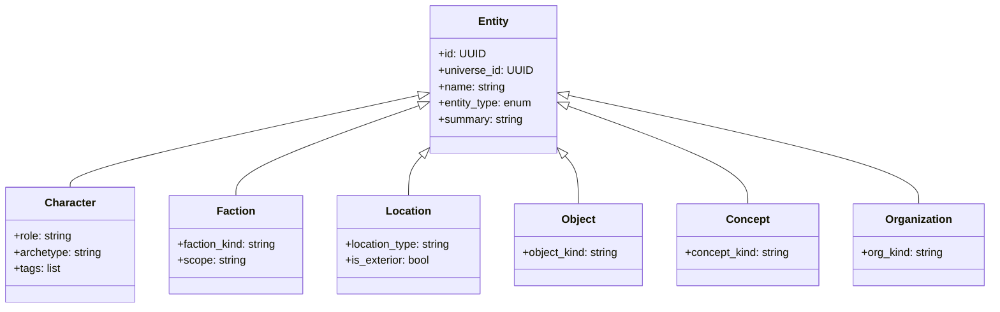

# MONITOR Ontology v1.0

*A precise structural definition of the narrative graph model for the MONITOR System.*

---

# 0. Overview

This document defines the **canonical ontology** used by MONITOR to represent:

* Worlds
* Stories
* Scenes
* Events
* Threads
* Entities & subtypes
* Relationships
* Narrative attachments (memories, transcripts, summaries)

The ontology is **LLM-agnostic** and **database-agnostic**, designed for:

* Neo4j (graph structure)
* Qdrant/OpenSearch (text memories)
* Document DB (transcripts, summaries)

This version is **v1.0**. Breaking changes require a v2.0.

---

# 1. Core Architecture Principles

1. **Graph-first modeling** – structure, causality, and world state belong in the graph layer.
2. **Entity unification** – all world objects are unified as `Entity` and specialized via subtype tags.
3. **Story hierarchy** – story nodes form a strict tree: campaign → arcs → episodes.
4. **Scene as atomic dramatic unit** – continuous narrative action with a single purpose.
5. **Event as causal moment** – directed acyclic causal graph (DAG).
6. **Threads at story-level** – campaign/arc stories own plot threads.
7. **Narrative docs external** – transcripts, summaries, and memories live in document storage.

---

# 2. Structural ERD (Graph Model)

---

# 3. Entity Taxonomy

Entities unify all world elements under a single abstraction.

### Subtype Purposes

| Subtype          | Purpose              | Examples                     |
| ---------------- | -------------------- | ---------------------------- |
| **Character**    | PCs, NPCs            | Coriolanus, Volumnia         |
| **Faction**      | Groups, populations  | Roman Senate, Volscians      |
| **Location**     | Spatial hierarchy    | Rome, Corioles, Forum        |
| **Object**       | Items, artifacts     | Sword, medal, scroll         |
| **Concept**      | Ideas, laws, beliefs | Honor, betrayal, citizenship |
| **Organization** | Structured bodies    | Army, Senate, Cult           |

---

# 4. Narrative Concepts

## 4.1 Story

A narrative container that can nest under other stories.

* Types: `campaign`, `arc`, `episode`, `one_shot`
* Status: `planned`, `active`, `finished`, `abandoned`
* Relations:

  * Contains Scenes
  * Contains PlotThreads
  * Substory of another Story

---

## 4.2 Scene

Smallest narrative unit with chronological and thematic continuity.

* Attributes: phase, tension, purpose
* Relations:

  * Belongs to one Story
  * Contains Events
  * Has preceding/following scenes
  * Has participating Entities

---

## 4.3 Event

Atomic causal moments.

* Severity 0–10
* Causal DAG via `causes` relations
* A scene may contain many events

---

## 4.4 PlotThread

Cross-scene and cross-arc narrative threads.

* Owned by a Story (usually the campaign)
* Advanced by scenes
* Touches events and references entities

---

# 5. Narrative Attachments (Document Layer)

The following live outside the graph but reference graph IDs.

## 5.1 Transcript

Full record of scene dialogue.

* List of messages
* Ordered by index

## 5.2 Message

* Speakers: `player`, `gm`, `ai`, `system`
* Optional in-character `character_id`

## 5.3 SceneSummary

Cached summaries in multiple levels:

* `full`, `medium`, `high`, `ultra`

## 5.4 Memory

Episodic memory for characters.

* Valence, importance, certainty
* Links to originating scene

---

# 6. Invariants Summary

* Universe boundary preserved for all children
* Story hierarchy forms a strict tree
* Scene chains are acyclic
* Event causality is a DAG
* PlotThreads belong to one Story only
* Memories always belong to characters

---

# 7. Versioning

This document is **v1.0**.
Non-breaking extensions produce v1.x.
Breaking ontology changes require v2.0.
